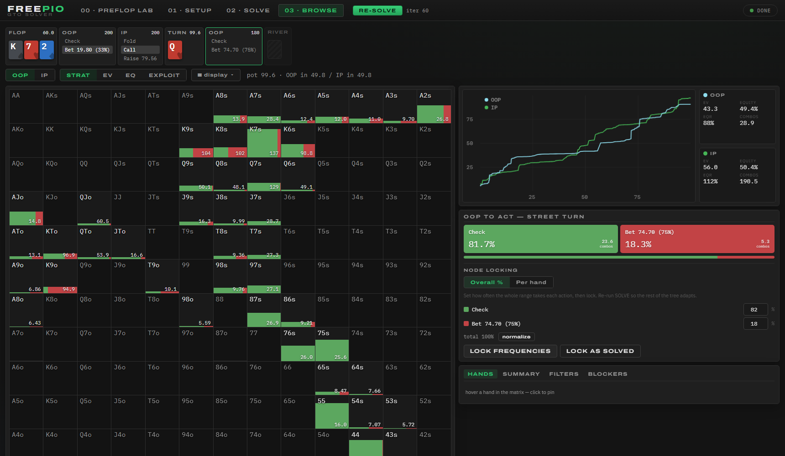

# GTOpen — an open-source GTO poker solver

A from-scratch no-limit hold'em solver with a local web UI: heads-up
postflop CFR, a multiway Preflop Lab, and player profiling/exploitation.
Rust solver core (discounted CFR), optional CUDA GPU engine, zero-install
browser frontend.


Validated on 7 September 2026; [test and benchmark evidence](research/autoresearch/gpu-pass.md).


*Mid-hand in BROWSE: a Preflop Lab line (UTG raises, BTN calls) arriving at
A♥9♠3♦, check–bet 75%–call to the Q♥ turn — action ribbon, strategy matrix,
equity curves, node locking, and BTN one click away from being locked to a
Whale profile.*

## Quick start

```bash
./start.sh          # builds (release) and serves on :3737
# open http://127.0.0.1:3737
```

`start.sh` detects the machine: with an NVIDIA CUDA runtime present it sets
up the library path and builds the GPU engine; without one it builds
CPU-only automatically (same UI, just slower). Manual equivalent:

```bash
cargo build --release        # no GPU feature
./target/release/gto-server
```

Run from the repo root (the server serves the `web/` directory). Solves and
saves land in `./saves/`.

### GPU engine (optional)

The CUDA backend needs an NVIDIA GPU and the `nvrtc` runtime compiler. The
easiest way to get `nvrtc` without a full CUDA toolkit:

```bash
pip install --target ~/.local/cuda-nvrtc nvidia-cuda-nvrtc-cu12
cargo build --release -p server --features gpu
./start.sh          # finds nvrtc and enables the GPU automatically
```

Without `LD_LIBRARY_PATH` pointing at `nvrtc` the server silently falls back
to CPU — `start.sh` handles this for you. The status JSON reports `"gpu": true`
when the engine is live.

### Windows (native, CPU or CUDA)

Needs Rust (`rustup`, MSVC toolchain) and the VS Build Tools C++ workload.
`GTOpen.cmd` reopens an existing GTOpen server without rebuilding or changing
its sessions. If none is running, it builds (`--features gpu` when
`nvidia-smi` is found, CPU-only otherwise), starts the server in the
background, and opens the browser after the GTOpen API is ready.
Concurrent shortcut launches share one server. For the GPU engine drop the
`nvrtc` DLLs next to the repo — no CUDA toolkit needed:

```bat
pip install --target .cuda-nvrtc nvidia-cuda-nvrtc-cu12
GTOpen.cmd
```

`GTOpen.cmd` puts `.cuda-nvrtc\nvidia\cuda_nvrtc\bin` (and `%CUDA_PATH%\bin`
if set) on `PATH` for the server; `libcuda` comes from the NVIDIA driver
(`nvcuda.dll`). `SOLVER_GPU=0` builds and runs CPU-only. The RAM budget
uses `GlobalMemoryStatusEx` on Windows (`/proc/meminfo` on Linux).

After a source update, an already-running server keeps its old code until
restarted. Save any open session, stop `gto-server.exe` in Task Manager
(or close an older launcher's server window), then use the same
Start menu shortcut or `GTOpen.cmd`: Cargo rebuilds changed code automatically.
No new shortcut or CUDA-runtime installation is needed for these optimizations.
See [Windows updates and shortcuts](docs/windows_updates.md).

Optional environment:

| var | default | meaning |
|---|---|---|
| `PORT` | 3737 | HTTP port |
| `SOLVER_THREADS` | physical cores | rayon worker threads (SMT hurts this workload; 12–16 is the sweet spot on a 5950X) |
| `SOLVER_COMPRESS` | 1 | `0` = full-precision f32 arenas instead of 16-bit compressed |
| `SOLVER_GPU` | 1 (if built with `gpu`) | `0` forces the CPU engine even when CUDA is available |
| `SOLVER_GPU_MEM_MB` | live free VRAM − 512 MB | manual VRAM cap for the GPU engine; spots over budget fall back to CPU |
| `SOLVER_MEM_MB` | 80% of free RAM (≤48 GB) | solver-arena + tree RAM budget; bigger builds are refused |
| `PREFLOP_EQ_SAMPLES` | 20000 | Monte-Carlo samples per hand-class pair for the Preflop Lab equity table |
| `PREFLOP_MAX_NODES` | RAM-derived | Preflop Lab tree-size limit; the lab shows a live estimate + this machine's caps before BUILD |
| `PREFLOP_MAX_ARENA_MB` | ~40% of free RAM | Preflop Lab regret/strategy memory limit (MB) |

Modeled preflop profiles now separate first-in and over-limp defenses and let
opponents adapt to large bets (default: 25% of stack). This addresses the
size-blind calling assumptions that could produce deep-stack limp/jam charts.
See [modeling correction and settings](docs/preflop_modeling_fix.md) for saved-game
compatibility, convergence semantics and remaining approximation limits.

Preflop setup includes **Small blind** and **Big blind** stake inputs (enter 2
and 2 for $2/$2). Stacks and bet sizes remain in bb. A small blind that already
matches the big blind can check an unraised pot; call/completion labels show
chips added, with the total contribution in the hover explanation. Saved game
files retain their actual posted ratio; changing a scenario requires rebuilding
and solving its tree. Matching saved scenarios restore their stake denominations.

## Workflow

0. **PREFLOP LAB** (optional) — solve the preflop game first (limps, any
   sizes, 2–9 players; see below), walk the line you care about, and **SEND
   TO POSTFLOP**: both conditional ranges, pot and stacks land in SETUP, the
   spot is saved as a reusable preset, and the preflop line shows in Browse's
   ribbon ahead of the flop.
1. **SETUP** — edit both ranges on the 13×13 grid (drag-paint, weight brush,
   text syntax `AA,AKs,KQs:0.5,A5s-A2s,99-66,AhKh:0.25`, presets), pick the
   board (3 cards = flop solve, 4 = turn, 5 = river), set pot/stacks/rake and
   per-street bet/raise/donk sizes (`33 75`, `a` = all-in, `2.5x` = raise
   multiple), then **BUILD TREE**. The build reports node count, solver-arena RAM, and a conservative
   GPU-memory estimate before you commit to solving. Donk sizes apply only when
   OOP leads into the previous street's aggressor; after a check-through
   street OOP bets with its normal sizes (saves made before September 2026
   keep their old tree shape and still load).
2. **SOLVE** — set a target exploitability (% of pot; 0.3% is a typical
   study-quality target), watch the live convergence chart. Stop/resume any
   time; save/load full solves to disk.
3. **BROWSE** — walk any line with breadcrumbs. The matrix shows strategy
   stacked-bars (blue fold / green check-call / amber→red bets by size),
   EV heatmap, or equity heatmap for either player. Click a cell for the
   per-combo breakdown (strategy, reach, EQ, EV per action). At card nodes,
   pick the turn/river from the deck or open the **RUNOUTS REPORT** (strategy
   + equity for every possible next card).
4. **NODE LOCKING** — at any decision node, set aggregate action frequencies
   or exact per-hand frequencies and lock. Re-run SOLVE and the rest of the
   tree re-optimizes around your assumption ("what if villain never raises
   here?"). Verified by test: locking the bluff-catcher to always-call drives
   bluffing to zero.
5. **EXPLOIT** — the fourth matrix mode: a true best response for either
   player against the opponent's CURRENT strategy, locks included. Lock
   villain to a pool tendency (station, never-bluffs, over-folds), flip to
   EXPLOIT, and read off the max-exploit strategy plus each hand's EV gain
   over the equilibrium line — no re-solve needed. Verified by test: vs a
   locked always-caller the best response bets the nuts and never bluffs.
6. **REPORTS** — batch-solve the same spot across a weighted canonical flop
   subset (47/95/184 or all 1755) in the background, then read the study
   at **any node**: an action ribbon like Browse's walks the tree (turn
   and river included — those nodes are pooled over every card that can
   come), and at every stop you get a strip chart + sortable table of
   EV/EQ/EQR and action frequencies per flop, texture filters and a
   per-texture summary, aggression-by-feature charts (high card, pairing,
   suits, connectedness) and a **hand-class breakdown** (made hands, draws,
   equity buckets: share of range, action mix and EV per class, either
   player). "Standard report sizes" keeps every report on one bet menu so
   spots compare; click any flop to re-solve it into BROWSE at the same
   line. Reports can run against a profile-locked villain (with the hero
   re-adapting) — "where does the whale bleed by texture" as one report.
   Each board keeps ~0.5 MB of node summaries (`saves/reports/<name>.lines/`),
   never the solve itself.
   The viewer separates **Chart**, **Table**, **Hand classes**, and **Textures**
   with a shared filtered summary. In Chart or Table, choose **Group by → High
   card** for each flop high rank's full action mix and EV/equity statistics,
   pooled with the same report weights and current texture filter. The compact
   Textures view compares texture rows and aggression by flop feature.
   **Filter flops** applies to every view, including texture comparisons and
   feature charts. **Sort** follows the current view; column headings and the
   arrow button reverse its direction. Every texture column is sortable
   (Strategy uses total bet/raise frequency). Hand classes sort by class,
   share, EV or equity. Clicking a texture name opens its flops in Table.
   The searchable library shows concise spot
   titles, model/stack context, completion state, and local date/time stamps;
   hover a title for the original name. Display labels do not rename saved
   reports. Expand **New report** to configure another run.
   Each library entry has a trash button: confirm the report name and timestamp
   to permanently delete it and its saved board summaries. Stop a running
   report before deleting it. Table and Hand classes use compact rows; grouped
   high-card labels show their flop counts on the same line.

## Engine

- **Algorithm**: Discounted CFR (α=1.5, β=0, γ=2) with alternating updates,
  vectorized over hands. CFR+ and Predictive CFR+ (PCFR+) are selectable per
  solve (`POST /api/solve {"algorithm": "pcfr+"}` or `SOLVER_ALGO` in the CLI).
- **Compressed arenas (16-bit)**: regrets stored as i16 and strategy
  sums as u16, quantized per node against the node's max magnitude — half the
  memory of f32, and faster on big trees because CFR is memory-bandwidth
  bound. Verified equivalent to f32 within 0.1% pot exploitability by test;
  save files stay full-precision f32 and load into either mode.
- **Zero-allocation traversal**: all per-node-visit scratch vectors come from
  a thread-local buffer pool instead of malloc.
- **CUDA GPU solver**: level-synchronous CFR with f32 working arenas in VRAM
  (`--features gpu`). On the current RTX 3090 benchmarks, the 1.35M-node
  rainbow/two-tone flop cases take **51.8 / 31.4 ms per iteration**.
  Exploitability also runs on the GPU, with reusable evaluation graphs and
  batched root downloads. Node locks, DCFR/CFR+, and both CPU storage modes
  are supported; PCFR+ uses the CPU. Compressed CPU arenas decode on upload
  and re-encode on sync. Visited action blocks are packed where worthwhile,
  value scratch is reused between tree levels, and inactive state is preserved
  for exact save/resume and CPU browsing. The server uses CUDA when available;
  `SOLVER_GPU=0` opts out. The default VRAM budget is **live free VRAM minus
  512 MB headroom**, with `SOLVER_GPU_MEM_MB` as a manual override. The final
  GPU plan is checked at solve time; allocation or CUDA failures fall back to
  CPU. The UI's conservative full-tree estimate can exceed that final plan.
  See [current performance and validation](research/autoresearch/gpu-pass.md).
- **Terminal evaluation**: O(n) sorted showdown sweep with exact card-removal
  (blocker) accounting via per-card prefix sums; precomputed 7-card strengths
  for every river runout.
- **Exploitability**: true best-response traversal both ways, reported as % of
  pot — the number shown is the real distance from Nash, not a proxy.
- **Parallelism**: rayon across chance branches; arenas use disjoint unsafe
  slices (each tree node's data is touched by exactly one branch).
- **Suit isomorphism**: chance branches that are suit-symmetric (given the
  board and ranges) are solved once and mirrored exactly — ~1.4x on two-tone
  flops, ~2.2x on monotone, no effect on rainbow. Exact (verified against the
  non-isomorphic solver). Zero-reach subtrees are also pruned exactly.
- **Trees**: per-street/per-player bet, raise and (OOP) donk sizes, all-in
  threshold conversion, raise caps, NL min-raise rules, rake (% + cap),
  flop/turn/river root. EVs use the pot-share convention (EV OOP + EV IP =
  pot).
- **Accuracy tests** (`cargo test -p solver --release`): hand evaluator vs an
  independent reference on 20k random deals; range parser round-trips; the
  clairvoyance game converges to its known closed-form solution (bet-ratio
  1/3 bluffs, MDF 50% calls, EVs exact); equity matches brute-force
  enumeration; full flop trees reach <1% pot exploitability; node-lock
  semantics; save/load roundtrip (both storage modes); compressed-vs-f32
  exploitability equivalence; PCFR+ convergence; exploit-view best response
  vs a locked station (bets the nuts, never bluffs, BR EV dominates);
  per-hand locks land on the right combos across suit-isomorphic runouts;
  preflop CFR vs an independent fictitious-play Nash oracle on HU jam/fold,
  plus multiway limp-tree chip conservation and rake-drain direction.

## Performance

Latest validated results: **7 September 2026**, Windows, RTX 3090 24 GB,
Ryzen 5950X, 64 GB RAM, 16 solver threads. These are fixed workloads, not a
promise for every tree or machine. The comparison below is the latest GPU
research pass versus fresh controls of the code at the start of that pass.

| Workload | Before | Current | Improvement |
|---|---:|---:|---:|
| Six-seat preflop, same accuracy target | 3.549 s | 2.317 s | 34.7% less time |
| Eight-seat preflop, same accuracy target | 8.926 s | 5.323 s | 40.4% less time |
| Rainbow flop, 0.3%-pot target | 12.067 s | 11.107 s | 8.0% less time |
| Two-tone flop, 0.3%-pot target | 7.219 s | 6.667 s | 7.6% less time |
| Six-seat preflop GPU allocation | 671 MB | 503 MB | 25.0% less |
| Eight-seat preflop GPU allocation | 1,711 MB | 1,309 MB | 23.5% less |
| Two-tone compressed postflop GPU allocation | 4,933 MB | 3,624 MB | 26.5% less |
| Rainbow compressed postflop GPU allocation | 6,241 MB | 5,906 MB | 5.4% less |
| Warm compressed two-tone full readback | 1,531 ms | 297 ms | 80.6% less time |

Target timings exclude tree construction and initial GPU upload. Preflop
still stops at 175/125 iterations, and the two flop cases at 200/200, with
identical checked states and final values. No precision, model, bet menu,
or accuracy target changed. MB are decimal; device allocations are measured,
while the UI shows estimates and a live memory budget.

The [current GPU report](research/autoresearch/gpu-pass.md) contains all
comparisons, limitations, and 696 source/numerical audit checks. The
[progress image](research/autoresearch/gpu-pass-progress.png) renders on GitHub;
the [interactive tracker](research/autoresearch/index.html) can be opened
locally and includes 130 metric graphs, controls, and rejected trials.

The [first research pass](research/autoresearch/report.md) additionally covers
CPU solving, profiles, reports, and loading: the measured six-seat CPU
iteration fell from 197.02 to 72.92 ms, report-line summaries from 199.18 to
77.63 ms, and warm f32 save loading from 47.49 to 37.20 ms. These earlier
comparisons have their own baselines; percentages across passes must not be added.
[Preflop](docs/preflop_performance.md) and [postflop](docs/postflop_performance.md)
notes summarize the latest results and preserve the earlier measurements.

RAM budgets cover solver arenas plus tree storage; actual process memory also
includes caches, staging, driver allocations, and other overhead. Compressed
CPU arenas use half the per-entry storage of f32, but do not halve total RAM
or GPU VRAM. The server refuses over-budget CPU trees. GPU packing and scratch
reuse reduce device allocation by different amounts on different trees.

## CLI

```bash
./target/release/solve-cli spot.json [max_iterations] [target_exploit_pct]
./target/release/solve-cli batch spot.json boards.txt [max_iterations] [target]
```

`spot.json` matches the `SpotConfig` JSON schema (see `bench_spot.json`).
Env: `SOLVER_STORAGE=f32|i16` (default i16), `SOLVER_ALGO=dcfr|cfr+|pcfr+`
(default dcfr), `SOLVER_ISO=0`, `SOLVER_THREADS=N`, `SOLVER_GPU=1`
(gpu-feature builds) — all of them apply to every mode (single spot, batch,
realization). Batch rows report range-average root EVs weighted by
reach × valid (the app's convention, so `ev_oop + ev_ip = pot`).

**Batch mode** solves the same ranges/tree across many boards (file with one
board per line, or an inline `b1,b2,..` list), prints one row per board
(iterations, exploitability, reach-weighted root EVs) and writes
`batch_results.json` — the raw material for multi-flop aggregate analysis.
Batch duration depends on each board, ranges, bet menu, target, and any
CPU fallback; the current single-board measurements above are not a full-set ETA. `SOLVER_BATCH_SAVE=1` also
writes `saves/batch_<board>.gto` per board.

## API

Everything the UI does is plain JSON over HTTP — scriptable:

`POST /api/spot`, `POST /api/solve`, `POST /api/stop`, `GET /api/status`,
`POST /api/node {path}`, `POST /api/exploit {path, exploiter}` (per-hand best
response + EV gain vs the current strategy), `POST /api/lock {path, mode}`,
`POST /api/unlock`, `GET /api/locks`, `POST /api/runouts {path}`,
`POST /api/range/parse`, `POST /api/save|load {name}`, `GET /api/saves`,
`GET /api/presets`.

Preflop lab: `POST /api/preflop/spot {config}`, `POST /api/preflop/solve`,
`POST /api/preflop/stop`, `GET /api/preflop/status`,
`POST /api/preflop/node {path}` (path = action indices),
`POST /api/preflop/export {path}` (heads-up flop node → postflop spot inputs),
`POST /api/preflop/save|load {name}` + `GET /api/preflop/saves` (whole-session
snapshots: config, seat models, point locks, full solver state — loading
resumes mid-convergence).

Path steps: `{"type":"action","index":0}` / `{"type":"card","card":"Ah"}`.
Browse deep links: `/#line=a1,a1,cQh` opens BROWSE at that node (`a<i>` =
action index, `c<card>` = dealt card).

## Preflop Lab (multiway preflop over an equity model)

The **00 · PREFLOP LAB** tab solves N-player (2–9) preflop trees exactly at
the action level — **limps, cold calls, any raise sizes, antes, rake** — the
spots fixed preset libraries can't express. Postflop play is priced by
a model instead of solved: at flop terminals each live player's share is
`pot × equity × R`, where R is **calibrated by default** — measured
per-hand-class realization fitted from 91k observations of this engine's
own postflop solves (M5; see `m5_spots/`), embedding the postflop rake
drain; "positional" (SPR-scaled heuristic) and "raw" (R = 1) remain as a
dropdown for sensitivity checks. Calibration applies to heads-up flop
terminals; multiway and all-in terminals stay heuristic/exact. Hands are the
169 canonical classes over a Monte-Carlo pairwise equity table (built once,
disk-cached, `PREFLOP_EQ_SAMPLES` env to tune); multiway equity uses the
product approximation (exact heads-up). Convergence is reported as per-player
best-response gaps in bb — for 3+ players CFR gives *an* equilibrium of the
model, not a unique GTO answer.

Games save to disk as whole sessions (SAVED GAMES in the lab panel):
config, every seat's model, point locks and the full solver state come back
exactly as left, and RE-SOLVE continues converging from the saved iteration.

Validated: CFR reproduces an independent fictitious-play Nash oracle on
heads-up jam/fold, and hits the published 10bb push/fold ranges (SB jams
~58%, BB calls ~37%). Walk any line in the ribbon; at a heads-up flop node,
**SEND TO POSTFLOP** exports both conditional ranges + pot/stack straight
into SETUP for an exact postflop solve.

**Manage models**, above the seat selectors, opens the model library and editor.
Use **New model** to create a player, **Edit** to open a saved profile or a copy
of a template, or **Edit seat** to change a player already in the current game.
The popup includes preflop and postflop tendencies, positional range generation,
hand painting, copying to all seats and **Save player**. New library drafts do
not change seat assignments; save them, then select them from a seat menu.
Range generation requires a built, solved Preflop game; choose the generation
seat when editing a library draft. Sidebar edit shortcuts open the same popup.

The library also removes unwanted generated archetypes, measured types or
saved profiles from the menus. Removal
is immediate, without browser confirmation prompts. Remove all generated
archetypes at once, or search and remove individual entries. **Show removed**
lets you restore them. These preferences persist in this browser; source
templates, saved profile files and models already assigned to games are retained.

**CoinPoker by stake:** the measured library includes separate **NL10, NL25,
NL50 and NL100** sections, each with a pool average and player types fitted to
HHDealer's 2025 histories. Look for **CP NL…** in a seat menu, or search
**CoinPoker** in Manage models. Hover a library entry for dates, sample size,
and scope; Edit opens the full measured stats. The current release covers
seven-max ante tables with five to seven active players, with duplicate hands
removed and action accounting validated. These are online ante-game models,
not measured live-casino or no-ante models. Entry frequencies now use fitted
position and player-count effects instead of the fixed positional prior;
outside the measured context, the editor labels extrapolation and format changes.
This release requires the updated server with dataset support. Existing saved profiles
keep their original numbers. See [coverage, validation and modeling limits](docs/coinpoker_models.md)
and the reproducible pipeline in `tools/coinpoker/`.

**Ignition measured preflop ranges:** **Ignition · NL10 regular · Pool** learns
hand probabilities from 34,466 validated histories, including opponents'
folded hole cards and excluding the user's hands. Unopened, Vs Raise, Squeeze,
and Vs 3-bet+ use known-card policies, including separate cold re-raise responses
and opening-size bands. Vs Limps separates free BB checks, SB completions and
other paid entries, with one/two/three-plus-limper policies. The SB/BB policies
blend learned probabilities with the reference model; this refinement improves
retrospective prediction but still needs new-period validation. Defense after
limping/calling remains inferred.
The original opening-range test improves action-prediction log loss by 24.1%
over reference-ordered ranges with tuned smoothing. This is prediction evidence,
not a solver-accuracy or profit claim. See [coverage and validation](docs/ignition_models.md).
The dataset checkbox in the model editor preserves measured policies; each tab
identifies its source. Uncheck it to edit rates and generate reference-ordered ranges instead. Saved profiles
retain the dataset, and the library remains separated by site.
Early opening positions beyond six-handed coverage now receive a labeled
position-adjusted estimate, preserving learned hand patterns. Hidden-position
checks improved retrospective prediction by 4.2–12.1% over copying the nearest
position. Eight-handed UTG/UTG1 now differ from MP; adjustment is capped at two
extra positions, and measured source-position matrices remain unchanged.
See [additional free/paid data sources](docs/poker_datasets.md) for ways to extend coverage.

**Player profiles** model real opponents: give any seat HUD-style stats
(VPIP/PFR/3-bet/fold-to-3-bet/squeeze, first-in open-raise/open-limp,
fold vs raise cold / after limping) or an archetype — the built-in ones, or
the **measured player types** derived from 21.6M real hands (seven preflop
types with station/folder postflop modifiers, `docs/player_types.md`) —
and its ranges are cut from a GTO reference ordering (a clean 9-max solve),
re-ordered toward card appeal by a naiveté dial and scaled by position —
then refined on a multi-action painting grid,
saved to `saves/profiles/`, and locked in. RE-SOLVE adapts the table around
the reads (on the GPU too — profiles, frozen seats, point locks and hero
mode all run in the CUDA engine); **HERO mode** freezes everyone else so your seat's re-solve
converges to a maximum-exploitation strategy, with per-seat "bleeds X bb"
readouts (turning hero off, or switching hero, puts the seat back on its
solved table strategy — the exploit line is an overlay, not a replacement;
the BR-gap target counts only the seats still learning, since a frozen or
ruled seat's gap is its bleed). Situation buckets: unopened / vs limps / vs raise / squeeze /
vs 3-bet+. Verified by test: an AA/KK-only OMC's raises get QQ folds (never
AA), a never-folding whale bleeds 2.5+ bb and flips the exploiter's EV
positive, frozen seats stay exactly put.

The same player continues **past the flop**: each profile carries postflop
tendencies (c-bet/barrel per street, fold-vs-bet per street, raise-vs-bet,
donk, bet-size preference). When a lab spot is sent to the postflop solver,
one click in Browse — **LOCK <seat> TO <name>** — compiles those stats into
node locks across the villain's whole tree, raking the solved strategy to
the targets (his natural betting hands keep betting — never hand-blind),
with target-vs-achieved readback. RE-SOLVE adapts your play; EXPLOIT reads
off the maximum punishment street by street.

The lab is multi-core on the CPU (subtree-parallel CFR + player-parallel
accuracy checks), prunes zero-mass action subtrees regret-style — exact for
opponents' branches, periodically refreshed for the traverser's own so dead
actions can revive; ~1.6x early, ~3x once converged, `PREFLOP_PRUNE=0`
opts out — and skips whole traversals for frozen/fully-ruled seats (hero
mode pays for one player, not the table) and, when built with `--features gpu`, solves on the GPU:
a level-synchronous CUDA engine mirroring the CPU math, with automatic
fallback to CPU + system RAM when the game exceeds free VRAM or CUDA
errors. First time on a GPU machine, validate the kernels:
`cargo test --release --features gpu --test preflop_gpu -- --test-threads=1`.

## Known gaps

- No multi-flop aggregated reports (single-board runouts reports only; batch
  solving is possible via the CLI/API).
- Preflop is solved against an equity-realization model (see Preflop Lab),
  not full-game trees; postflop solving is heads-up only. No ICM.
- Saves use GTOpen's own format (not portable to other solvers).

## Layout

```
crates/solver           — engine: cards, evaluator, ranges, tree, CFR, BR, queries
crates/solver/src/preflop — multiway preflop solver + 169-class equity table
crates/server           — axum HTTP server + static hosting
web/                    — vanilla-JS frontend (no build step)
cache/                  — preflop equity table (deterministic, regenerable)
```

### Research setup and overnight reports

`python research/autoresearch/research.py setup` creates the research checkout
and a local Python environment automatically; no absolute-path edits or
activation commands are needed. `python research/autoresearch/research.py verify`
audits the published historical evidence without running GPU workloads or
rewriting the recorded results. See [research setup](research/autoresearch/setup.md).

The [overnight runner](docs/overnight_reports.md) reads current saved Preflop Lab
scenarios, preserves the existing lab session, and gives each run separate
reports, input snapshots, and logs. Windows scenario names containing colons
are now saved as ordinary files; the launcher recovers older hidden-stream saves.
