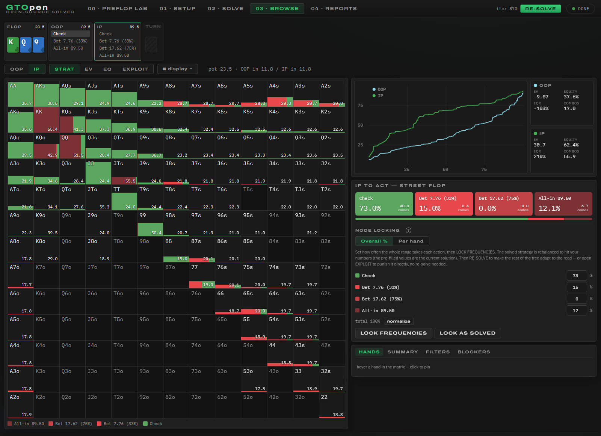
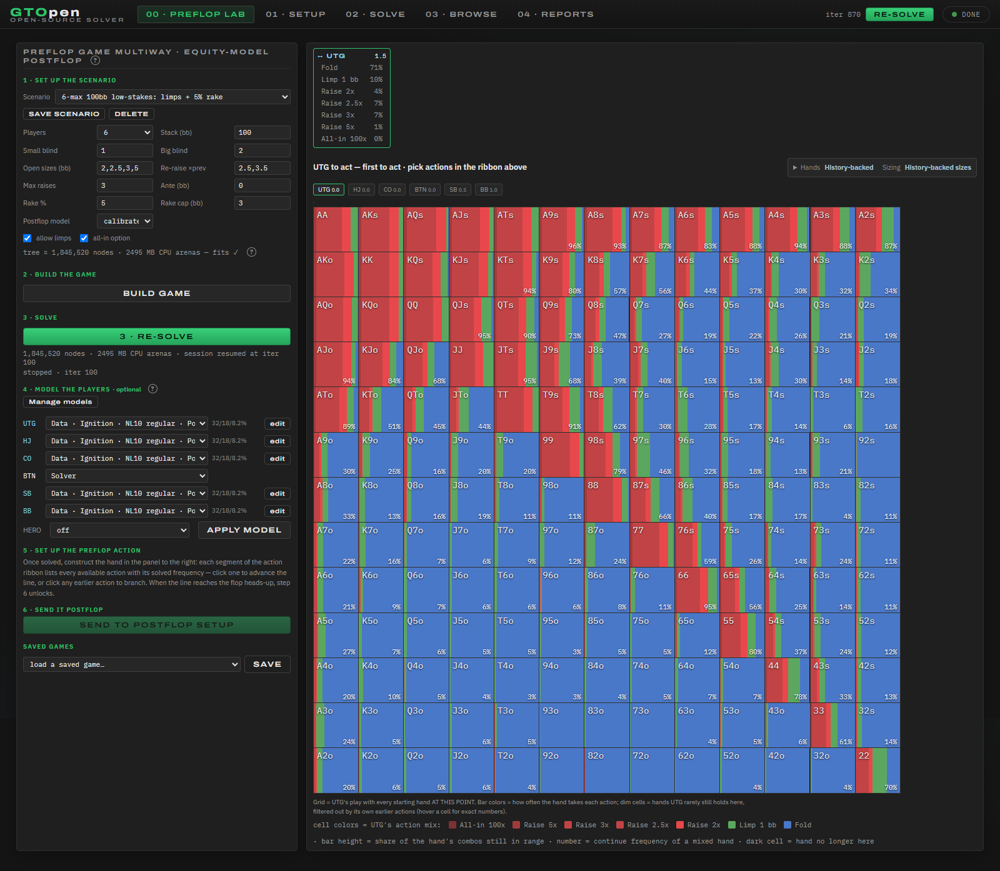
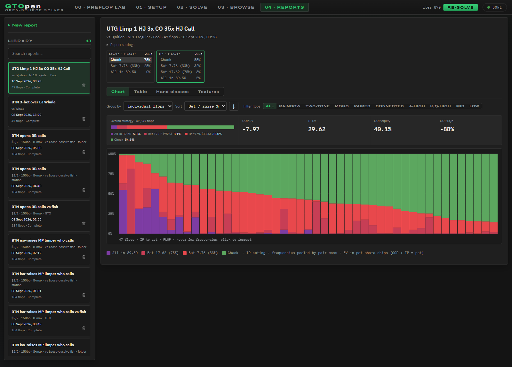

# GTOpen

An open-source no-limit hold'em solver with a local browser interface. Build custom preflop scenarios, study heads-up postflop play, model opponents, and compare strategies across hundreds of flops.

Runs on your computer with a Rust engine and optional NVIDIA CUDA acceleration. The browser UI needs no frontend build step.



## Get started

Install [Rust](https://www.rust-lang.org/tools/install) and Git, then clone the repository:

```sh
git clone https://github.com/MatthewPDingle/GTOpen.git
cd GTOpen
```

### Windows

Use the Rust MSVC toolchain and install the **Desktop development with C++** workload from Visual Studio Build Tools.

```powershell
.\GTOpen.cmd
```

The launcher builds the app, starts a local server, and opens your browser. If GTOpen is already running, it reopens that server and preserves its sessions.

For NVIDIA GPU acceleration, install the CUDA runtime compiler once before launching (requires Python/pip and an NVIDIA driver):

```powershell
python -m pip install --target .cuda-nvrtc nvidia-cuda-nvrtc-cu12
.\GTOpen.cmd
```

### Linux / WSL

Install a C/C++ build toolchain, then run:

```sh
./start.sh
```

Open **http://127.0.0.1:3737**. The launcher selects a CUDA build when it detects NVIDIA support; otherwise it builds for CPU. For CUDA without a full toolkit:

```sh
python3 -m pip install --target ~/.local/cuda-nvrtc nvidia-cuda-nvrtc-cu12
./start.sh
```

For a manual CPU build, run `cargo build --release -p server`, then `./target/release/gto-server` from the repository root.

The first build takes longer. Large trees need substantial RAM; GPU solving also depends on available VRAM. The app estimates memory before solving and can fall back to CPU.

## The workflow

| Tab | What to do |
| --- | --- |
| **00 · Preflop Lab** | Build a 2–9-player game, choose blinds and raise sizes, assign optional player models, and solve. Follow an action line to a heads-up flop, then **Send to postflop setup**. |
| **01 · Setup** | Enter or import both ranges, choose the board, and set pot, effective stack, rake, and bet sizes. |
| **02 · Solve** | After **Build tree** in Setup, solve the selected board. Watch convergence, stop/resume, and save the session. |
| **03 · Browse** | Follow the action ribbon and inspect strategy, EV, equity, and individual hands. Lock frequencies or a player model, then re-solve to study the response. |
| **04 · Reports** | Solve the Setup configuration across **47, 95, 184, or all 1,755 canonical flops**. Compare results by board, high card, hand class, or texture. |

You can start directly in Setup if you already have ranges. Preflop Lab is optional.

**Units:** preflop stacks and sizes are in big blinds; Small blind and Big blind specify the stake amounts (enter `2` and `2` for $2/$2). Postflop bet sizes are percentages of the pot; `33 75` offers two sizes, `a` means all-in, and `2.5x` means a raise multiple.

### Preflop and player models

Use **Manage models** to create, edit, copy, or remove models from the menus. Assign models to seats, then apply them and re-solve. The **Evidence** indicator distinguishes measured hand policies and sizing from estimates and fallbacks.

The library includes Ignition NL10 and CoinPoker NL10/NL25/NL50/NL100 models. Coverage differs by dataset, position, and situation; saved or edited models keep their own settings.



### Reports versus Browse

Reports use the configuration in **Setup** and solve each flop independently. You do **not** need to Build tree or run Solve first just to generate a report.

- **Standard report sizes** replaces Setup's bet menu with a shared report menu. Turn it off to use your Setup sizes.
- **Vs modeled villain** applies one available player model from the Preflop export. It does not copy Browse's manual locks or lock both players. The current selection prefers OOP when both players have models.
- **Open in Browse** rebuilds and solves the selected report spot; it does not load a stored full solve. Match the board, action line, sizes, and modeling assumptions when comparing frequencies. Different convergence targets can still produce differences.

Use **Group by → High card** in Chart or Table, click column headings to sort, or switch to Hand classes and Textures. Hover a strategy bar for every action's frequency, including zeroes. Search and delete completed reports from the library.



*Screenshots captured from the running app on 10 September 2026, using saved studies.*

## Save and update

Use the app's Save controls before closing or restarting the server. Files stay in the repository's `saves/` directory:

| Folder | Contents |
| --- | --- |
| `saves/` | Postflop solve sessions |
| `saves/preflop/` | Preflop game sessions |
| `saves/profiles/` | Saved player models |
| `saves/reports/` | Reports and their per-node summaries |

To update, finish or stop running jobs, save both sessions, and pull the latest code with `git pull`. Backend changes require a server restart and rebuild; reopening an already-running Windows server keeps its existing binary. See [Windows updates and shortcuts](docs/windows_updates.md) for the full procedure.

## What the results mean

- **Postflop** solves the configured heads-up tree. Results depend on the ranges, sizes, rake, locks, and convergence target you choose.
- **Preflop** uses an approximate continuation model. New games use coupled-deck equity for pots with three or more players; heads-up pots retain the configured realization model. It does not solve the full multiway game through the river, and overlapping tight ranges can still expose large card-removal errors. [Model details](docs/technical_reference.md#preflop-continuation-model).
- **Player models** combine observations and inference. Sparse or unsupported situations need estimates; a dataset label is not proof that every displayed hand frequency was observed.
- Postflop is heads-up only. There is no ICM, and saved solves use GTOpen's own format.

Older preflop saves keep their original equity model. **Re-solve** continues that model; save your work, then **Build game → Solve** to use the updated model in a fresh game.

## More detail

| Topic | Guide |
| --- | --- |
| Model coverage | [Ignition](docs/ignition_models.md) · [CoinPoker](docs/coinpoker_models.md) · [Player types](docs/player_types.md) |
| Model behavior | [Evidence labels](docs/model_evidence.md) · [Raise sizing](docs/preflop_action_sizing.md) · [Contextual preflop](docs/contextual_preflop.md) · [Contextual postflop](docs/postflop_contextual_model.md) |
| Running studies | [Overnight reports](docs/overnight_reports.md) · [Research setup](research/autoresearch/setup.md) |
| Development | [Engine, CLI, API, and runtime settings](docs/technical_reference.md) · [GPU benchmarks](research/autoresearch/gpu-pass.md) · [Preflop performance results](research/autoresearch/passes/03-preflop-20260910/README.md) · [Preflop research](research/preflop-evolution/README.md) |

The code is organized into `crates/solver` (Rust engine), `crates/server` (HTTP API), and `web` (browser UI).

```sh
# CPU tests
cargo test --release -p solver

# GPU integration tests (requires CUDA)
cargo test --release --features gpu --test gpu --test preflop_gpu -- --test-threads=1
```
