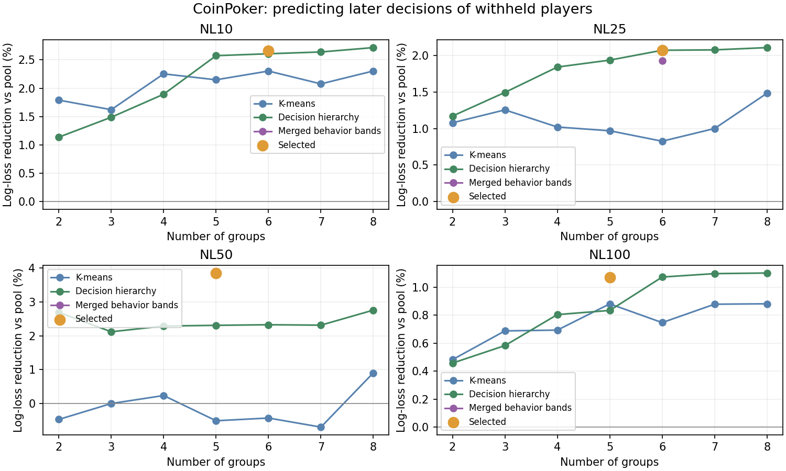

# CoinPoker player models by stake

Measured 8 September 2026 from HHDealer CoinPoker hand histories recorded in 2025. No raw histories or individual player identifiers are included in this public study.

## Using the library

In Preflop Lab, open **Manage models** and search **CoinPoker**, or choose a **CoinPoker · NL… · measured** group in a seat menu. **Pool** is the opponent average; the other entries describe fitted behavior groups. Hover a library entry for its source and sample size, or Edit it to inspect/copy its stats. Refresh is enough: the existing server reads `cache/archetypes.json` on request. Existing profiles and seat assignments are unchanged.

These models describe **seven-max ante tables with five to seven players dealt in**. They are not measurements of live casino games or no-ante tables. Date windows differ across stakes, so differences between stakes are not necessarily caused by the stake itself.

## Coverage

| Stake | Validated hands | Player names | Pool VPIP / PFR / 3-bet | Fitted types | Dates |
|---|---:|---:|---|---:|---|
| NL10 | 768,314 | 6,352 | 25.5 / 16.8 / 8.8 | 6 | 2025-06-17 to 2025-08-24 |
| NL25 | 794,406 | 4,902 | 24.7 / 17.1 / 8.9 | 6 | 2025-07-04 to 2025-08-24 |
| NL50 | 866,844 | 5,004 | 24.4 / 17.5 / 9.3 | 5 | 2025-05-26 to 2025-08-22 |
| NL100 | 729,191 | 5,020 | 24.7 / 17.5 / 9.3 | 5 | 2025-03-31 to 2025-08-22 |

Hand counts are distinct games; model sample sizes in the library are **player-hands**, not additional independent games. Names can overlap between stakes. Short-history players contribute to Pool even when they cannot be classified reliably.

## Validation and type selection

Each stake uses its last 14 calendar days as a temporal holdout. A stable hash additionally withholds 20% of player identities from both grouping and group-frequency estimation. Those players are assigned using only their earlier observations and scored on their later decisions. Types use 11 smoothed preflop/postflop features. We compare standardized k-means and a fitted decision hierarchy with 2–8 groups, plus the historical seven behavior bands remeasured on CoinPoker. Rare historical bands merge into the nearest supported group. All groups must contain at least 30 fitting players. Fixed seeds make fitting reproducible.

The decision hierarchy fits smoothed action distributions, emphasizing common situations and capping each player’s fitting weight at 3,000 hands. Its squared-error training criterion is only a proxy: every candidate is selected using the same later-action log-loss score. K-means fits players equally.

The score is opportunity-weighted multinomial log loss across entry/defense situations and street-specific betting/folding. Lower is better. A player-level bootstrap checks whether the gain over Pool is positive; it does not treat every action as independent. We select the smallest supported grouping within 0.1% of Pool log loss of the best candidate. This is model-selection validation, not an untouched final test set and not proof of natural, discrete player species.

| Stake | Method | Groups | Withheld players | Later opportunities | Gain over Pool | Old seven bins, refitted gain |
|---|---|---:|---:|---:|---:|---:|
| NL10 | behavior_bands | 6 | 140 | 135,133 | 2.66% | 2.66% |
| NL25 | tree | 6 | 130 | 293,477 | 2.07% | 1.93% |
| NL50 | behavior_bands | 5 | 92 | 316,913 | 3.85% | 3.86% |
| NL100 | behavior_bands | 5 | 73 | 134,917 | 1.07% | 1.07% |



The old-bin comparison remeasures the historical seven VPIP/PFR categories on the same CoinPoker training players; it does not use 2009 parameter values. Its unmerged benchmark can include poorly supported bins, so it is a comparison rather than an automatically publishable library. Published names are descriptive labels assigned **after** fitting. Sticky/High-fold means at least seven percentage points below/above that stake pool’s fold-to-flop-bet rate, not a claim about profitability or skill. When two groups share a label, their VPIP/PFR appears as a disambiguator.

## Models

| Stake / type | Players | Player-hands | VPIP | PFR | 3-bet | Fold vs flop bet |
|---|---:|---:|---:|---:|---:|---:|
| NL10 · Pool | 6,352 | 4,914,323 | 25.5 | 16.8 | 8.8 | 44.1 |
| NL10 · Moderate-mixed | 99 | 169,693 | 20.1 | 10.7 | 4.3 | 45.0 |
| NL10 · TAG · 20/16 | 672 | 2,560,824 | 20.4 | 16.0 | 8.6 | 47.7 |
| NL10 · Loose-mixed | 815 | 486,597 | 34.2 | 14.4 | 6.3 | 43.3 |
| NL10 · TAG · 28/20 | 841 | 1,479,237 | 27.9 | 19.7 | 10.3 | 42.0 |
| NL10 · Very loose-passive | 240 | 82,435 | 64.2 | 14.2 | 8.5 | 39.0 |
| NL10 · Very loose-mixed · Sticky | 60 | 18,814 | 59.3 | 35.5 | 20.2 | 35.2 |
| NL25 · Pool | 4,902 | 5,100,057 | 24.7 | 17.1 | 8.9 | 43.6 |
| NL25 · Loose-mixed | 394 | 224,284 | 40.7 | 24.0 | 11.5 | 38.3 |
| NL25 · Very loose-passive | 391 | 149,000 | 51.2 | 11.7 | 7.5 | 40.1 |
| NL25 · Moderate-mixed | 258 | 211,598 | 27.0 | 12.8 | 5.5 | 42.9 |
| NL25 · TAG · 27/20 | 547 | 1,358,764 | 26.9 | 19.6 | 10.1 | 42.9 |
| NL25 · TAG · 18/13 | 219 | 654,632 | 18.2 | 12.7 | 7.0 | 46.5 |
| NL25 · TAG · 21/17 | 441 | 2,411,602 | 21.2 | 16.9 | 8.8 | 46.2 |
| NL50 · Pool | 5,004 | 5,611,362 | 24.4 | 17.5 | 9.3 | 43.7 |
| NL50 · Moderate-mixed | 61 | 113,451 | 18.9 | 9.2 | 3.4 | 45.5 |
| NL50 · TAG · 21/17 | 676 | 3,616,350 | 21.2 | 16.9 | 9.2 | 45.5 |
| NL50 · Loose-mixed | 606 | 349,929 | 34.9 | 14.9 | 6.6 | 41.5 |
| NL50 · TAG · 28/21 | 722 | 1,381,218 | 27.8 | 20.6 | 10.9 | 42.6 |
| NL50 · Very loose-passive | 170 | 56,928 | 63.5 | 12.8 | 8.1 | 38.7 |
| NL100 · Pool | 5,020 | 4,712,268 | 24.7 | 17.5 | 9.3 | 43.6 |
| NL100 · Moderate-mixed | 74 | 81,549 | 21.3 | 9.1 | 3.5 | 46.7 |
| NL100 · TAG · 21/17 | 649 | 2,759,666 | 21.3 | 16.8 | 9.1 | 45.5 |
| NL100 · Loose-mixed | 600 | 313,304 | 34.7 | 14.6 | 5.9 | 42.0 |
| NL100 · TAG · 27/20 | 821 | 1,416,645 | 27.2 | 20.0 | 10.9 | 42.3 |
| NL100 · Very loose-passive | 132 | 48,598 | 59.9 | 15.2 | 7.7 | 38.5 |

## What is measured and what is approximated

- Every rate pools its actual opportunities and outcomes, rather than averaging players’ percentages weighted by unrelated hand counts. Exported estimates use 100 prior opportunities from the stake pool. The aggregate JSON records denominators, sparse fields and any engine constraints.
- Players need 100 earlier hands to fit/validate types. At publication, players with 100 total eligible hands can be assigned with smoothed estimates; shorter histories remain in Pool. Final production groups refit on all eligible earlier players, then aggregate the complete sample.
- The 3-bet field follows GTOpen’s cold single-raise bucket with no caller ahead. Squeezes are measured separately; this is not necessarily a tracker’s combined 3-bet statistic. Fold-to-3-bet and 4-bet refer to the original raiser. Limp-then-face-raise is separate from cold defense.
- Postflop betting with initiative, betting without initiative and facing-bet decisions have separate denominators. The engine’s donk field pools no-initiative bets/stabs; raises facing bets are pooled across streets. All-in runouts do not generate fictitious checks or betting opportunities.
- Position, stack band, actual occupancy and size-band counters are retained in each public aggregate. Current GTOpen archetype inputs still pool position/stack frequencies and use the engine’s positional shaping.
- `flatten=0` deliberately uses GTO reference hand ordering. Hole-card composition was not fitted; zero is a modeling assumption, not measured intelligence or skill. Shove responses still follow GTOpen’s adaptive large-bet model.
- The current engine can choose only the smallest/largest configured size. The exporter maps the majority opening-size band (up to 2.5bb versus larger) and bet-size band (up to 60% pot versus larger) to those choices. These are approximations, not an exact sizing distribution. Defense bands are floored at the overall 3-bet percentage where the engine requires it; such adjustments are recorded.
- Site population samples are not random censuses. Dealer coverage, observation dates, selection into long histories and unusual-hand exclusions can affect the results. Prediction gains do not establish an exploit EV gain or exact hand ranges.

## Data checks and exclusions

The parser validates action order, street progression, calls including short all-ins, stack limits, blind/button order, and exact cent-level contributions against the recorded total pot after uncalled returns. Forced blinds/antes are not VPIP. Sitting-out/out-of-hand seats are not dealt players. Implicit all-in raises are reconstructed only when their amount equals the actor’s remaining stack.

Deduplication is by hand ID within each site/stake input. Timestamp shifts, trailing padding and showdown-only differences do not create extra action observations. One inspected NL10 duplicate disagreed about the showdown winner; these models do not use winners, revealed cards or win rates. A conflicting **action** duplicate stops fitting for review.

Four-max tables, hands dealt to fewer than five players, extra/missing blinds, dead-button cases, irregular antes, under-minimum raises and multiple runouts are excluded from this release. Excluding those hands can particularly affect short-stack and all-in behavior; they are not quietly treated as standard situations.

| Stake | Raw records | Repeated IDs | Accepted | Excluded distinct hands |
|---|---:|---:|---:|---:|
| NL10 | 1,116,810 | 159,571 | 768,314 | 188,925 |
| NL25 | 1,186,044 | 246,791 | 794,406 | 144,847 |
| NL50 | 999,521 | 13 | 866,844 | 132,664 |
| NL100 | 896,342 | 37 | 729,191 | 167,114 |

Full exclusions, position/size counters, model-selection scores, opportunity counts and model parameters: [NL10](coinpoker/NL10.json), [NL25](coinpoker/NL25.json), [NL50](coinpoker/NL50.json), [NL100](coinpoker/NL100.json).

## Reproduce

Python 3.12; NumPy 1.26.4; scikit-learn 1.5.2; Matplotlib for the figure. No solver session is built or changed by the data pipeline.

```powershell
python -m unittest discover -s tools/coinpoker -v
python tools/coinpoker/analyze.py --source "T:/Dev/Poker Data/hhdealer/CoinPoker" --out output/coinpoker --workers 4
python tools/coinpoker/fit.py --input output/coinpoker --out docs/coinpoker --publish cache/archetypes.json
python tools/coinpoker/report.py
```

Per-player counters in `output/coinpoker` remain local. The fitting command without `--publish` creates reviewable aggregates without changing the library. Publishing replaces only the `Data · CoinPoker ·` collection and preserves other models. No raw data is uploaded.
