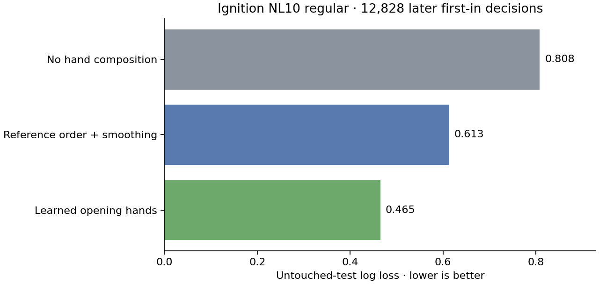
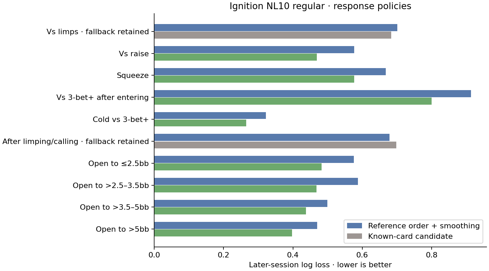
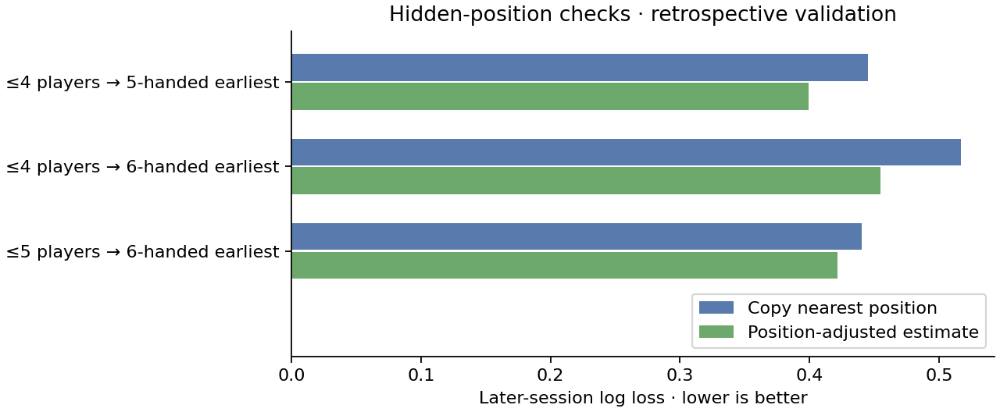
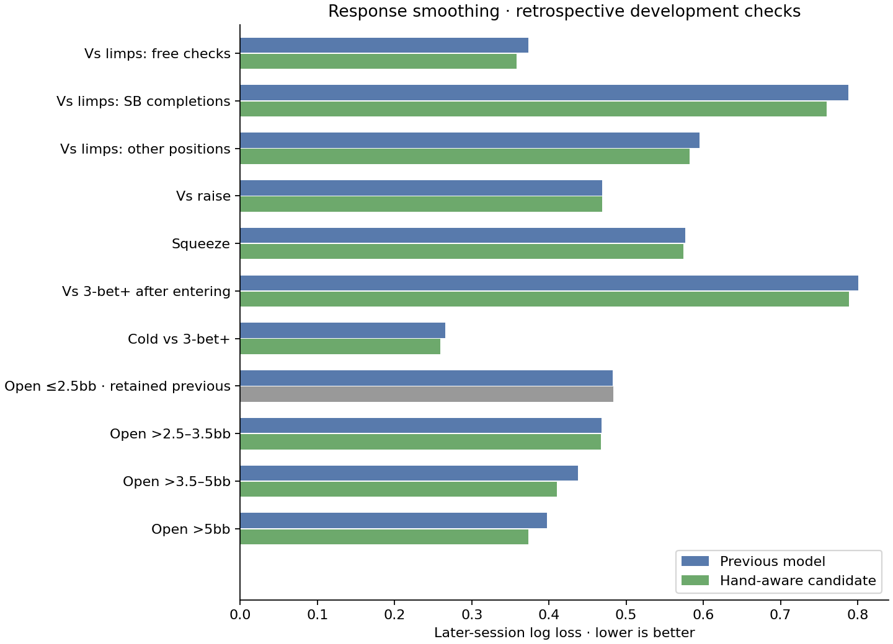

# Ignition NL10 regular: measured preflop ranges

Recorded 2025-08-20 to 2025-12-02; model built 8 September 2026. The library entry is **Ignition · NL10 regular · Pool**, under Manage models. This is an anonymous opponent pool, excluding every `[ME]` observation. It is a separate source from CoinPoker and is never presented as measured CoinPoker behavior.

## What the model contains

- **34,466 validated hands** in **555 file/session groups**, with three to six players dealt in. No ante; small blind 0.5bb. Stack depths are pooled.
- First-in hand probabilities use all known-card opportunities: raises, folds, and calls/completions. A player folding before showdown still has a known hand. The 169-hand index and combination weights match the Rust engine (pairs 6, suited 4, offsuit 12).
- Hand/action counts first borrow a global action prior, then each position/player-count/hand cell borrows the pooled hand estimate. Smoothing strengths are selected on separate later sessions. This gives probabilities rather than cutting a deterministic range from reference rankings.
- The engine consumes these probabilities directly for Unopened, Vs Raise, Squeeze, and Vs 3-bet+. Cold re-raise responses and four opening-size bands have their own known-card policies. Vs Limps now uses separate legal-action and limper-count policies described below. Defense after limping/calling remains inferred. Postflop hand composition remains inferred.
- The editor's dataset checkbox keeps published measured policies active. Disabled HUD fields display source rates; each tab labels its provenance. Uncheck to edit those rates and return to reference-generated ranges. Hand painting remains available. Saved profiles preserve the dataset for later generation.
- Unsupported early opening positions use the positional adjustment below; other unsupported positions/table counts borrow the nearest observed context; outside three to six players is visibly labeled as extrapolation. Ante and blind-ratio changes are labeled as unvalidated transfers. None of this establishes a live-casino or cross-site population model.

## Validation

Sessions are split chronologically: training before 2025-10-05; tuning from that date until 2025-11-03; untouched test from 2025-11-03. Entire sessions crossing a boundary are excluded from evaluation (4); they return only for the final production refit. Split sizes: 331 training, 137 tuning, 83 test sessions. This prevents adjacent hands in the same session being scattered across training and test.

The selected smoothing uses 10 prior opportunities per context/hand and 5 per pooled hand. The final test contains **12,828 first-in decisions**.

| Predictor | Untouched-test multinomial log loss (lower is better) |
|---|---:|
| Hand-independent contextual action frequencies | 0.80821 |
| Reference-ordered ranges with measured context totals and tuned smoothing | 0.61275 |
| Learned known-card ranges | 0.46486 |

Learned ranges reduce log loss by **24.1%** versus the reference comparator. A 1,000-resample session bootstrap gives a positive 95% interval for absolute log-loss improvement: **0.1383 to 0.1578**. The comparator uses GTOpen's OPEN_SCORE plus cached equity tie-breaking, fills to training context totals, and tunes a probability mixture on validation sessions. It is a smoothed reference-order benchmark, not a fresh equilibrium solve for the held-out games. The global-frequency comparator likewise receives no test labels.

These scores measure action prediction, not exploit profitability or solver accuracy. Final publication refits the chosen method on all validated sessions after the untouched test is scored. Future periods and different sites remain untested.



## Response-range extension

Known cards are now counted separately for each preflop decision situation, including folds. Cold responses (no voluntary investment yet) are separated from responses after entering. BB checks behind limpers count as passive decisions; forced blind posts do not. All hero observations are excluded before fitting.

Each situation uses its own smoothing parameters, selected on the original chronological tuning sessions. The later-session holdout is used to evaluate and screen publication. Learned policies are published only when a 1,000-resample session bootstrap gives a positive lower 95% bound on improvement over the reference-order comparator. These are per-comparison intervals, not a simultaneous guarantee across all situations. No parameter search was repeated after seeing the response test results. The opening evaluation above is unchanged.

| Situation | Source decisions | Test decisions | Reference log loss | Learned log loss | Published policy |
|---|---:|---:|---:|---:|---|
| Vs limps | 13,637 | 1,793 | 0.7015 | 0.6833 | Inferred fallback |
| Vs raise | 45,099 | 8,456 | 0.5764 | 0.4689 | Learned |
| Squeeze | 7,366 | 1,195 | 0.6684 | 0.5768 | Learned |
| Vs 3-bet+ after entering | 6,873 | 1,226 | 0.9135 | 0.8003 | Learned |
| Cold vs 3-bet+ | 5,590 | 1,125 | 0.3224 | 0.2656 | Learned |
| After limping/calling | 3,744 | 524 | 0.6788 | 0.6984 | Inferred fallback |
| Open to ≤2.5bb | 20,018 | 5,168 | 0.5756 | 0.4826 | Learned |
| Open to >2.5–3.5bb | 20,348 | 2,604 | 0.5872 | 0.4685 | Learned |
| Open to >3.5–5bb | 3,636 | 570 | 0.4990 | 0.4377 | Learned |
| Open to >5bb | 1,097 | 114 | 0.4698 | 0.3975 | Learned |

The comparator uses the same continue/raise ordering rules as the zero-naivety generator: reference CALL+THREEBET for cold defense, half reference/strength ordering for raises, strength ordering for re-raises. It receives training-only context action totals and reaching-hand weights, with a separately tuned probability mixture. It is a smoothed benchmark, not an exact replay of every saved model or an equilibrium solve.



**Limits that remain:** these are pooled anonymous opponents, not individually tracked players. Position/player count is conditioned within each situation, but aggressor position, stack depth, preceding action sequence and re-raise depth are pooled. The Vs 3-bet+ grid is conditional on prior entry; a separate cold policy is applied when no voluntary chips were invested. Vs Raise shows the pooled grid; actual play uses the matching size-band policy. The >5bb band has only 114 test decisions, so its estimate is particularly uncertain. Very large responses still follow the model's explicit adaptive-stack threshold. Raise/jam sizing is chosen from the configured menu rather than learned as a separate action-size distribution. Transfers to 8-handed equal-blind live games remain unvalidated and are labeled in the editor.

Existing copies and saved games retain their compiled ranges. Select the updated built-in Ignition pool to generate the new response policies. Raw histories and session-level counts stay local.

## Vs Limps refinement

The original pooled Vs Limps candidate above was rejected. Its replacement separates **free checks**, **SB completions**, and **other paid entries**, then conditions on position/player count and **one, two, or three-plus limpers**. The editor exposes these three counts; the engine selects them from the actual history. Forced posts, antes and free checks never add a limper. An equal-blind SB checks free and borrows BB observations: this transfer remains unvalidated.

| Decision | Source | Later evaluation | Reference log loss | Refined log loss | Improvement |
|---|---:|---:|---:|---:|---:|
| BB free checks | 3,682 | 465 | 0.4233 | 0.3733 | 11.8% |
| SB completions | 3,277 | 443 | 0.8641 | 0.7876 | 8.9% |
| Other positions | 6,678 | 885 | 0.7170 | 0.5950 | 17.0% |

These results are **retrospective chronological validation**, not a fresh untouched test: the late period was already inspected during the initial response work. This refinement's candidate family was fixed before scoring that period, with smoothing and blend weights selected on earlier tuning sessions. All three session-bootstrap improvement intervals have positive lower bounds, but a new period is needed for independent confirmation. Prediction improvement does not establish profitable exploitation.

The earlier BB and SB policies blended learned hand probabilities and a smoothed reference model **50/50**. This blend was subsequently replaced by the hand-aware smoothing below because it injected substantial premium-hand folds. Other positions use the learned probabilities. Sparse cells borrow pooled hand, position and player-count estimates. There are 11,234 decisions facing one limper, 2,024 facing two, and only **379 facing three or more** across all roles. Unsupported contexts use the nearest available context, not invented observations. Limper identity/position, exact preceding sequence, stack depth and isolation sizing remain pooled; after-limp defense is still inferred.

Existing saved games/copies keep their ranges. Select the updated built-in Ignition pool, or regenerate a model using its updated dataset, to use these policies. Painting one count changes only that count's entry policy.

See [additional data sources and the sample checklist](poker_datasets.md) before acquiring more histories.

## Opening positions beyond six-handed coverage

The earlier nearest-position fallback copied the six-handed earliest opening policy to eight-handed UTG, UTG1 and MP. UTG and UTG1 now receive a **position-adjusted estimate**. MP and all originally supplied non-extrapolated opening matrices remain unchanged, as do every response policy and the original validation scores.

The adjustment uses fold/call/raise counts including known folded hands. A regularized multinomial model estimates a shared positional trend, with shrunk deviations for pairs, suited hands and offsuit hands, individual hand intercepts and nuisance terms for observed table sizes. Its positional log-odds change tilts the nearest measured hand policy; it does not replace that policy with ranked ranges. Extra occupancy effects are not extrapolated. Both entry-versus-fold slopes are constrained to be nonpositive and capped at 0.75 log-odds per added position. This structural restraint is a modeling assumption, not a measured law for every hand.

Smoothing of the anchor uses the previously fixed opening parameters. Trend regularization and adjustment strength are selected on earlier tuning sessions, using only smaller tables for each prediction exercise. Entire larger-table contexts are removed from training; later sessions provide the comparison below.

| Hidden-context exercise | Extra early positions | Evaluation decisions | Nearest log loss | Adjusted log loss | Improvement |
|---|---:|---:|---:|---:|---:|
| ≤4 players → 5-handed earliest position | 1 | 1,532 | 0.4449 | 0.3990 | 10.3% |
| ≤4 players → 6-handed earliest position | 2 | 2,660 | 0.5171 | 0.4547 | 12.1% |
| ≤5 players → 6-handed earliest position | 1 | 2,660 | 0.4404 | 0.4218 | 4.2% |

All three 2,000-resample session-bootstrap improvement intervals have positive lower bounds. The two six-handed exercises reuse the same decisions, so their counts are not additive independent observations. Intervals are per comparison. This is **retrospective validation** on a period already inspected in prior work, not a fresh untouched test or proof of eight-handed/live-game accuracy.



For eight players, the final model raises/limps approximately **11.6%/9.2% UTG**, **15.0%/9.5% UTG1**, and **19.0%/9.8% MP**. Adjustment stops after two extra positions, the greatest distance checked here; the earliest nine-handed position therefore retains that capped estimate and explicitly says so. Source 3–6-player positions keep their measured probabilities. Other table sizes with the same players left to act retain the existing borrowed-context probabilities and are labeled accordingly. Blind-ratio, stakes and site transfers remain unvalidated.

The range editor labels each opening grid as measured, borrowed across table sizes, or position-adjusted. Existing saved copies retain their old dataset; select the updated built-in Ignition pool to generate the new estimates.

## Hand-aware response smoothing

The SB 3+ limper grid exposed an artifact: a hand-independent reference mixture contributed a minimum 11.6% fold probability to every hand, including premiums. This was a modeling assumption, not observed premium-hand folding. The new response smoother has **no population-wide action-percentage mixture**. Openings, including the positional adjustments above, are unchanged.

Sparse hands first borrow observations from nearby ranks within the same pair/suited/offsuit family, then from the same hand across contexts. Own-hand counts and the selected smoothing strengths determine the resulting probabilities. Limper count and free-check/completion/other-entry distinctions remain intact. A tiny 0.001 pseudo-count avoids numerical zeroes in paid situations; it is not a constant probability floor. Free checks have exactly zero folding. No premium hand is hard-coded to always continue.

Squeeze additionally borrows the same hands from ordinary cold raise-response data, with fitted hand-family action offsets to match squeeze tendencies. This is transfer between related situations, not a claim that they have identical strategies. Raise-size and prior-entry distinctions remain in use.

| Situation | Later decisions | Previous log loss | Candidate log loss | Production |
|---|---:|---:|---:|---|
| Vs limps: free checks | 465 | 0.3733 | 0.3580 | Updated |
| Vs limps: SB completions | 443 | 0.7876 | 0.7594 | Updated |
| Vs limps: other positions | 885 | 0.5950 | 0.5822 | Updated |
| Vs raise | 8,456 | 0.4689 | 0.4686 | Updated |
| Squeeze | 1,195 | 0.5768 | 0.5741 | Updated |
| Vs 3-bet+ after entering | 1,226 | 0.8003 | 0.7889 | Updated |
| Cold vs 3-bet+ | 1,125 | 0.2656 | 0.2590 | Updated |
| Open ≤2.5bb | 5,168 | 0.4826 | 0.4831 | Prior policy retained |
| Open >2.5–3.5bb | 2,604 | 0.4685 | 0.4669 | Updated |
| Open >3.5–5bb | 570 | 0.4377 | 0.4103 | Updated |
| Open >5bb | 114 | 0.3975 | 0.3729 | Updated |

Parameters minimize 75% overall tuning log loss plus 25% equally weighted premium/other-pair/other-suited/other-offsuit tuning loss. Publication requires lower retrospective mean loss and no clearly negative 95% session-bootstrap improvement interval for a subgroup with at least 30 decisions. This screen does **not** prove noninferiority: several overall and subgroup intervals overlap zero, some subgroup means worsen, and some premium samples are very small. The ≤2.5bb response band retains its prior learned policy because the candidate did not improve overall loss.

The candidate family was expanded after initial results: broader smoothing strengths, then related-context transfer for squeeze. All comparisons reuse previously inspected historical evaluation sessions; they are development diagnostics, **not an untouched test**. Independent future-period validation remains necessary. The aggregate JSON contains all candidates, subgroup loss, observed/predicted fold rates and bootstrap intervals; do not add overlapping size-band and pooled sample counts.

For the reported eight-handed SB-versus-3+ limpers preview (borrowing the six-handed SB context):

| Hand | Previous fold | Updated fold estimate |
|---|---:|---:|
| AA | 16.37% | 0.011% |
| KK | 14.86% | 0.007% |
| QQ | 16.11% | 0.006% |
| AKs | 16.67% | 0.006% |
| AKo | 12.24% | 0.359% |

These small values reflect the prior and limited observations, not precisely established population rates. See [full diagnostics](ignition/NL10.json).



The running app reads the library on request, so the library and provenance can update without rebuilding or restarting the solver. Refresh the browser and select the built-in Ignition pool; existing saved copies/solves retain their compiled policies. CoinPoker models and postflop composition are unchanged.

## Observed first-in opening sizes

The model now uses **18,511 validated non-all-in first-in raises**, excluding the hero, isolation raises, and 146 opening jams. Ordinary opening size is sampled from the observed position/player-count distribution, with 30 pooled pseudo-observations for sparse contexts. Existing opening hand probabilities are unchanged: size is independent of hand conditional on raising. Stacks are pooled, so this does not establish deep-stack or short-stack size-specific hand ranges.

At runtime each observed bb amount maps to the nearest available **non-jam** raise size by logarithmic distance (ties smaller). Mass is conserved; an unsupported menu size can still receive exactly zero. No artificial exploration floor is added. A single-size menu necessarily concentrates all ordinary raising mass there. Menus outside historical coverage are an unvalidated approximation. Jams, isolation raises and re-raises keep their prior rules. The editor calls min/max sizing the fallback rule; measured first-in mixes take precedence unless the user explicitly chooses jam.

Example projection to the screenshot's 2 / 2.5 / 3 / 5bb menu, conditional on ordinary raising:

| Position role (0 BTN, 1 CO, 2 HJ, 3 UTG, -1 SB) | Direct opening samples | 2bb | 2.5bb | 3bb | 5bb |
|---|---:|---:|---:|---:|---:|
| -1 | 1,020 | 10.5% | 10.9% | 74.7% | 3.8% |
| 0 | 1,825 | 11.0% | 52.5% | 32.0% | 4.4% |
| 1 | 1,893 | 13.1% | 46.0% | 36.3% | 4.5% |
| 2 | 2,185 | 21.4% | 37.4% | 35.8% | 5.4% |
| 3 | 2,556 | 23.3% | 34.5% | 35.8% | 6.4% |

Shrinkage strength was selected on earlier chronological tuning sessions. On 3,383 later-session opening-size observations, contextual size log loss was **1.0990**, versus **1.1527** for pooled sizes. This checks the fixed diagnostic menu above; production retains exact amounts. These previously inspected periods are retrospective development evidence, not a fresh test or a guarantee at other stakes. The deterministic legacy largest-size rule assigns zero to other bins; its epsilon-clipped loss is stored for diagnosis, not used as a strong validation claim.

This feature requires the updated server binary; older binaries ignore the new size metadata and retain min/max behavior.

Unreachable action histories now carry an explicit reason in the API and UI, suppress the hand strategy and ribbon percentages downstream, and cannot export an empty-range flop. A reachable node with no accumulated strategy is marked unsolved. No solve averages are modified by browsing. Existing saved games remain loadable and preserve their old compiled policies until updated and re-solved.

Reproducing the size artifact (after the preceding analysis/model steps):

```powershell
python tools/ignition/sizes.py --input output/ignition/analysis.json --out docs/ignition --publish
```

## Sample depth

Roles: BTN=0, CO=1, HJ=2, LJ=3, continuing backwards; SB=-1. BB has no first-in opening decision after everyone folds. Many cells are sparse, which is why estimates borrow information rather than reporting every observed fraction as precise.

| Players | Role | First-in opportunities | Hand classes observed | Median opportunities per class |
|---|---:|---:|---:|---:|
| 3 | -1 | 697 | 157 | 3 |
| 3 | 0 | 1,204 | 168 | 7 |
| 4 | -1 | 1,417 | 168 | 8 |
| 4 | 0 | 2,478 | 168 | 13 |
| 4 | 1 | 3,413 | 169 | 15 |
| 5 | -1 | 2,615 | 169 | 12 |
| 5 | 0 | 4,562 | 169 | 20 |
| 5 | 1 | 6,598 | 169 | 29 |
| 5 | 2 | 9,033 | 169 | 41 |
| 6 | -1 | 2,706 | 168 | 13 |
| 6 | 0 | 4,881 | 169 | 24 |
| 6 | 1 | 7,345 | 169 | 37 |
| 6 | 2 | 10,340 | 169 | 45 |
| 6 | 3 | 14,060 | 169 | 68 |

## Parsing and exclusions

The adapter validates dealt-card uniqueness and board/hole-card consistency, converts Ignition's raise amount (chips added) to the solver replay's raise increment, and handles both `All-in` and `All-in(raise)` forms. The shared replay validates action order, complete street transitions, exact calls/returns, stacks and cent-level pot accounting. Forced blinds never count as VPIP. Hero observations are excluded before any population aggregation or fitting.

Nonstandard/dead blind arrangements, extra posted chips, heads-up hands, under-minimum raises and malformed/incomplete records are excluded and counted in [the aggregate audit](ignition/NL10.json). These exclusions can bias short-stack/nonstandard-game representation. Source labels are anonymous seat positions, so this release does not claim persistent-player archetypes. File/session grouping is a conservative split unit, not a persistent opponent identity.

## Reproduce

```powershell
python tools/ignition/test_models.py
python tools/ignition/analyze.py --source "T:/Dev/Poker Data/Ignition" --out output/ignition
python tools/ignition/fit.py --input output/ignition/analysis.json --out docs/ignition
python tools/ignition/responses.py --input output/ignition/analysis.json --out docs/ignition
python tools/ignition/limps.py --input output/ignition/analysis.json --out docs/ignition
python tools/ignition/positions.py --input output/ignition/analysis.json --out docs/ignition --publish
python tools/ignition/smoothing.py --input output/ignition/analysis.json --out docs/ignition --publish
python tools/ignition/report.py
```

Requires NumPy, SciPy, scikit-learn and Matplotlib, plus `cache/preflop_eq169.bin` for the reference comparator. Analysis and fitting do not mutate a solver session. Raw histories and session-level observations remain local; only aggregate counters, context coverage, validation and model parameters are published. See also [CoinPoker models](coinpoker_models.md).
