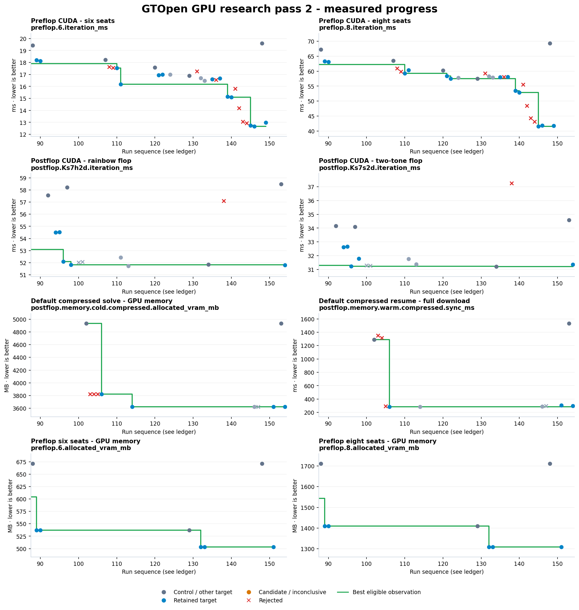

# GPU research pass 2

Approximately three-hour pass: 7 September 2026, 03:57–06:55 UTC. The retained changes are
in the shared checkout. This pass found **14 retained improvement
families** across preflop CUDA, postflop CUDA, and GPU memory/transfers.
No precision, solver model, bet menu, target, or learning algorithm was changed.

[Tracking webpage](index.html) · [All measurements](results.tsv) ·
[Validation evidence](gpu-validation.json) · [Retained source patch](patches/gpu-pass-retained.patch) ·
[Earlier progress notes](gpu-pass-milestones.md) · [Next-pass handoff](gpu-pass-handoff.md) · [Pass 1 report](report.md)

## Time to the same accuracy

These are fresh comparisons with the implementation at the start of this pass,
commit `a557aede`, rebuilt using the same frozen workloads.
Preflop still stops at exactly **175 / 125 iterations**, with identical complete
arena, gap, and EV fingerprints. Postflop still stops at **200 / 200 / 60 iterations**
and the same final exploitability values, using the unchanged 0.3%-pot target.

| Workload / metric | Before | Final | Reduction | Evidence |
|---|---:|---:|---:|---|
| Preflop, six seats | 3.549 s | 2.317 s | 34.7% | [B034](raw/B034.log) / [G001](raw/G001.log) |
| Preflop, eight seats | 8.926 s | 5.323 s | 40.4% | [B034](raw/B034.log) / [G001](raw/G001.log) |
| Postflop, rainbow flop | 12.067 s | 11.107 s | 8.0% | [B034](raw/B034.log) / [G002](raw/G002.log) |
| Postflop, two-tone flop | 7.219 s | 6.667 s | 7.6% | [B034](raw/B034.log) / [G002](raw/G002.log) |

The time-to-target workload excludes initial tree construction and GPU upload.
Lifecycle costs are measured separately below. Timings vary with machine state;
the report uses fresh controls, and the ledger retains earlier repetitions.

## Iteration throughput

The fixed workload uses five warm-up iterations followed by three measured
20-iteration batches. Entries are the median batch time per iteration.

| Workload / metric | Before | Final | Reduction | Evidence |
|---|---:|---:|---:|---|
| Preflop, 6 seats | 19.612 ms | 12.981 ms | 33.8% | [B034](raw/B034.log) / [G001](raw/G001.log) |
| Preflop, 8 seats | 69.358 ms | 41.768 ms | 39.8% | [B034](raw/B034.log) / [G001](raw/G001.log) |
| Preflop, 9 seats | 315.572 ms | 185.170 ms | 41.3% | [B034](raw/B034.log) / [G001](raw/G001.log) |
| Postflop, rainbow flop | 58.500 ms | 51.796 ms | 11.5% | [B035](raw/B035.log) / [G005](raw/G005.log) |
| Postflop, two-tone flop | 34.590 ms | 31.358 ms | 9.3% | [B035](raw/B035.log) / [G005](raw/G005.log) |

The nine-seat workload contains 1,825,426 nodes. Two- and three-seat trees are
also checked: the adaptive launch policy keeps larger blocks for narrow levels,
so the large-tree improvement does not impose the rejected universal-64-thread
policy's small-tree latency cost.

## GPU and host memory

| Workload / metric | Before | Final | Reduction | Evidence |
|---|---:|---:|---:|---|
| Preflop 6 seats: GPU allocation | 671.089 MB | 503.316 MB | 25.0% | [B034](raw/B034.log) / [G003](raw/G003.log) |
| Preflop 8 seats: GPU allocation | 1,711.276 MB | 1,308.623 MB | 23.5% | [B034](raw/B034.log) / [G003](raw/G003.log) |
| Two-tone compressed: GPU allocation | 4,932.502 MB | 3,623.879 MB | 26.5% | [B035](raw/B035.log) / [G005](raw/G005.log) |
| Rainbow compressed: GPU allocation | 6,241.124 MB | 5,905.580 MB | 5.4% | [B035](raw/B035.log) / [G005](raw/G005.log) |
| Two-tone compressed: cold live host RAM | 5,317.960 MB | 2,300.477 MB | 56.7% | [B035](raw/B035.log) / [G005](raw/G005.log) |
| Two-tone compressed: warm live host RAM | 5,318.644 MB | 3,769.422 MB | 29.1% | [B035](raw/B035.log) / [G005](raw/G005.log) |

MB are decimal. GPU allocation is measured through device free-memory deltas.
Live host RAM is the Windows process working set after the specified lifecycle;
it includes driver and allocator behavior and is distinct from GPU VRAM.
The default application uses compressed CPU stores. F32 stores retain direct
full action arenas when the VRAM budget permits; a tight budget can use the exact
compact representation. Trees with less than 5% action-storage savings skip packing.

## Initialization and readback

| Workload / metric | Before | Final | Reduction | Evidence |
|---|---:|---:|---:|---|
| Two-tone compressed: cold initialization | 1,667.706 ms | 624.819 ms | 62.5% | [B035](raw/B035.log) / [G005](raw/G005.log) |
| Two-tone compressed: warm initialization | 1,707.969 ms | 1,064.163 ms | 37.7% | [B035](raw/B035.log) / [G005](raw/G005.log) |
| Two-tone compressed: warm full download | 1,531.001 ms | 297.399 ms | 80.6% | [B035](raw/B035.log) / [G005](raw/G005.log) |
| Rainbow compressed: cold initialization | 1,630.134 ms | 840.781 ms | 48.4% | [B035](raw/B035.log) / [G005](raw/G005.log) |
| Rainbow compressed: warm full download | 1,655.883 ms | 340.291 ms | 79.4% | [B035](raw/B035.log) / [G005](raw/G005.log) |

Independent repeat G003 covers the same final lifecycle. Retained transfer
changes reuse a pinned staging allocation and encode independent node blocks
in parallel on download. Parallel chunk decoding on upload was rejected after
it made every measured compressed initialization case slower.

The fixed report-adaptation workload also retained its exact 80-iteration result:
4.914s in B028 to
3.630s in G004. B028 is an
earlier within-pass control, not the fresh pass-start comparison used above.

## Repeated evaluation

| Workload / metric | Before | Final | Reduction | Evidence |
|---|---:|---:|---:|---|
| Two-seat preflop: first check | 0.352 ms | 0.257 ms | 27.2% | [B035](raw/B035.log) / [G005](raw/G005.log) |
| Two-seat preflop: steady checks | 0.371 ms | 0.104 ms | 72.0% | [B035](raw/B035.log) / [G005](raw/G005.log) |
| River postflop: first check | 0.863 ms | 0.759 ms | 12.0% | [B035](raw/B035.log) / [G005](raw/G005.log) |
| River postflop: steady checks | 0.791 ms | 0.310 ms | 60.8% | [B035](raw/B035.log) / [G005](raw/G005.log) |

Steady checks are the median after the first eager check and graph-capture check.
First-check timings are listed separately; short startup measurements are noisier
and graph reuse benefits repeated checks most. Large-flop checks are also recorded
in the tracker, without claiming the small-river percentage applies to them.

## What changed

| Research path | Retained implementation families |
|---|---|
| Preflop CUDA | Separate terminal entry points for common seat counts; common-action specialization; reusable evaluation graphs and batched root downloads; block-shared terminal uniforms for generic seat counts; an exact 128-thread reach-mass reduction; adaptive 256/64-thread non-reduction launches. |
| Postflop CUDA | Common-action specialization in both sweeps; reusable evaluation graphs, with the original eager first-check path and invalidation when lock buffers change. |
| GPU memory and transfers | Remove the preflop sigma arena; reuse preflop action-value scratch across levels; pack visited postflop action arenas while preserving inactive state; reuse postflop action/chance CFV scratch; reuse pinned staging and parallelize compressed readback. |

E021–E038 cover 18 hypothesis families. Four were rejected entirely: universal
shared terminal uniforms, postflop card-run loops, explicit equity-loop unrolling,
and parallel upload decoding. Additional refinements were rejected when a better
variant won. All measurements, including failures, remain in the ledger.

## Accuracy and regression validation

The final combined source passed **124 CPU tests, 42 GPU tests, and the server
continuation test** in the actual shared checkout. The separate final report run
also passed its benchmark and continuation test. Source hashes attest which code
the suites compiled; all frozen workload hashes are checked in both checkouts.

The combined research runs reproduce:

- Seven complete preflop arena/gap/EV fingerprints at 2/3/5/6/7/8/9 seats.
- 48 preflop variants covering seat counts, menus, frozen players, hero and locks.
- Exact normal-versus-tight-cache preflop results and unchanged target stopping states.
- 24 original postflop saved-state fingerprints and 24 action-menu/algorithm/lock cases.
- 112 resume snapshots across cold/warm, F32/compressed and isomorphism on/off cases,
  including save bytes, CPU query materialization, lock updates, and resumed EVs.
- Exact large lifecycle evaluation bits and repeated first/capture/steady evaluation results.
- Focused scratch-lifetime and signed-zero tests, plus the original CUDA/CPU equivalence suites.

The audit records **696 successful source/numerical/suite checks**
across retained and final runs. This demonstrates unchanged results on the tested
coverage; performance percentages are specific to these workloads and hardware.

## Measurement record and limits

Hardware: RTX 3090 24 GB, Ryzen 5950X, 64 GB RAM, 16 solver threads, Windows.
GPU benchmarks ran serially. Fresh original-code controls B034/B035 bracket the
final validation phase; G001–G005 run the combined retained implementation.
Repeated-check graphs improve steady evaluation, especially small river solves;
first-check and capture timings are recorded separately and remain noisier.

One initial E026 measurement reused an older Cargo artifact after a copy preserved
its timestamp. That measurement is explicitly invalidated and excluded from plots.
The runner now hashes compiler inputs and refreshes changed input timestamps.
E026A and later runs are rebuilt measurements. E038's commit attribution was
corrected in an append-only audit event; its source bytes were unchanged during
the run, and the experiment was rejected on performance grounds.

This pass recorded **67 runs**; the cumulative tracker contains
**130 metric graphs**, with individual histories and per-chart
run-to-experiment tables. Gray points are controls or metrics collected alongside
another target; blue points are retained targeted results; crosses are rejected
or failed trials; green is the best eligible observation, not an average.

The source is ready for the normal application rebuild/restart. The existing live
application and its saved/current sessions were left running unchanged. Changes
remain reviewable in the shared working tree; nothing was pushed.
