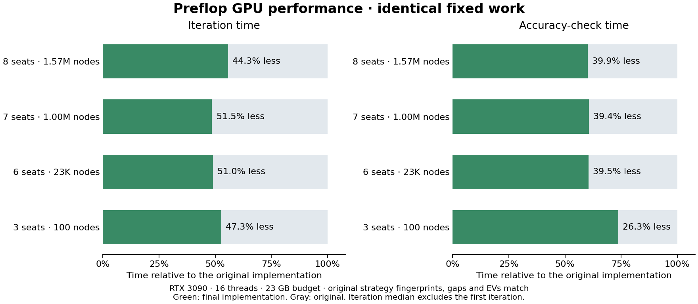

# Preflop performance research — 10 September 2026

**Status: final convergence validation is running. The live app has not been updated.**

This ten-hour pass runs from 11:34 to 21:34 UTC (07:04 Adelaide on 11 September). It focuses on preflop performance. Postflop solver code, player-model data, betting options, precision, and the 1,024 coupled-deck samples are unchanged.

The accepted implementation is frozen at `4878044`. The pre-pass GPU reference is `1b8fc3f`. Experiments and controls ran in a separate worktree on the Ryzen 5950X / RTX 3090, with 16 solver threads and the live app left idle. Rejected candidates remain in the evidence.

## GPU results

Same inputs, iteration counts and starting states. Values are milliseconds; iteration timing is the median after the first iteration.

| Fixture | Original iteration | Final iteration | Less iteration time | Original accuracy check | Final accuracy check |
|---|---:|---:|---:|---:|---:|
| 8 seats, 1,567,754 nodes, native 74→80 | 9,788.29 | 5,456.62 | 44.3% | 11,699.70 | 7,033.90 |
| 7 seats, 1,003,570 nodes, fresh 0→4 | 2,820.81 | 1,369.16 | 51.5% | 5,919.96 | 3,586.22 |
| 6 seats, 23,038 nodes, fresh 0→6 | 99.53 | 48.81 | 51.0% | 133.56 | 80.76 |
| 3 seats, 100 nodes, fresh 0→30 | 2.48 | 1.31 | 47.3% | 3.33 | 2.46 |

Every listed final arena fingerprint, gap and EV matches its original control. These short controls measure fixed work, not convergence time. The longer comparisons below address accuracy targets separately.

For the eight-seat fixture, the planned solver allocation falls from **20,889 MB to about 13,075 MB**, including CDF scratch falling from 16,550 MB to 8,445 MB. These are allocation-plan estimates, not total device residency or a universal memory reduction.

The final six-seat modeled-player controls also match literal deployed behavior at 19 GB and 21 GB budgets, plus a saved coupled game with five seats frozen. For each, the independent native comparator checked all **623,785,422 stored arena values** and **311,892,711 effective action-policy entries**, with exact finite values and matching metadata.

## Accuracy-target comparisons

**The independent final modeled comparison passed; the extended eight-seat comparison is still running.** Binary, input and cache hashes, targets, limits and checkpoint cadence were [frozen before launch](extended-convergence-protocol.json).

- Modeled six-seat game: fresh state, literal pre-pass 19 GB grouping, target 0.004 bb, at most 100 iterations, checking every 10.
- Eight-seat game: identical native iteration 174, target 0.005 bb, at most 900 additional iterations, checking every 50.
- Both versions use identical settings. Targets are not relaxed after a slow run or miss.

The final modeled six-seat pair reached the 0.004 bb target at iteration 80 in both versions. Solver trajectory time fell from **522.14 to 282.92 seconds**, a **45.8% reduction**; total guarded process time, including startup and native save/reload, fell from 548.27 to 306.03 seconds. All eight checkpoints, final gaps/EVs and the complete native strategy match exactly. The independent comparator checked 623,785,422 stored values and 311,892,711 effective policy entries. [Trajectory results](extended-convergence-comparisons.json) · [Native comparison](raw/extended-native-modeled-a.log).

The earlier [initial protocol](convergence-protocol.json) remains separate evidence. Its modeled six-seat comparison reached 0.004 bb at iteration 80 in both versions: 526.51 seconds originally versus 289.59 seconds optimized, a 45.0% reduction. That comparison includes the same forced-policy accounting correction in both versions; it is not the literal deployed grouping.

The initial eight-seat 74→174 comparison took 1,064.62 versus 602.49 seconds, with every checkpoint and final native value matching. **Both missed the 0.005 bb target**, ending at 0.13924 bb. Its 43.4% saving is fixed-work performance, not time to convergence. The new extended protocol does not erase that miss.

## CPU and tree construction

The CPU changes reuse one traversal for best-response and average-value checkpoints, and use the minimum mathematically sufficient quadrature for each opponent count. The quadrature preserves the model but can change floating-point rounding; original CPU bit patterns are not promised.

| CPU fixture | Original | Optimized | Stopping condition |
|---|---:|---:|---|
| 3 seats | 145.35 ms | 97.88 ms | Both reach 0.004 bb at iteration 30 |
| 4 seats | 1,045.92 ms | 651.03 ms | Both reach 0.004 bb at iteration 40 |
| 6 seats | 32.71 s | 20.49 s | Fixed 20 iterations; both miss target |
| 9 seats, limps only | 4.11 s | 3.29 s | Both reach 0.004 bb at iteration 20 |

These are the paired CPU solve controls; they do not establish large eight-seat CPU solve times. Separate dense/sparse/tie reference tests preserve the existing 2e-12 numerical bound for the quadrature. Checkpoint traversal tests require exact results against the separate traversals using the same terminal evaluator.

Avoiding action-string/vector cloning improves fresh eight-seat tree construction by **4.24% median paired time** across five alternating comparisons. Timing medians are 620.46→595.05 ms. Loading shows no material regression; small-tree repeats are too noisy for a speed claim. Topology, action labels and native fingerprints match. Retained string capacity grows by 621 KB; large-process observed peak RSS remains about 2.745 GB. [Paired results](build-owned-confirm-a-comparison.json) · [Small control](build-owned-small-repeat-a-comparison.json).

## What changed

- Prepare shared terminal probabilities once and avoid building unused CDFs during learning. Accuracy checks still evaluate all required branches.
- Reuse normalized reach and compact per-player CDF scratch.
- Hoist repeated CDF address calculations and specialize equivalent terminal loops.
- Retain the best measured 192-thread terminal launch.
- Account for forced-policy storage while preserving the literal prior batch/cache choice when it physically fits; retain a minimum-memory fallback.
- Combine CPU accuracy-check work and avoid tree-construction copies.

No samples, betting branches, model policies or accuracy targets were removed to obtain these results.

## Validation and limits

- [Full CPU suite](final-cpu-suite.json): 181 passed, zero failed; five manual performance tests ignored.
- [GPU-feature suite](final-gpu-suite.json): 105 passed, zero failed, including preflop/postflop CUDA, save/lock/resume checks and explicitly invoked minimum-memory boundaries. Counts overlap some CPU library tests; they are not 286 unique tests.
- [Frozen GPU comparisons](gpu-parity.json): 68 completed controls match the original fingerprints, gaps and EVs.
- Literal modeled 19/21 GB and frozen-seat games pass independent full native comparisons.
- Long convergence, final server integration and live-session restoration remain pending.

A literal original 23 GB modeled-game attempt timed out before completing one iteration. The optimized version completed, but **no whole-game parity result or speedup ratio is claimed for that original 23 GB case**. Allocation tracing localized a large original driver-memory increment; it did not establish paging, a leak or its exact cause.

Changing sample-batch grouping once produced tiny aggregate errors but large conditional-policy differences on rarely reached branches. That candidate was rejected. The retained compatibility planner preserves prior grouping when it fits. Native saves do not encode their historical device budget, so this is not a guarantee of identical results across arbitrary devices or memory budgets.

Other rejected trials include alternate launch widths, grouped opponent-entry kernels and shared CDF staging. Fewer registers did not necessarily mean faster solves. Unrun proposals are not part of the accepted implementation.

[Detailed findings](findings.md) · [Run manifest](run.json) · [Raw logs](raw/) · [Source and binary provenance](build-binaries.json)
