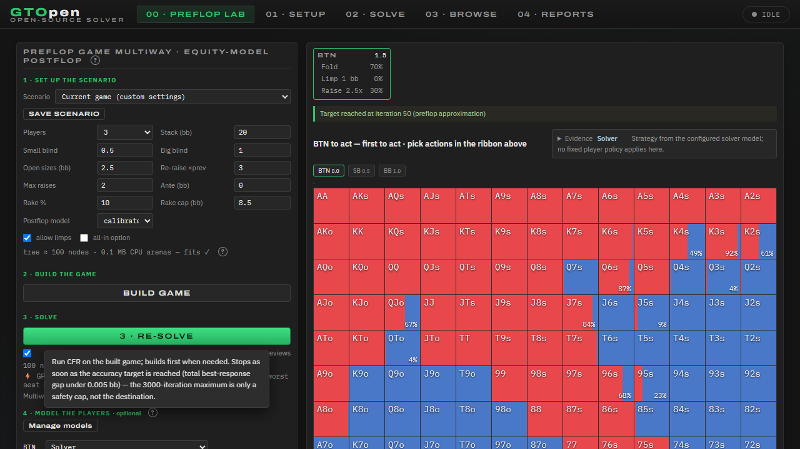
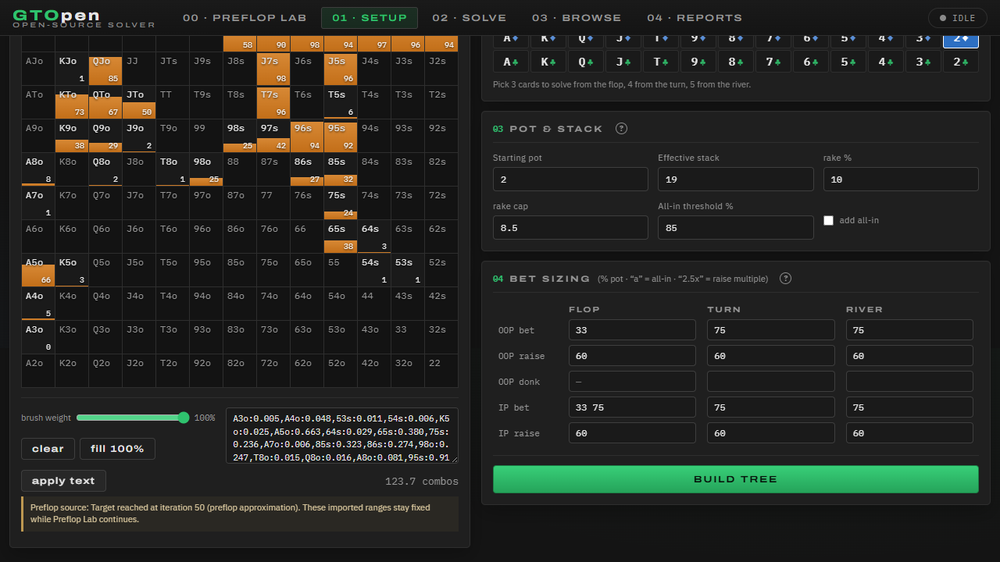

# Production UI smoke

Root reviewed the curated full-reference UI at1280x720. The publication status occupies its own readable row; early previews are checked with no research model selector. A100-node full-model game reached iteration50, and BTN fold → SB complete → BB check exported to Setup with the source/fixed-range warning. Root reported zero console errors/warnings. Both archived screenshots were also independently inspected; the first has an incidental left-control hover tooltip, with the main status row clear.

`summary.json` pins all source/artifact hashes and preserves the exact terminal helper result. Cleanup occurred at the owned300-second lifetime; the stop-token request arrived afterward. The helper was reported exit0 and its intentionally terminated child exit1. This is successful manual UI coverage, not a numerical/performance gate or live deployment. Live restoration remains pending.
