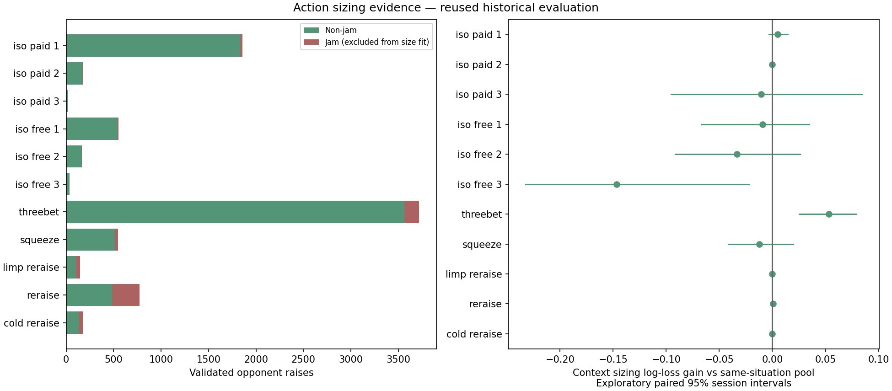
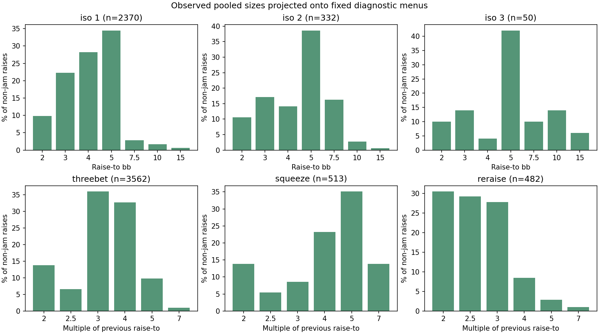

# Measured action sizes beyond opening — 9 September 2026

The new candidate library adds measured **non-jam iso-raise, 3-bet, squeeze
and later re-raise sizes** to the existing Ignition NL10 regular model. It
preserves every hand's fold/call/raise/jam probabilities and every existing
opening-size mixture. This changes which legal size gets ordinary raising
mass, not how often the hand raises.

The source contains **7,545 non-jam raises** and **610 true all-ins** across
these non-opening situations. All-ins are recorded separately and excluded from
the size fits. No new jam probability is fitted.

| Situation | Non-jam raises | Excluded jams | Source sessions | Published detail |
|---|---:|---:|---:|---|
| iso paid 1 | 1,833 | 25 | 398 | pooled |
| iso paid 2 | 172 | 2 | 121 | pooled |
| iso paid 3 | 17 | 0 | 15 | legacy/same-limper-count fallback |
| iso free 1 | 537 | 16 | 280 | pooled |
| iso free 2 | 160 | 3 | 118 | pooled |
| iso free 3 | 33 | 4 | 31 | legacy/same-limper-count fallback |
| threebet | 3,562 | 153 | 491 | contextual |
| squeeze | 513 | 32 | 277 | pooled |
| limp reraise | 105 | 42 | 83 | pooled |
| reraise | 482 | 291 | 266 | pooled |
| cold reraise | 131 | 42 | 106 | pooled |

Free means the BB can check; paid means completing/calling is required. Three
limpers means **3 or more**. The sparse free/paid 3+ groups borrow their common
same-limper-count pool: **50 non-jam raises in 43 sessions**. That is limited
pooled evidence, not a well-measured separate policy for either payment context.

## What improved, and what did not

Only ordinary 3-bet sizing supported the additional position/table-size detail
under the fixed release gate. On **698 later non-jam 3-bets across 75 sessions**,
the selected contextual mixture reduces diagnostic log loss from **1.398457
to 1.345358**, a **3.8% reduction**. The paired 95% session-bootstrap improvement
interval is **0.025418 to 0.078792**. This metric concerns projected size
probabilities conditional on raising; it is not an improvement in win rate,
whole-hand prediction, or solver speed.

The context strength (30 observations) was selected on earlier tuning sessions.
Other selected context candidates did not pass the predeclared later release
gate; those situations use their observed empirical pools. The result table
retains the selected candidates' later scores even when rejected, so a fallback
is not presented as a retrospectively winning ensemble.



## Sizing semantics

- **Iso-raises:** total raise-to amount in big blinds, separated by one, two,
  or three-plus limpers and paid/free action where sufficient data exist.
- **3-bets and squeezes:** total raise-to divided by the previous faced
  raise-to. For example, raising a 3bb open to 9bb is **3×**, not 6bb or 9×.
- **Later re-raises:** the same multiplier definition, with separate pools
  after prior voluntary entry and when cold. Earlier histories and depths are
  still pooled within these groups.
- **Limp re-raises:** a separate observed pool in the research. It is supplied
  where an existing logical `limp_defense` policy exists; this pass does not
  invent missing hand-action policies simply to add a size mixture.

Exact empirical amounts remain in the artifact. At runtime they are projected
onto the scenario's available **non-jam** action menu by nearest logarithmic
distance, breaking ties toward the smaller size. Several observed amounts can
map to the same action. Unmatched legal sizes do not receive an invented
minimum frequency.



The chart uses fixed diagnostic menus (iso: 2/3/4/5/7.5/10/15bb; re-raises:
2/2.5/3/4/5/7×). It is a view of the full-source pooled distributions, not the
only sizes retained by the model and not held-out prediction evidence.

Re-raises use a new **`raise_multiples`** field. Existing **`raise_sizes`**
always means absolute bb. They cannot both be nonempty. An older binary that
does not understand multipliers therefore retains the old min/max fallback
instead of misinterpreting 3× as 3bb. Opening policies are unchanged.

## Collection, validation and support

The new collector lives in `tools/ignition/action_sizes.py`; the existing
Ignition and CoinPoker collectors remain unchanged. It extracts sizes only
**after the full original replay has validated the complete hand**. Hero is
excluded. It preserves every existing logical action denominator and every
original opening-size count, both per hand and against the old session
analysis. Raising bands are not double-counted as extra actions.

The collector snapshots the same **574 source files / 38,341 unique raw hand
IDs**, yielding **34,466 accepted hands / 555 sessions**. Exact file hashes and
IDs match the previous source audit. Raw hands, identifiers and session records
stay in ignored `output/action-sizing/`.

A jam is identified by **chips added equaling remaining stack**, not by
comparing the total raise-to with remaining stack. Previous investment matters:
a player who already put in 3bb and raises to 9bb from a 10bb starting stack
has added 6 of the 7bb remaining; this is not a true all-in.

The historical split is 331 training / 137 tuning / 83 later sessions, with
four boundary-crossing sessions excluded. All these periods have already been
inspected during previous development. This is **retrospective evidence**, not
fresh independent validation.

Before collection, the protocol fixed pooled sizing plus contextual shrinkage
strengths 30/100/300/1000. Earlier tuning chooses among them. Later data can
reject contextual detail under the fixed release gate; they never choose a new
strength or expand the search. The later gate requires a positive paired 95%
bootstrap lower bound, at least 30 later raises and 10 later sessions.

Production empirical pools require 50 non-jam observations across 10 source
sessions. Sparse iso contexts first borrow the same limper-count pool, then the
all-iso pool if necessary; sparse re-raise groups retain legacy sizing. These
are explicit support heuristics, **not confidence percentages**. Even when a
position mixture is released, an unobserved exact table/position uses the pool.

## What remains uncertain

Sizes are **independent of the hand conditional on raising**. Stack depth,
opponent positions, original open size and detailed raise history remain pooled.
Ordinary 3-bet response bands share the same sizing model; they are not separately
validated size distributions. Sizing models from 3–6-handed NL10 are not newly
validated in 8-handed $2/2, $2/5, different blind ratios, or different rake games.

The 50%-or-so conditional calls discussed in earlier research are a separate
hand-action issue. This pass neither changes those probabilities nor claims
that more realistic sizes solve that uncertainty. Hand-dependent sizing needs
its own held-out evaluation and substantially more relevant observations.

## Safe candidate export

`output/action-sizing/archetypes-candidate.json` is a **candidate only**. The
collector/exporter does not replace the installed library or mutate live games.
It starts from canonical `cache/archetypes.json`, leaves the other 45 models
unchanged, and changes only the Ignition model's sizing/provenance metadata.

Shared response policies are cloned and deduplicated so that two logical
contexts can retain identical hand probabilities while receiving different
sizes. The library goes from **138 to 347 unique response policies**, under the
existing 512-policy limit. All 660 logical row/response references remain.
[Export verification](export-verification.json) records exact preservation of
all opening policies, all hand-action vectors and unrelated models.

The dataset includes `sizing_<policy-key>` descriptive notes separately from
hand-range evidence, plus a general `action_sizes` note. Sample totals in those
notes describe source pools; mixture weights are never presented as observation
counts or confidence.

## App integration and validation

The measured library is now installed in `cache/archetypes.json`. The runtime
uses absolute bb for isolation raises and a separate multiplier field for
re-raises. The game and editor show independent **Hands** and **Sizing** evidence.

Validation passed **162 CPU**, **18 CUDA**, **5 server** and **22 extraction/
migration** tests. The actual saved six-player game was upgraded in 75 policy
contexts across five modeled seats, preserving every hand-action vector and
all non-sizing settings. Its GPU re-solve reached a summed learning-seat gap
of **0.000996bb** at 100 iterations. The postflop session was preserved.

That convergence gap measures the configured game, not the accuracy of the
population model. One new CUDA fixture's long-run pure-action comparison
diverged beyond the generic threshold; strict early full-arena checks and
300-iteration EV/gap comparisons pass, with a maximum observed EV difference
below 0.0006bb. Existing CUDA tests and tolerances were unchanged. See the
[complete runtime validation](runtime-validation.json).

## Reproduce

The frozen source library is `cache/archetypes.json` from commit
`5b725e79c3d3da806550a9c93042e661423acce7`; its byte hash is recorded in
`export-verification.json`. Reproduce in a separate checkout with that source
library to preserve the published study files and current installed library.

```powershell
$env:OMP_NUM_THREADS='4'
$env:OPENBLAS_NUM_THREADS='4'
python tools/ignition/action_sizes.py prepare
python tools/ignition/action_sizes.py collect
python tools/ignition/action_sizes.py evaluate
python -m unittest discover -s tools/ignition -p test_action_sizes.py
```

The protocol, selected tuning candidates, later scores, exact empirical size
masses, source hashes and export verification are public. Private source paths,
hand IDs, per-session observations and execution logs remain local. Existing
byte-hashed research artifacts and installed models are not overwritten by this
script.
