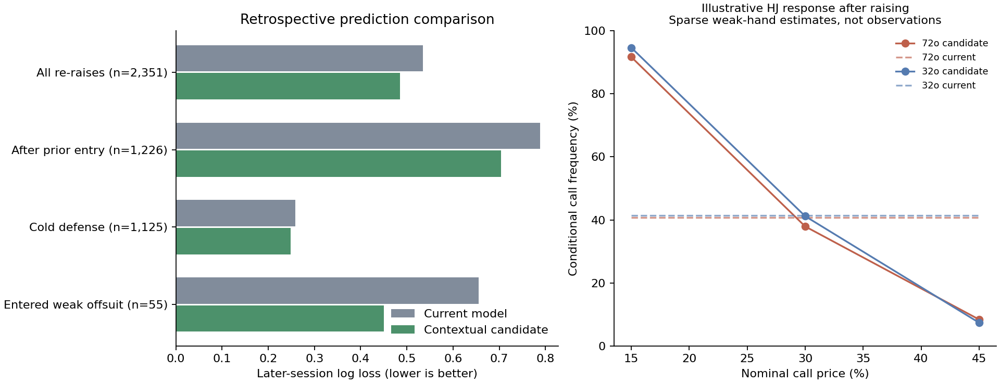

# Contextual re-raise experiment — 9 September 2026

**Frozen offline experiment; now available separately as Contextual v1.** See
[runtime integration and coverage](../../docs/contextual_preflop.md). This page
and `experiment.json` record the retrospective experiment before integration;
existing profiles and saved games are not converted. Lower log loss means
better probability predictions, not an equivalent increase in win rate or
classification accuracy.

| Comparison | Later decisions | Current log loss | Candidate log loss | Reduction |
|---|---:|---:|---:|---:|
| All re-raises | 2,351 | 0.5353 | 0.4858 | 9.3% |
| After prior entry | 1,226 | 0.7889 | 0.7037 | 10.8% |
| Cold defense | 1,125 | 0.2590 | 0.2483 | 4.2% |
| Entered weak offsuit | 55 | 0.6559 | 0.4507 | 31.3% |



## Model and evaluation

The candidate adds regularized multinomial log-odds adjustments to the current
hand-aware model. Inputs are cold/called-only/previously-raised entry, 3-bet
versus 4-bet+, continuous nominal call price, investment fraction, remaining
stack, position and table size. Shared hand-rank/family interactions allow
price and depth effects to differ between hands without separately estimating
every hand/position/price cell. There is no forced weak-hand fold rule.

The nominal price is the incremental call capped at the actor's remaining
stack, divided by the pot before acting plus that call. It is **not side-pot
adjusted pot odds**. Entry means whether the player has ever raised in the
hand; it does not encode every earlier action or opponent position.

The fixed search compared context-only and hand-interaction families at four
regularization strengths (1, 10, 100, 1000), selected on earlier tuning
sessions. The hand-interaction candidate at strength 1 won. Baseline hand
counts were also refitted only on training data. The chronology is 331 training,
137 tuning and 83 later sessions; four boundary-crossing sessions are excluded.
There are 6,981 / 2,979 / 2,351 re-raise decisions in those splits; 80 later
sessions contain relevant decisions. The final prototype is refitted on the
full source only after evaluation.

This reuses periods already inspected in earlier development. The baseline's
smoothing strengths also come from that earlier work. It is a **retrospective
comparison, not fresh independent validation**. The JSON records the entire
candidate grid and 2,000-resample session-bootstrap intervals. Price/support
subgroups were added as exploratory diagnostics after the first result; they
did not change candidate selection.

## Findings and limits

- Overall mean log-loss gain: 0.0496, with a 95% session-bootstrap interval
  of 0.0382–0.0606. After-entry gain: 0.0852 (0.0635–0.1059).
- All four after-entry groups (prior call/raise × 3-bet/4-bet+) improved on
  these sessions. All reported subgroups with at least 30 decisions passed
  the screen against clearly negative improvement intervals; that does not
  establish noninferiority everywhere or account for multiple comparisons.
- The HJ after-entry subgroup has 290 later observations and its improvement
  interval includes zero. Cold 4-bet+ has only 18 later observations. These
  remain uncertain rather than independently validated position policies.
- Low/middle/high price groups and hands with zero direct position-specific
  training observations improved in exploratory checks. The low-price group
  has just 36 later decisions.
- At an illustrative six-handed HJ state (previously raised to 2.5bb, 97.5bb
  remaining, facing a 3-bet), 72o's old 40.8% call becomes 37.9% at price 30%
  and 8.4% at price 45%. These individual hand estimates are not validated
  observations. At price 15% it still predicts 91.7% calls: rare loose entries
  and cheap calls are not made realistic simply by forcing all weak hands out.

## Artifacts and next integration step

- `experiment.json`: selection, metrics, bootstrap intervals and limitations.
- `candidate.json`: frozen feature order, coefficients and baseline matrices.
- `examples.json`: the illustrative hand predictions plotted above.

The candidate requires contextual inputs at each decision; it cannot correctly
replace a static Vs 3-bet+ grid. The separate versioned integration supplies
runtime entry/depth/price, supported-format checks, legal-action mapping and
context controls in the preview. Integration checks and runtime costs are
tracked in the [development record](../preflop-evolution/README.md), separately
from the predictive results here.

Reproduce from the private validated source:

```powershell
python tools/ignition/analyze.py --source 'T:\Dev\Poker Data\Ignition' --out output/ignition-contextual-reraise
python tools/ignition/contextual_reraise.py --input output/ignition-contextual-reraise/analysis.json --out research/ignition-reraise
python -m unittest discover -s tools/ignition -p test_models.py
```

Only aggregate parameters and diagnostics are published; raw histories and
session-level observations stay local.
