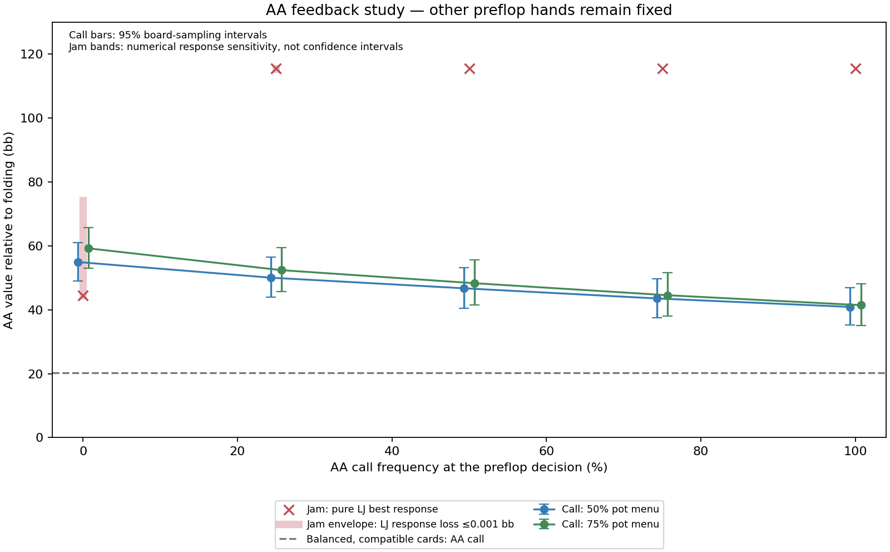

# AA call/jam feedback: completed

All 400 registered GPU solves passed the configured global and per-hand checks. No production changes.

The experiment moves AA coherently between calls and jams. LJ adapts its all-in response; both players adapt postflop. Other preflop hands and all earlier ranges remain fixed. It is a restricted diagnostic, not a new full-game equilibrium.

| AA calls | Postflop bet menu | AA call value [95% interval] | AA jam vs pure best response |
|---|---|---:|---:|
| 0% | half | 54.95 [49.07, 61.00] | 44.44 |
| 0% | large | 59.23 [53.04, 65.72] | 44.44 |
| 25% | half | 50.05 [43.90, 56.57] | 115.53 |
| 25% | large | 52.41 [45.67, 59.46] | 115.53 |
| 50% | half | 46.73 [40.51, 53.17] | 115.53 |
| 50% | large | 48.31 [41.53, 55.54] | 115.53 |
| 75% | half | 43.55 [37.58, 49.72] | 115.53 |
| 75% | large | 44.56 [37.99, 51.65] | 115.53 |
| 100% | half | 40.90 [35.19, 46.85] | 115.53 |
| 100% | large | 41.45 [35.15, 48.17] | 115.53 |

Values are incremental bb relative to folding at the preflop decision. Call values subtract the additional 12 bb investment. The zero-calling boundary uses a tiny AA probe, not a literal zero-mass postflop query.

## Interpretation

The Balanced model with corrected card accounting assigns AA a call value of about 20.28 bb regardless of how often AA joins its own calling range. The explicit solves measure the range-dependent response that this fixed approximation misses.

Moving from rare AA calls to always calling lowers AA's explicit value by 14.05 bb in the half-pot menu (paired 95% interval: -16.48 to -11.78) and 17.78 bb in the larger menu (-20.07 to -15.44). Meanwhile A5s, KQo, QJs and 55 gain roughly 0.86–1.49 bb; their paired intervals exclude zero in both menus. A stronger calling range changes the opponent's play and protects some other hands. These exploratory cross-hand effects are recorded in other-hand-effects.json.

When AA moves out of the jam range, LJ can profitably call more hands. That makes an AA deviation back to jamming more valuable. Therefore the attractive rare-AA call value cannot simply be assigned to AA at every calling frequency.

The starting point is numerically delicate: TT and AKo are almost indifferent against a jam. Exact switching points below one millionth of AA call frequency are not credible real-poker precision. Responses costing LJ only 0.001 bb per reached jam can give AA jam values from 44.43 to 74.27 bb at that boundary. Both call-menu point estimates lie inside this envelope. Board-bootstrap intervals alone therefore do not establish a robust preferred action at the starting point.

At the positive registered call frequencies, the opponent response and the jam value are much less sensitive to that small response-loss budget. Do not interpolate these five points into a precise equilibrium mixing rate: other UTG hands are fixed, the smaller 4-bet is excluded for AA, and intervening response switches are discontinuous.

## Consequence

A useful replacement must update all relevant preflop ranges and postflop continuations coherently. This experiment rejects the shortcut of inserting the rare-AA postflop value as a fixed calling bonus. It does not show that explicit postflop values alone will reproduce Wizard, nor certify these restricted response frequencies for play.

The next implementation experiment should use a controlled small game with both calling and raising continuations active, a consistent card prior, and continuation values evaluated at each current range state. Validate the backed-up decisions and both players' responses together before attempting a full-game deployment.

## Verification and limits

GPU and full-enumeration CPU global gaps all met 0.05% pot. The maximum independently decoded OOP probe best-response gain was 0.04998338 bb (limit 0.05). Mean reconstruction error was 3.2e-14 bb. Independent physical-card enumeration reproduced AA flop pair mass within 4.76e-08 relative error.

The 40 stratified flops and two postflop menus match the earlier diagnostic panel. Bootstrap intervals cover board sampling only. They omit equity-cache error, fixed earlier ranges, folded-card bunching, range trimming, restricted menus and model error. The response envelopes are a separate numerical-sensitivity calculation, not statistical confidence bounds.

See PROTOCOL.md, RESPONSE-ROBUSTNESS.md, manifest.json, fixtures.json, summary.json, paired-changes.json, response-thresholds.json, response-robustness.json, validation.json and jobs/ for the registration and raw evidence.

## Physical all-in cross-check

A separate 32-million-deal check per hand evaluates actual shared boards and holdings for TT and AKo, with the frozen earlier history. It does not use the cached equity table. At the zero-calling boundary:

| LJ hand | Two-live-hand call EV [95% MC interval] | Including six earlier folds |
|---|---:|---:|
| TT | -0.185 [-0.518, 0.147] | -1.488 [-1.850, -1.127] |
| AKo | -0.232 [-0.612, 0.148] | -0.134 [-0.515, 0.248] |

TT and AKo both remain consistent with near-indifference in the two-live-hand experiment. Conditioning on the six earlier folds lowers TT's call value by about 1.30 bb (paired 95% interval: -1.42 to -1.18 bb); TT then clearly prefers folding in this fixed range state. The corresponding AKo effect is small and its call/fold sign remains unresolved.

Thus the earlier small folded-card effect on AA cannot be generalized to every near-indifferent response. The pure two-player response curve is a controlled diagnostic with a material missing factor, not a prescription for this eight-player history. See PHYSICAL-PROTOCOL.md, physical-freeze.json, physical-batches.json, physical-review.json and physical-range-check.json.
