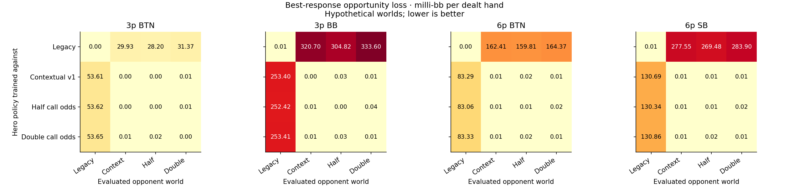
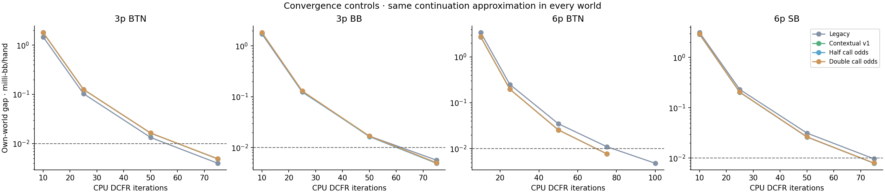
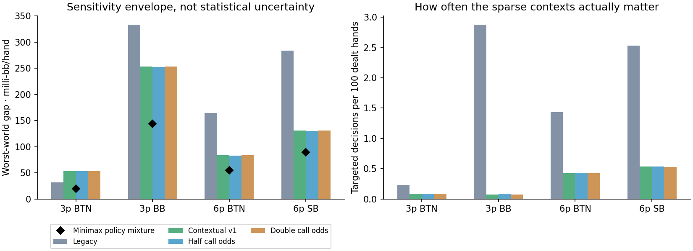
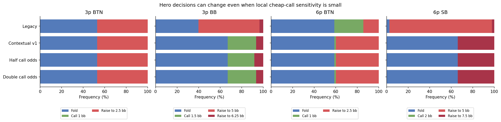

# Opponent-behavior sensitivity — research pass 2

This study asks whether uncertain re-raise predictions change **decisions and EV**, not whether a range looks plausible. It uses actual preflop CPU solves against fixed measured opponents, then evaluates each learned hero strategy against all four hypothetical opponent worlds.

Run: `2026-09-09T03:05:39.217456+00:00`. Model: `ignition-nl10-reraise-v1`. No production profile, artifact, save or live session was changed.

| Scenario | Tree nodes | Largest own-world gap | Legacy worst-world loss | Contextual worst-world loss | Candidate-mixture worst loss |
|---|---:|---:|---:|---:|---:|
| 3p BTN | 640 | 0.005 | 31.372 | 53.613 | 19.795 |
| 3p BB | 640 | 0.006 | 333.601 | 253.397 | 143.706 |
| 6p BTN | 21,772 | 0.008 | 164.374 | 83.287 | 55.185 |
| 6p SB | 21,772 | 0.010 | 283.904 | 130.686 | 89.338 |

All three loss columns and the convergence column are **milli-bb per dealt hand** (1 milli-bb = 0.001 bb). They are best-response opportunity costs **inside these specified models**, not measured poker win rates. Compare strategies within the same evaluated world; different worlds need not have the same attainable EV.

## Findings

The broad choice between the legacy and contextual response models matters much more here than the narrow cheap-call stress test. A legacy-trained hero loses **29.9–320.7 milli-bb/hand** against the contextual world relative to its model best response. That is not evidence that the contextual world is the truth: the reverse cross-evaluations also incur substantial loss.

The contextual-trained hero's opportunity loss in the halved/doubled cheap-call worlds is only **0.010–0.027 milli-bb/hand**, including its residual convergence gap. These cells are sparse in the data and infrequent along the hero's selected lines. Their visual irregularity is a reason to inspect evidence, but these fixtures do not justify treating them as the largest source of decision error.

The scenario results are not interchangeable. The 3-player BTN opening frequencies barely change, although later responses change EV. In the blind-defense and 6-player fixtures, focal action mixtures can change sharply between the broad model choices. This argues for contextual sensitivity displays and stronger validation, rather than a universal statement that every displayed range is stable.

The fixed-world best-response value stayed consistent across evaluated hero policies within 1.4e-09 bb/hand, providing a check that cross-evaluation preserved the learned hero policy and did not accidentally re-solve it.



## Study design

- Four worlds: the existing static Ignition pool; Contextual v1; Contextual v1 with call/fold odds halved in the targeted cells; and Contextual v1 with those odds doubled. Raising mass is retained when raising is legal. If the tree caps further raises, the existing mapping first puts that mass onto the legal call action.
- Targets: **after voluntarily entering**, nominal call price at most 25%, offsuit T-high or lower. Cold re-raises, premiums, other hands and other situations retain their original predictions. The 0.5× and 2× odds factors are declared stress assumptions; they are **not fitted confidence bounds**.
- 100bb, 0.5/1 blinds, no ante; 5% rake capped at 3bb. Three-player trees allow three total raises with 2×/2.5× re-raises; six-player trees allow two total raises with 2×/3× re-raises. Every faced re-raise remains below 25% of stack. Jams are omitted. These bounded trees isolate ordinary response modeling and do not represent unrestricted full-game poker.
- All non-hero seats use the existing measured Ignition position policies in all other buckets and remain fixed throughout a run. This makes the hero's best response well-defined. The study does not emulate a jointly adaptive table.
- The same calibrated continuation approximation, equity cache, four CPU threads and legal action grammar are used in every world. Its known range/rake limitations remain; this experiment does not validate those values.
- Hero trains separately against each world, stopping at a best-response gap ≤ 0.000010 bb/hand. Cross-world comparisons preserve the learned strategy sums and replace only opponent policies. The exact model best-response traversal supplies each opportunity gap; we also check that the best-response value is consistent across evaluated hero policies in the same world.
- The optional minimax mixture chooses one **entire learned policy before the hand**, with weights optimized against this finite four-world set. It is not a naive average of conditional ranges, a calibrated uncertainty strategy, or a production recommendation.







Focal decisions: 3-player BTN unopened; 3-player BB after BTN opens and SB calls; 6-player BTN after the first three seats fold; 6-player SB after those folds and BTN opens. Other branches and the complete 169-hand strategies remain in the aggregate JSON.

## What the data can support next

The existing aggregate source contains **81 targeted decisions** across 50 sessions and 28/36 relevant hand classes. These are pooled over positions, table sizes, entry histories and prices, so individual cells are considerably thinner. All available source periods have already been inspected in earlier development. The retrospective later-period results are useful diagnostics but **there is no untouched fresh holdout here**.

The next candidate should use **support-aware, hierarchical context effects**: estimate a population price response, permit entry/position/hand-family deviations where there is evidence, and shrink sparse hand-context effects toward that response. The current predictor already uses ridge regularization; this proposal makes its shrinkage depend on the hierarchy and available support instead of treating all context coefficients alike. It should preserve strong own-hand observations and should not impose cosmetic fold floors. Cheap weak-hand predictions should carry source counts and a sensitivity indicator in the editor.

Before fitting that candidate, reserve newly acquired sessions untouched, group splits by session, and predeclare comparisons: overall log loss, calibration and per-context losses, plus strategy opportunity loss on these fixed fixtures. Use only earlier sessions for model and regularization choices. A new source period is needed for a genuine promotion decision. More data at the same already-dense contexts is less valuable than known-card decisions in missing prices, prior-entry paths and raise depths.

## Reproduce

```powershell
python tools/research/behavior_sensitivity.py
```

The default command builds a standalone Rust executable, runs all four fixtures, verifies normalization/convergence and consistent best-response values, and regenerates this report. Optional private aggregate coverage is read from `output/ignition-contextual-reraise/analysis.json`; raw histories are never read or published by this study. Its absence does not prevent the solve experiment.

Outputs: [full aggregate results](results.json), [summary metrics](summary.json). Source: `crates/solver/examples/behavior_sensitivity.rs`, `tools/research/behavior_sensitivity.py`.
