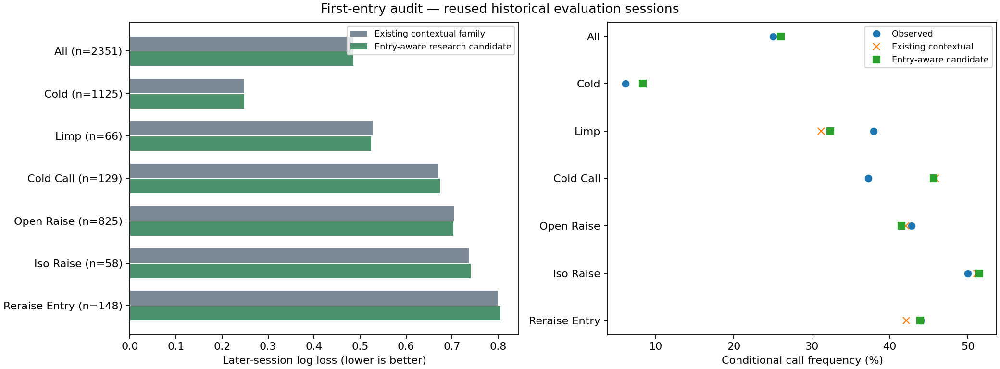
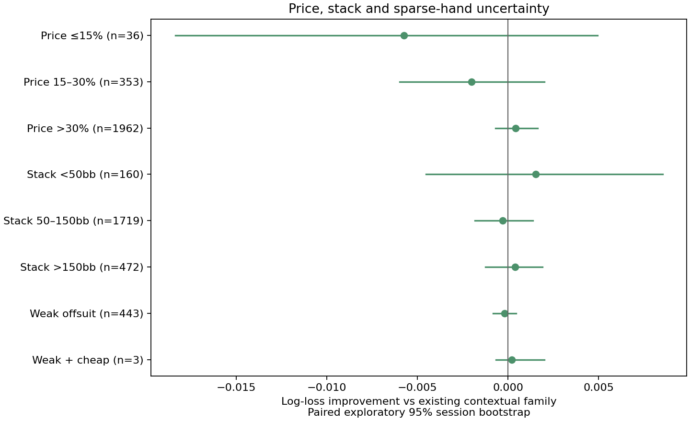
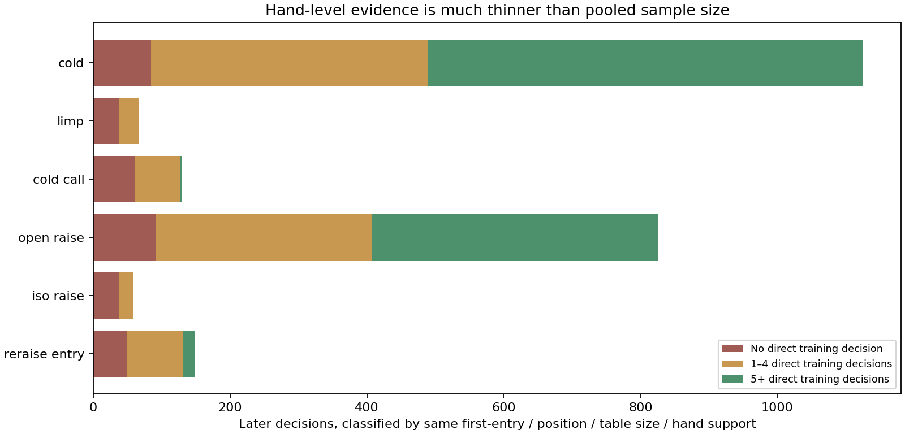

# First-entry calling audit — research pass 3

**Keep the existing contextual predictor.** The new first-entry correction did
not improve overall later-session prediction, and it did not pass the frozen
research gate. Nothing in this study changes installed player models, defaults,
saved games, or supported formats.

On 2,351 later re-raise decisions, the existing contextual family has log loss
**0.485777** and the new candidate **0.485807** (lower is better). The paired
95% session-bootstrap improvement interval is **−0.001227 to +0.001241**.
Brier score is also slightly worse: 0.287206 → 0.287276. The result is
inconclusive, not a demonstrated gain.

The useful finding is that the calling problem is not uniform. Players who
first cold-called are overcalled by the model, while players who first limped
are undercalled in this sample. Reducing all calling frequencies would make
one problem worse.

| First voluntary entry | Later decisions | Observed call | Existing contextual | Research candidate | Log-loss gain |
|---|---:|---:|---:|---:|---:|
| cold | 1125 | 6.1% | 8.3% | 8.3% | +0.0001 |
| limp | 66 | 37.9% | 31.2% | 32.4% | +0.0029 |
| cold call | 129 | 37.2% | 45.8% | 45.6% | -0.0030 |
| open raise | 825 | 42.8% | 42.0% | 41.5% | +0.0011 |
| iso raise | 58 | 50.0% | 51.1% | 51.4% | -0.0033 |
| reraise entry | 148 | 43.9% | 42.1% | 43.9% | -0.0047 |

Frequencies above are conditional on actually reaching a re-raise decision;
they are not percentages of all dealt hands. The groups have different hand
mixes and prices. The table does not establish that entry type causes a change.



## What was tested

The collector replays all 34,466 validated NL10 regular hands and excludes the
user's hero seat. It adds the **first voluntary action** to each re-raise
observation: cold, limp, cold call, open raise, iso-raise, or direct re-raise.
The original model's separate `ever raised` feature remains available. A player
who limp-re-raises is therefore still a first-entry limper, while also being
marked as having raised earlier. The same distinction applies to callers who
later raise.

All 12,463 extracted re-raise decisions match the old collector **exactly** in
session, table size, position, old entry class, raise depth, price, investment,
remaining stack, hand class and chosen action. No folds disappear and no
showdown or later outcome enters the prediction features.

The existing chronological split remains 331 training / 137 tuning / 83 later
sessions; four boundary-crossing sessions are excluded. These contain 6,981 /
2,979 / 2,351 decisions; 80 later sessions contain relevant decisions.

The comparator reproduces the existing contextual family using only each
training split's hand probabilities and coefficients. **The full-source
installed artifact is never used to predict its own NL10 evaluation data.**
The reproduced later log loss agrees with the earlier 0.485777 result.

Before collection, the protocol fixed six candidates: regularized residual
corrections at strengths 10, 100 and 1000, each with or without a support blend.
Corrections add first-entry interactions with price, actor starting stack and
raise depth to the existing contextual predictions. The model's hand-aware
probabilities remain the starting point; no hand-independent call floor is
introduced. Tuning selected strength 10 with the support blend.

For the blend, a correction receives weight `n / (n + 30)`, using **training**
decisions in that first-entry / price-band / stack-band group. At zero support,
the existing contextual prediction is retained exactly. Tuning and later labels
never enter these support counts. This is a tested conservative research
fallback, not a claim that the existing prediction is accurate in sparse cases.
The six-choice selection and final train+tune artifact are recorded before
later metrics are computed. There was no post-result search expansion.

## Price, raise size and stack depth

The evaluation reports all first-entry groups, their price bands, faced totals
(up to 10bb, 10–25bb, over 25bb), actor stacks (under 50bb, 50–150bb, over 150bb),
3-bet vs 4-bet+, and sparse hand-support groups. The evidence is in
[evaluation.json](evaluation.json), including empty groups rather than invented
estimates.

Only **36 later decisions** have a nominal call price at or below 15%. Only
**three** are weak offsuit hands in that cheap-price group, across two sessions;
all three happened to call. That does not validate a 90% calling range for every
weak hand. A smooth chart can still rest on almost no relevant observations.



Actor starting stack is not effective stack. Nominal price caps the additional
call at the actor's remaining chips but does not resolve multiway side pots.
Opponent position, exact earlier raise sequence, entry size and rake are not
fitted in this small correction. The faced-total bands are audit subgroups,
not extra fitted size buckets.

## Evidence for the model indicator

The audit also measures how much of the apparent hand detail is directly
supported. All 66 later first-limp decisions and all 58 iso-raise decisions have
fewer than five prior observations at the same position, table size, first-entry
type and hand class. So do 127 of 129 cold-call entries. Pooling is necessary,
but should be visible to the user.



[evidence-metadata.json](evidence-metadata.json) contains **84 aggregate
contexts** and 12,463 source decisions, tied to the immutable installed model
hash. It uses the **existing v1 schema** (table size, position, cold/called/raised
entry and raise depth), because that is what the installed predictor knows.
It pools price, stack and first-entry detail. Its observed-class count means
historical coverage, not certainty or validation of each predicted frequency.
No individual hand histories or session identifiers are published.

The intended UI wording is **Contextual estimate**, with an explanation of
pooled evidence. Zero direct evidence should be described as estimated, not
silently assigned a confidence percentage. This file cannot make a 6-handed
model directly measured at an 8-handed position or a different blind ratio.

## No untouched holdout claim

The NL10 periods were inspected in previous model development. The existing
NL5/NL25 regular and Zone groups were also inspected in pass 2. This pass
checks that the same 555 validated NL10 sessions and their decision denominators
are used; it does not relabel any of them fresh or independent. New recognized
sessions or changed old-session counts stop collection for a revised prospective
protocol. Previously rejected source hands remain rejected.

[The source inventory](source-availability.json) independently compares this collection
with the already inspected pass-2 snapshot: all **574 source-file hashes and
38,341 unique raw hand IDs are identical**. There are no new NL10 regular
files or IDs in this corpus to reserve as an untouched holdout. This statement
does not claim that every unparsed file elsewhere has been audited. A separate
filename-only inventory found no NL10 Zone files; its only unscored source group
is one **835-byte NL50 Zone file**. Its hash is reserved locally without parsing
outcomes. Earlier format audits may have inspected it, and it is not a useful
independent sample for these subgroups.

These are retrospective development diagnostics. The split protects against
fitting directly on later labels, but cannot undo earlier human exposure. The
baseline smoothing choices also come from previous retrospective development.
Session-bootstrap intervals are exploratory, not simultaneous confidence
statements across all subgroups, and are suppressed below two sessions.

## Recommendation

1. **Keep the installed predictor and expose its evidence level.** The richer
   research candidate offers no established improvement; the overall and
   cold-call results do not justify promotion.
2. Collect a **new chronological batch** of Ignition known-card opponent hands,
   including folded cards. Freeze a date cutoff and evaluator before inspecting
   results. Maintain separate regular/Zone and stake labels. Additional
   showdown-only histories cannot establish fold frequencies by hand.
3. Prioritize more re-raise opportunities after **cold calls and limps**, with
   price, effective stack and opener/raiser position recorded. Do not merely buy
   a larger total hand count: the rare relevant decision count is the constraint.
4. Evaluate a later candidate by those entry groups as well as globally. Keep
   sparse groups on an explicit pooled fallback and require an independent
   follow-up before expanding model support to $2/2, $2/5 or other table sizes.

## Reproduce

```powershell
$env:OMP_NUM_THREADS='4'
$env:OPENBLAS_NUM_THREADS='4'
$env:MKL_NUM_THREADS='4'
python tools/research/calling_audit.py prepare
python tools/research/calling_audit.py collect
python tools/research/calling_audit.py evaluate
python tools/research/calling_evidence.py
python tools/research/calling_source_inventory.py
python -m unittest discover -s tools/research -p test_calling_audit.py
```

Private source snapshots, exact hand IDs, session observations and execution
logs remain under ignored `output/behavior-pass3/`. The public protocol, selected
candidate, evaluation and source hashes permit reproduction. The final
candidate file includes its training baseline, original contextual coefficients,
residual coefficients and support counts; it is explicitly research-only.
