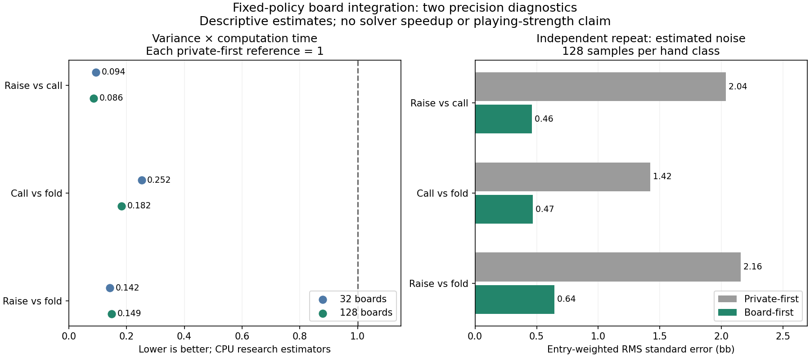

# Fixed-policy precision comparison

Both runs completed their registered samples and readback checks. They use the same saved generation-77 policy and independent chance seeds. These are estimator diagnostics, not trained-range or playing-strength results.

| Comparison | Pilot variance-time ratio | Repeat variance-time ratio | Repeat private RMS SE | Repeat board RMS SE |
| --- | ---: | ---: | ---: | ---: |
| raise-call | 0.094 | 0.086 | 2.036 bb | 0.461 bb |
| call-fold | 0.252 | 0.182 | 1.421 bb | 0.469 bb |
| raise-fold | 0.142 | 0.149 | 2.156 bb | 0.643 bb |

Ratios below one favour board integration on this measured variance-times-summed-worker-wall-time metric. This does not compare against production GPU throughput. Class errors share boards and are correlated; no confidence intervals or significance claim are supplied.

## 32-board run

Private deals: 5,408. Total elapsed: 182.8 s. Summed worker time: board 444.6 s; private 258.2 s.

- raise-call: lower measured board variance for 168/169 classes. Entry-weighted mean difference -0.430 bb. Largest absolute descriptive mean discrepancy: AA, +18.128 bb, +3.24 combined SE.
- call-fold: lower measured board variance for 150/169 classes. Entry-weighted mean difference +0.039 bb. Largest absolute descriptive mean discrepancy: 95o, -2.791 bb, -2.89 combined SE.
- raise-fold: lower measured board variance for 164/169 classes. Entry-weighted mean difference -0.391 bb. Largest absolute descriptive mean discrepancy: 93o, -8.684 bb, -4.17 combined SE.

Every class, including regressions: `board-precision-pilot-v1-all-classes.json`.

## 128-board run

Private deals: 21,632. Total elapsed: 719.4 s. Summed worker time: board 1721.2 s; private 1029.2 s.

- raise-call: lower measured board variance for 168/169 classes. Entry-weighted mean difference +0.107 bb. Largest absolute descriptive mean discrepancy: QJo, +9.605 bb, +2.72 combined SE.
- call-fold: lower measured board variance for 165/169 classes. Entry-weighted mean difference -0.033 bb. Largest absolute descriptive mean discrepancy: 62s, +1.926 bb, +2.55 combined SE.
- raise-fold: lower measured board variance for 168/169 classes. Entry-weighted mean difference +0.073 bb. Largest absolute descriptive mean discrepancy: QJo, +10.152 bb, +2.55 combined SE.

Every class, including regressions: `board-precision-repeat-v1-all-classes.json`.

## Limits and next decision

The arithmetic controls and independent chance streams support assessing precision per computation budget. They do not prove unbiasedness from finite mean agreement, establish equilibrium accuracy, or show faster learning. Rare large-payoff outcomes still require attention. The largest standardized discrepancies are descriptive diagnostics selected from all classes, not multiplicity-adjusted tests.

Interpret these complete results before choosing a training experiment. A new root estimator needs its own typed state and checkpoint admission, a mechanical update/recovery control, and matched training plus held-out payoff evaluation. The active stratified study is separate and remains pending until its registered final evaluation finishes.
