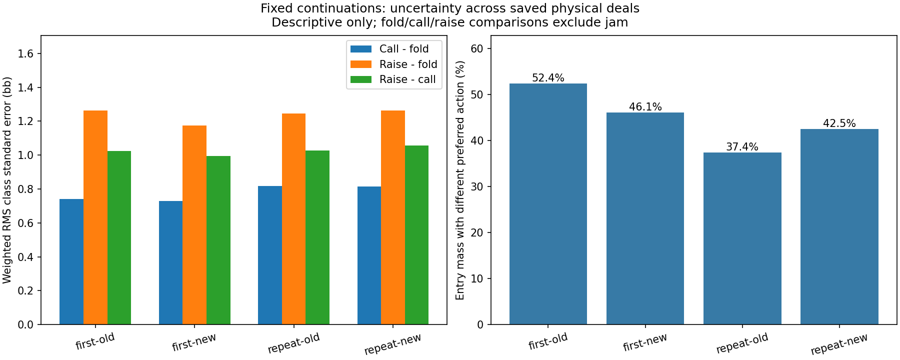

# Frozen-continuation root precision

This exploratory diagnostic measures uncertainty in action values while continuation policies remain fixed. It does not establish more accurate preflop ranges or select a model for deployment. The earlier confirmatory study and its inconclusive intervals remain unchanged.

## Method

Reused all 65,536 already-inspected deals, in original order, for four frozen self-play policy pairs. BB's first action was forced to fold, call, raise or jam while every later policy row remained unchanged. Each original payoff was reproduced and recovered by mixing the four forced-action values. Both players' cashflows and rake were checked. No new cards, training, GPU inference or production modifications were involved.

Every class has 165–646 observations. Even and odd global deal indices define the halves. Standard errors describe fixed-policy sample precision, not simultaneous confidence bounds. Incoming hand-class masses weight the RMS summaries below. Preferred actions compare fold, call and raise only; a disagreement between halves is not a percentage of hands played incorrectly.

| Bank | Call - fold SE (bb) | Raise - fold SE (bb) | Raise - call SE (bb) | Half-sample disagreement mass |
| --- | ---: | ---: | ---: | ---: |
| first-old | 0.740 | 1.265 | 1.023 | 52.4% |
| first-new | 0.730 | 1.175 | 0.994 | 46.1% |
| repeat-old | 0.819 | 1.247 | 1.029 | 37.4% |
| repeat-new | 0.815 | 1.265 | 1.058 | 42.5% |

## Evidence and limits

The separate scalar audit recomputed means, paired standard errors, class coverage, weighted aggregate errors and split-sample preferred actions. Maximum discrepancy: 2.84e-14. The parallel control also reproduced the qualified serial native outputs byte for byte. Full batch processing and first analysis took 31.2 minutes, excluding storage admission and separate readbacks. Compressed batch evidence occupies 47.5 MB.

[All class values](frozen-root-precision-class-values.csv) and [all six paired bank comparisons](frozen-root-precision-paired-bank-values.csv) are retained. The paired comparisons use common deals, but both players' continuations change between self-play banks; they are not unilateral gains or proof of treatment benefit. Action numbers in the class export are 0=fold, 1=call, 2=raise.

These forced values can enter branches with weak fallback continuation play. Their maximizing action is not a best response to a fully solved game. Jam is excluded from the precision summaries because this native per-deal estimator differs from the exact private-hand integration used for training jam targets. This spot remains BB versus BTN, 200bb, 2bb open, 0.5bb dead money, 5% rake capped at 2bb; it does not qualify other stacks or positions.

The result separates fixed-policy sampling variation from the moving-policy behavior already documented. It does not alone apportion the original training instability or justify extrapolating a required training budget. The next experiment should address whichever uncertainty remains visible here, alongside the existing evidence of sparse per-class coverage and policy movement.
