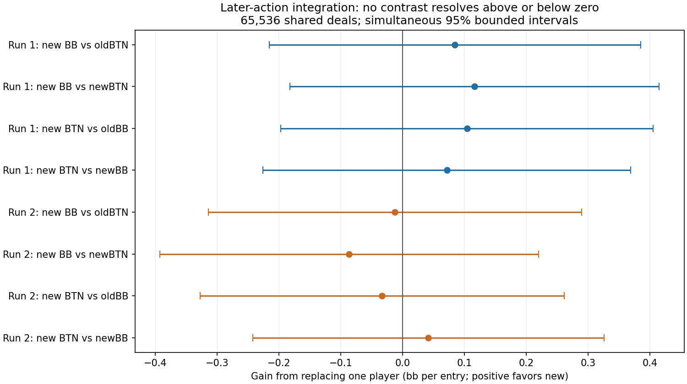

# Later-action training study: completed findings

The fixed-budget experiment does not establish better preflop ranges. Do not promote this candidate. The two training runs still produce very different hand assignments, and all eight preregistered payoff intervals include both gains and losses. This is an inconclusive effectiveness result, not proof of equivalence or proof that action integration cannot help with a different training budget.

## What was compared

The same BB-versus-BTN-open context, 200bb stack, 2bb open, 0.5bb dead money, 5% rake capped at 2bb, and the same restricted action tree. Each candidate matches its baseline's seeds, 78 updates, 512 deals per update, network size, reservoir and fitting budget. Both already integrate BB root actions and retain exact initial all-in targets. The new treatment additionally integrates later postflop actions into training targets. Complete played banks use generations 0–77 with weights 1–78; generation 78 is excluded.

After freezing and auditing all four banks, the registered final evaluation used 65,536 fresh common physical deals and eight crossed profiles. There was one final look, no sample extension and no checkpoint selection. These results concern complete policies against fixed tested opponents, not a best-response bound or a comparison with GTO Wizard.

## Reproducibility of the hand ranges

Incoming-mass-weighted disagreement between training seeds barely changed: **47.03% to 46.48% total variation**, a reduction of **0.55 percentage points**. The most frequent action still differs in **89 of 169 hand classes**, versus 90 for the baseline. This metric measures how much probability must move to reconcile two policies; it is not the percentage of hands played incorrectly. There are only two seeds, so this is descriptive, not a statistical stability guarantee.

| Complete bank | Fold | Call | Raise | Jam |
| --- | ---: | ---: | ---: | ---: |
| first-old | 38.93% | 45.49% | 14.71% | 0.88% |
| first-new | 39.31% | 47.25% | 12.51% | 0.94% |
| replication-old | 45.11% | 41.79% | 12.45% | 0.64% |
| replication-new | 48.35% | 38.32% | 12.68% | 0.65% |

Aggregate frequencies conceal substantial per-hand differences. The treatment changes roughly 40% of root action probability within each matched run, yet leaves almost all the cross-seed disagreement. The first run calls more; the second calls less. The [169-class export](later-action-final-root-ranges.csv) records every root policy, exact incoming mass and per-class comparison; probabilities are stored on a 0–1 scale.

Export correction (September 26): the first publication labeled rows using display-grid order rather than native class order. The CSV now includes native class indices and labels checked against the physical-card catalog. Source probabilities, aggregate statistics, intervals and conclusions were unchanged.

## Effectiveness on fresh deals

Positive means replacing that player with the new policy improved its own payoff against the named fixed opponent. Units are **bb per entry into this particular spot**, not bb/100 dealt hands. The intervals use the registered two-sided bounded empirical Bernstein construction with Bonferroni coverage over all eight contrasts, at one final look. They include the effect of rare large pots and are wider than ordinary normal-approximation intervals. We do not change methods after observing the outcomes.

| Replacement and fixed opponent | Mean gain | Paired standard error | Simultaneous 95% interval |
| --- | ---: | ---: | ---: |
| first:newBB-v-oldBB-against-oldBTN | +0.0848 | 0.0323 | [-0.2156, +0.3852] |
| first:newBB-v-oldBB-against-newBTN | +0.1166 | 0.0318 | [-0.1819, +0.4150] |
| first:newBTN-v-oldBTN-against-oldBB | +0.1042 | 0.0325 | [-0.1969, +0.4053] |
| first:newBTN-v-oldBTN-against-newBB | +0.0715 | 0.0315 | [-0.2261, +0.3691] |
| replication:newBB-v-oldBB-against-oldBTN | -0.0123 | 0.0327 | [-0.3142, +0.2897] |
| replication:newBB-v-oldBB-against-newBTN | -0.0864 | 0.0339 | [-0.3925, +0.2198] |
| replication:newBTN-v-oldBTN-against-oldBB | -0.0330 | 0.0306 | [-0.3272, +0.2612] |
| replication:newBTN-v-oldBTN-against-newBB | +0.0418 | 0.0278 | [-0.2423, +0.3258] |

All four point estimates are positive in run 1. Three are negative in run 2. All eight intervals include zero. Neither averaging away the contradictory seeds nor selecting the attractive first run would establish the intended improvement. More test deals could narrow evaluation uncertainty, but would not repair these already-frozen, inconsistent ranges.

## Verification and runtime

Both full 78-update training audits passed. The separate CPU evaluation reader then reconstructed the registered deal stream and checked all 2,048 archived batches, 29,771,619 policy observations, policy transport, payoff accounting, root aggregation and paired intervals. Maximum statistical recomputation discrepancy was 8.1e-13. This reader does not repeat neural inference or independently solve poker; integrity checks are not accuracy claims.

The evaluation controller took 3h 10m; the independent reader took 23m 39s. The complete supervised evaluation and review took 3h 34m. The final evaluation archive uses 6.50GB. Port 56708 and production code were not modified by this study. These local jobs completed through the conversation's connection interruption.

## What to do next

1. Keep the candidate experimental and retain the complete baseline and candidate evidence. Do not make the displayed ranges look smoother to hide instability.
2. Diagnose the remaining card/runout noise and learning drift using existing training evidence, before another expensive training pair. Use fixed-policy comparisons to separate noisy payoff estimates from changing opponents and network fitting. These are exploratory diagnostics; register any subsequent confirmatory experiment separately.
3. Qualify the already prepared shared-query GPU optimization on previously inspected control deals. Its CPU preparation check passed, but there is no GPU or whole-batch speed claim yet. The September 26 launch refused before registration because production port 56708 was offline; the activity safeguard remains intact.
4. If the next diagnostic supports a change, test a bounded pilot with unchanged baselines and matched budgets before expanding to both full seeds. Broader positions, stack depths, sizes and multiway play remain necessary for the larger preflop goal; this one context does not cover them.

## Evidence identities

- Study registration: `5e92c5b742f9d0690c75d45a522ea4b8df6ef19bb5bc99e60ad46a8de5df81a7`
- Completed result: `5f352a4635c36861f3d96b6d08fb8b3ea2d8ed639c212f9abb614da0584f1966`
- Independent review: `26eb297c69a7fd34394d0a846e023db114776f7a1af09687196ebc25382166b8`
- Final analysis: `d12f5d8887b46964fc07c369763b8ab5987178fe93a9100b274f8a4754115c34`
- Full root policies and stability: `5a22493fbc637f922461fb7e0e21cba00a5debf99bfbc32a244ac6ac33ed975d`

The source artifacts retain all per-deal summaries and archive identities. This report is generated by `tools/research/later_action_final_findings_20260926.py` from those authenticated, completed outputs.
