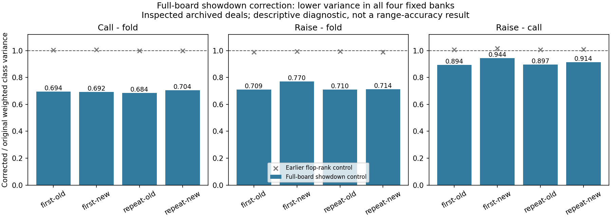

# Showdown control: consistent modest variance reduction

The full-board showdown control reduced descriptive variance for all three contrasts in all four frozen banks. This qualifies a small fresh-training integration experiment, not production deployment or a claim of better ranges. The difficult raise-minus-call contrast improved less than either action versus folding.

## Completed diagnostic

Used all 65,536 previously inspected physical deals, the same frozen self-play pairs and the same opposite-parity fitting protocol as the unsuccessful eight-feature flop test. The only feature is BB's sampled five-card showdown share minus its exact expectation conditional on both private hands. The archived integer counts cover all 1,712,304 compatible boards. No new equity enumeration, policy inference, training or production changes were involved.

Each class/bank/contrast coefficient was fitted on the other sample half with an intercept and the fixed ridge penalty of 1. Only the centered feature correction was applied, without the fitted intercept. The unused feature slots are identically zero, retaining the checked fitting implementation. No penalty tuning or winning-bank selection followed the result.

| Bank | Call - fold variance ratio | Raise - fold variance ratio | Raise - call variance ratio |
| --- | ---: | ---: | ---: |
| first-old | 0.6940 | 0.7094 | 0.8944 |
| first-new | 0.6923 | 0.7697 | 0.9441 |
| repeat-old | 0.6839 | 0.7104 | 0.8966 |
| repeat-new | 0.7042 | 0.7137 | 0.9136 |

A ratio below 1 means lower variance. Call-minus-fold variance decreased **29.6–31.6%**, raise-minus-fold **23.0–29.1%**, and raise-minus-call **5.6–10.6%**. These are ratios of incoming-mass-weighted class variances. They are not wall-clock speedups; standard deviation reductions are smaller than variance reductions.

## Verification and limits

The isolated scorer's four tests and four existing evaluator tests passed. A best-of-21 five-card reference agreed on every native score in the full 65,536-deal pass. The separate readback reauthenticated cards and exact counts, independently scored every board, reconstructed coefficients using augmented least squares, and recomputed moments using scalar sums. Maximum coefficient discrepancy: 8.53e-14; maximum moment discrepancy: 2.96e-12.

The diagnostic took 290.2 seconds including storage admission; readback took 118.5 seconds. Array and card evidence occupies 8.71 MB plus compact metadata. Detailed class records and coefficient/source hashes remain in `archived-showdown-control-diagnostic-v1-result.json` and its registered store.

This is exploratory reuse of inspected outcomes. Cross-fitted residuals share fitted coefficients, so a naive pooled standard error is not an independent-sample confidence guarantee. A smaller variance does not validate the fixed continuations, solve low-reach branches, remove policy drift, or establish convergence. Jam is excluded from the three comparisons. The earlier confirmatory intervals and negative flop-rank result are unchanged.

## Next training control

Build a separately identified root-target correction that leaves fold and the exact initial-jam target unchanged, adjusts call/raise with the centered showdown feature, and recenters advantages under the played policy. The correction must preserve expected targets and must not enter policy observations.

Freeze coefficients using the equal-weight average of all four banks and both parity fits; do not choose whichever bank looks best. Fit no coefficient using the target deal itself. For a fresh trial, coefficients must predate independent new training seeds, and the final evaluation must use separate unseen deals. Replaying the old seeds would not provide that clean separation because the archived policies contributed to coefficient estimation.

First measure one bounded training-control generation and its storage before admitting any longer trial. A small variance benefit should not trigger an unbounded GPU run. Any adoption decision requires actual range stability and payoff evidence from the fresh matched trial, with training budgets and checkpoint rules fixed in advance.
