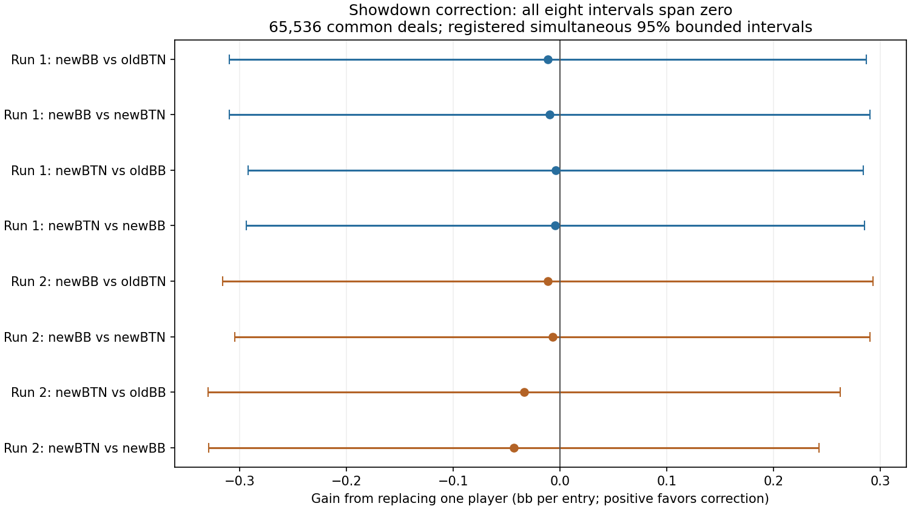

# Showdown correction: completed study

The correction has not demonstrated better preflop play. It modestly reduces
the difference between the two training runs, but leaves substantial hand-range
instability. All eight payoff estimates are slightly negative and all registered
intervals span zero. That is an inconclusive strength result, not proof of harm,
equivalence, or general failure of variance reduction. Do not deploy this candidate.

## What was tested

The restricted BB-versus-BTN context has a 200bb stack, a 2bb open, 0.5bb dead
money, and 5% rake capped at 2bb. Four arms used two fresh matched seeds,
78 updates and 512 physical deals per update. Both treatments integrate root
and later postflop actions; the candidate additionally applies a fixed, centered
showdown correction to BB root learning targets. Evaluation uses unchanged poker
payoffs, not corrected targets.

Every full training arm passed scalar readback. Each evaluated policy averages
played generations 0–77 with weights 1–78 and own-action reach. Generation 78
was not played and is excluded. The fixed final evaluation used 65,536 fresh
common deals across eight crossed profiles. There was no outcome-based sample
extension, favorable checkpoint selection, or changed statistical rule.

## Range stability

Cross-seed root total variation decreased from **46.94%
to 43.92%**, a **3.02-percentage-point** reduction.
The most frequent action still differs in **88 of 169 classes**, compared with
95 for the baseline. This is a descriptive comparison of two seeds.
Total variation measures how much action probability must move to reconcile
the policies; it is not the percentage of hands played incorrectly.

| Complete bank | Fold | Call | Raise | Jam |
| --- | ---: | ---: | ---: | ---: |
| first-old | 45.46% | 38.59% | 15.81% | 0.14% |
| first-new | 46.49% | 37.17% | 16.09% | 0.26% |
| replication-old | 43.59% | 37.96% | 17.64% | 0.80% |
| replication-new | 43.88% | 39.24% | 16.27% | 0.61% |

Within matched seeds, the correction changes root probability by
37.91% and
36.75% total variation.
Aggregate frequencies hide these large per-hand changes. The
[complete 169-class table](showdown-final-all-hand-classes.json) includes native
indices, labels checked against every physical private-hand combination, all
four policies, entry masses and every per-class comparison. The
[original stability data](showdown-final-root-stability.json) is copied byte-for-byte.

## Playing-strength comparison

Positive values mean the replacement player gains against the specified fixed
opponent. Units are bb per entry into this research spot, not bb/100 dealt hands.
The intervals are the prospectively registered bounded empirical-Bernstein
intervals with Bonferroni adjustment over all eight contrasts, family error 0.05,
at one final look. Ordinary paired standard errors are also shown.

| Replacement and fixed opponent | Mean gain | Standard error | Simultaneous 95% interval |
| --- | ---: | ---: | ---: |
| first:newBB-v-oldBB-against-oldBTN | -0.0113 | 0.0317 | [-0.3095, +0.2869] |
| first:newBB-v-oldBB-against-newBTN | -0.0096 | 0.0322 | [-0.3096, +0.2904] |
| first:newBTN-v-oldBTN-against-oldBB | -0.0038 | 0.0289 | [-0.2919, +0.2843] |
| first:newBTN-v-oldBTN-against-newBB | -0.0044 | 0.0292 | [-0.2938, +0.2850] |
| replication:newBB-v-oldBB-against-oldBTN | -0.0113 | 0.0334 | [-0.3157, +0.2932] |
| replication:newBB-v-oldBB-against-newBTN | -0.0070 | 0.0315 | [-0.3046, +0.2905] |
| replication:newBTN-v-oldBTN-against-oldBB | -0.0334 | 0.0311 | [-0.3296, +0.2628] |
| replication:newBTN-v-oldBTN-against-newBB | -0.0430 | 0.0282 | [-0.3288, +0.2427] |

The negative point estimates provide no encouraging strength signal here,
but their uncertainty does not establish harm. Wider simultaneous intervals
reflect rare large-pot outcomes and the fixed coverage requirement. We do not
replace them with narrower post-hoc intervals. More evaluation alone would
not stabilize the already-trained policies. [Full analysis](showdown-final-analysis.json).

## Verification, performance and retained history

The independent reviewer checked all 2,048 batches, **29,771,489 policy
observations**, reconstructed the exact chance stream, checked the two archive
sources, all crossed policies, root summaries, payoff accounting and all eight
statistical reductions. Maximum numerical discrepancy was
3.41e-13. This does not independently reimplement
neural inference or native poker evaluation and is not a best-response certificate.

CPU archive work had kept the GPU waiting. Parallel archival processing improved
observed sampling throughput from roughly 2.3 to 7.2 hands/sec while preserving
the original 19,776 completed hands. The remaining 45,760 hands completed in the
separate registered continuation. These are sampling-stage measurements, not
training or whole-project speedups.

The initial serial verifier was also underusing the CPU. An eight-worker control
checked 512 reused hands with exactly matching serial outputs and rejected invalid
batch metadata; it took 12.09 seconds versus 46.34 seconds including startup
(3.83x). The full parallel review checked every hand from the beginning and
finished in **15.44 minutes**. It used the unchanged original decoder
and scalar checks; results were combined in original order.

After that complete proof and source-immutability checks passed, the redundant
serial reviewer was intentionally stopped. Its controller consequently exited
with an assertion, as expected; it is not represented as a completed serial
review. The sampling result remains complete, and the separately named parallel
execution/result proves full verification. Original interrupted sampling records,
partial serial logs and the retirement record remain retained.

Production port 56708 and production code were not changed. No candidate was deployed.

## Next useful step

Do not spend another full training run simply retuning this correction. Prior
diagnostics found roughly two observations per hand class per update, empty
classes in many updates, noisy call-versus-raise values, and continued policy
movement. This experiment has not resolved that larger problem.

First use the newly completed training records to quantify class coverage and
late-policy movement for all four arms with the same definitions as the prior
study. Then qualify a small class-stratified sampling pilot: ensure regular
coverage while preserving the intended physical-card distribution through
explicit conditional sampling and any required weights. Check estimator
expectations, action-target variance, fitting behavior and time per useful
observation before a new fixed-budget matched study. This is a proposed research
direction, not a claim that stratification will solve within-class runout noise
or that a particular speedup/accuracy improvement is already available.

Future substantial runs should first inspect competing workloads and benchmark
CPU worker counts, GPU batches, RAM and I/O on a representative small workload.
Use available resources to shorten completion time, preserve room for user solves,
and avoid serial evidence processing when independent batches can run concurrently.

The larger goal still requires reliable learning and validation across positions,
stack depths, sizing trees and multiway contexts. This one spot and two seeds
cannot support those broader claims.

## Evidence identities

- Sampling registration: `f124a083fc8e24a1a4b44804d58fb8c5626fe0173eb785e85457baf5b7f259ef`
- Completed sampling result: `1189e75aa271d038386973f4ef06e6f9645220819d9964fcc3673a9ba82a8fea`
- Completed parallel independent review: `c043df0f6c5d5f72ea1b7fdf512e4e2a340bc37f0c450480a7792b515a70fe2a`
- Parallel execution result: `0f3d497f59a52c37f111f73ffdd5f751cfd96253df467e51fac27729e29165d5`
- Analysis: `c6db99addb9f97a3041603cb29987cd99c7d7fc5b739d0a44662cf0c23f8f645`
- Root policies and stability: `e2ae5d61057932229915c55fac78af082a1c549e3383be37e375fbbb3456b1c8`

Generated from authenticated completed artifacts by
`tools/research/showdown_final_findings_20260927.py`.
