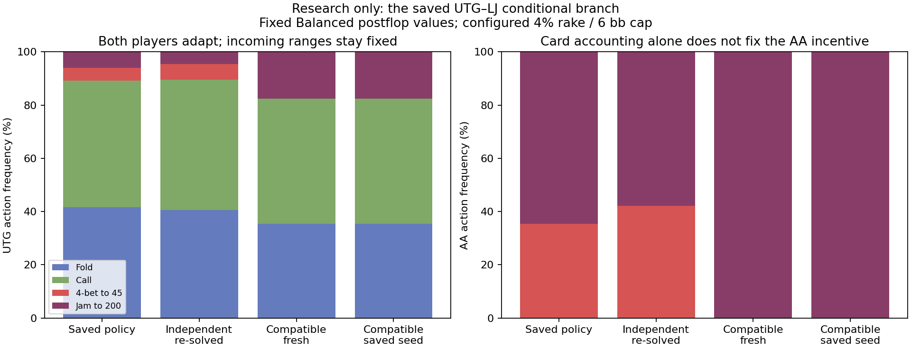

# Card accounting in the actual UTG–LJ branch

**Correcting physical-card compatibility materially changes the equilibrium
of this conditional game, but does not make the fast postflop approximation
behave like Wizard.** Both players adapt. The corrected game chooses more
jamming and virtually eliminates the smaller 4-bet. This is a useful negative
result: fixing card accounting alone is not an accuracy solution.

## What was held fixed

The frozen 1,000-iteration eight-player baseline, branch
`[1,2,0,0,0,0,0,0]`: UTG opened to 6, LJ raised to 18, everybody else folded.
UTG is out of position. Pot 27.5 bb, investments 6/18 bb, dead money 3.5 bb,
stacks initially 200 bb, configured 4% rake capped at 6 bb. All 12 remaining
nodes were exported read-only, including the direct fold and call outcomes.

All earlier ranges and choices stay fixed. Both players' decisions inside
this branch can change. The independent model multiplies class probabilities;
the corrected model discounts impossible overlapping card combinations and
normalizes once at branch entry. Both use the same cached showdown equities
and the existing Balanced non-all-in continuation values. Neither includes
the six folded players' card removal.

This is an independent CPU correctness reference, not a CPU speed project or
an application integration. Production on 56708 was not changed.

## Results at 50,000 iterations

Frequencies are conditional on entering this branch, not percentages of all
dealt hands. Saved frequencies use the original independent accounting; each
new solve uses its own chance model.

| Policy | Fold | Call | 4-bet to 45 | Jam to 200 |
|---|---:|---:|---:|---:|
| Saved original | 41.57% | 47.56% | 4.94% | 5.93% |
| Independent, re-solved | 40.50% | 49.09% | 5.88% | 4.54% |
| Compatible, fresh start | 35.38% | 47.09% | <0.001% | 17.53% |
| Compatible, saved-policy seed | 35.38% | 47.09% | <0.001% | 17.53% |

For AA specifically, the saved policy is 35.47% 4-bet / 64.53% jam.
The independent re-solve is 42.23% / 57.77%. Both compatible runs choose
essentially 100% jam. The saved independent action values are reproduced:
AA call 19.76040, 4-bet 40.11960, jam 40.10420 bb relative to folding here.

Under the compatible fresh solution, AA's call value remains only 20.27685
bb, while the jam value becomes 49.18952 bb. The smaller 4-bet's value is
45.06593 bb for the fresh run versus 48.28837 bb for the saved-seed run.
That difference is not hidden: virtually nobody takes the smaller 4-bet,
so its downstream policy is poorly identified. Both resulting strategies
nevertheless pass complete-game best-response checks and prefer jamming AA.

LJ's response changes with UTG's changed jamming range:

| LJ hand facing jam | Independent re-solve: call | Compatible fresh: call |
|---|---:|---:|
| AA | 100% | 100% |
| KK | 100% | 100% |
| AKs | 50.58% | 100% |
| AKo | <0.001% | 10.17% |
| AQs | 0.001% | <0.001% |
| QQ | 0.001% | <0.001% |
| JJ | 18.96% | <0.001% |

Earlier fixed-range physical-deal tests found profitable AQs calls against
the *old* jam mix. That does not imply AQs must call this new mix: UTG's jams
now include substantial AK and premium-pair weight. This demonstrates why
changing just one player's response is not a complete repair.

## Verification and uncertainty

Alternating CFR+, linear own-reach averaging, checkpoints at 1,000 / 10,000 /
50,000 iterations, with both fresh and saved-policy initializations as
preregistered. Final total exact response gains:

| Run | Best-response gain, conditional bb |
|---|---:|
| Independent fresh | 0.000004852 |
| Compatible fresh | 0.000001324 |
| Compatible saved seed | 0.000003342 |

All pass the preregistered 0.001 bb numerical target. A second implementation
enumerates all 5 UTG and 6 LJ complete contingent plans. It reproduces both
players' utilities and best-response gains across 20 policy/chance combinations
within 2.67e-15 bb. Terminal probabilities are one; conservation including
dead money and expected rake is within 4.53e-9 bb. Inputs and outputs are hashed.

The saved policy has a 0.001481 bb response gain under independent accounting,
but 1.330949 bb under compatible accounting. Further independent convergence
does not repair that: its final policy has 1.347720 bb response gain when
evaluated in the compatible game. These are *conditional branch* figures,
not full-game exploitability or measured real-poker losses.

Rake makes the game general-sum; convergence was checked, not presumed.
Small best-response gains certify this finite approximation only. Equity-cache
sampling error, earlier fixed ranges, missing folded cards, and inaccurate
non-all-in values remain. Near-zero-reach actions should not be interpreted
as reliably solved poker recommendations.

## Implication and next step

Two separate errors now have independent evidence: impossible card combinations
distort all-in responses, and fixed pot-share continuation values miss the
future value and range interaction of calling or making a smaller raise.
The previous explicit-postflop AA studies already showed that adding AA to a
calling range changes its own value substantially. A fixed bonus is inadequate.

Next, measure continuation values at the *newly adapted range states* and test
a controlled joint update. Keep card accounting correct in that experiment;
do not tune it back to the old ranges or promote this conditional reference
to production. Full-game GPU integration and validation remain separate work.

## Reproduction

1. Build `conditional_hu_export` and export the frozen save to `subtree.json`.
2. Run `tools/research/conditional_hu_audit.py register`, then `run`.
3. Run `tools/research/conditional_hu_verify.py` and `conditional_hu_report.py`.

Export and registration refuse to overwrite evidence. Existing registered
completed jobs are skipped. See `PROTOCOL.md`, `freeze.json`, `review.json`,
`pure-plan-verification.json`, and `result-hashes.json`.
