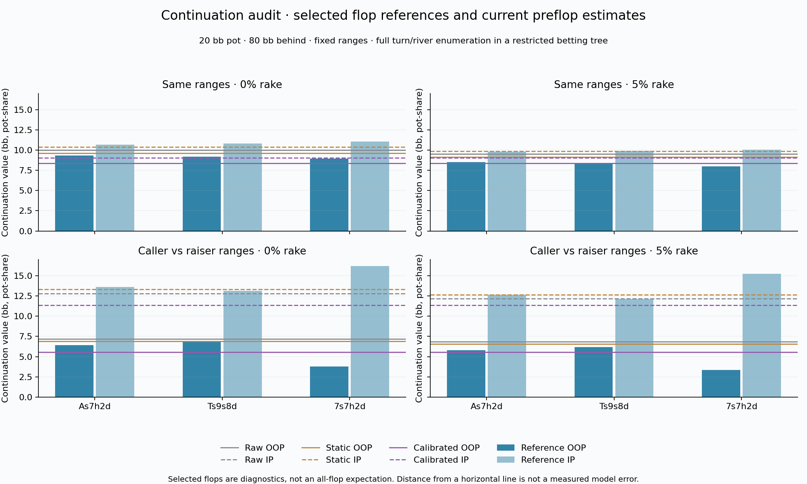
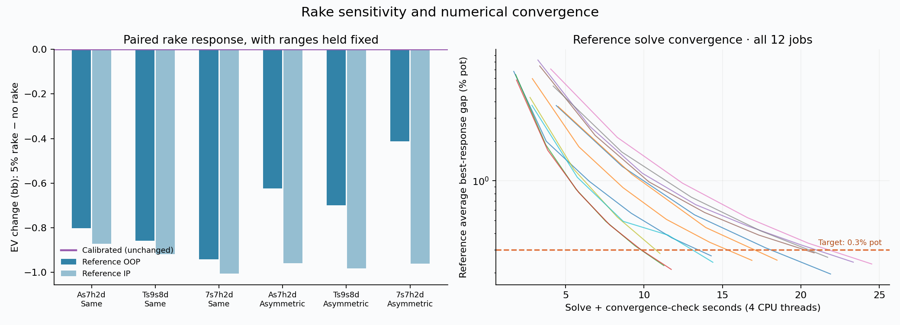

# Initial continuation-value audit — 9 September 2026

The first controlled audit confirms a useful next target: **HU calibrated
preflop leaf prices do not respond to the requested rake**, and the current
per-player realization formulas do not enforce a consistent total pot value.
No production pricing or saved games were changed by this audit.

[Pass 2](pass2/README.md) extends this diagnostic with a frozen weighted board
sample, disjoint fitting/evaluation boards, and a research-only joint value/rake
candidate. Its progress and results are tracked separately.

This is a small diagnostic panel, **not a measured all-flop error or a new
continuation model**. The reference solves are also abstractions of poker:
finite iterations, a restricted size menu, and unmodeled opponents playing
against each other with DCFR.

## Findings

- Changing rake from zero to 5%, capped at 3 bb, leaves calibrated prices
  exactly unchanged. In the six matched postflop comparisons, combined
  player value falls by **1.37–1.95 bb**. Ranges, board, pot, stack and betting
  menu are held fixed; each rake configuration is solved separately.
- At zero rake, calibrated OOP + IP prices total **17.41 bb** for identical
  ranges and **16.88 bb** for asymmetric ranges in a **20 bb** pot. Some rake
  is already embedded in the calibration. This missing value is an accounting
  limitation, independently of which flops were sampled.
- The static positional adjustment also fails exact accounting in the
  asymmetric fixture: OOP + IP total **20.225 bb** at zero rake. Raw equity
  prices sum to 20.0005–20.0022 bb; that small discrepancy comes from the
  cached Monte Carlo equity table and floating-point aggregation.
- All **12** reference solves met the **0.3% pot** average best-response-gap
  target, finishing between **0.196% and 0.283%**, in 100–175 iterations.
  Build, solve/check and final query wall time totaled **212.3 seconds** on
  four CPU threads. Maximum solver arenas were **283.5 MiB**, with at most
  **26.7 MiB** of tree storage. These are instrumented allocations, not peak
  process memory; runtime depends on concurrent machine activity.



Horizontal lines are board-independent preflop prices. Bars are values
conditional on a particular flop. Their distance is **not** an estimate of
preflop model error; all-flop expectations can differ from each individual
board value.



The orange dashed line is the convergence target. Each thin curve is one
reference solve; its complete series and identity are in `results.json`.

## Fixtures and units

Both cases use a 20 bb gross pot and 80 bb effective stack behind (SPR 4):

| Fixture | OOP range | IP range |
|---|---|---|
| Same ranges | `88+,ATs+,KQs,AQo+` | `88+,ATs+,KQs,AQo+` |
| Caller vs raiser | `22-JJ,A2s-AQs,KTs+,QTs+,JTs,T9s,98s,87s,AJo-AQo,KQo` | `88+,ATs+,KQs,AQo+` |

These are fixed analytical fixtures, not fitted player profiles or claims
about what a particular seat should play. The three purposively selected
boards are `As7h2d`, `Ts9s8d` and `7s7h2d`. Each is solved at 0% and 5% rake.
The postflop tree offers a 50%-pot bet and one 100%-pot raise per street,
no donk sizes, and an 85% all-in conversion threshold. It enumerates the
remaining turn and river runouts under the engine's suit isomorphisms.

Values are **bb in gross-pot-share convention**: future bets are accounted
for, but sunk preflop investments are not subtracted. Subtracting the same
known preflop contribution would translate both methods to net-from-hand-start
EV without changing their comparison.

The reference averages use `hand.reach × hand.valid`, where `valid` is
compatible opponent mass. The harness checks matching pair denominators,
OOP + IP equity = 1, no-rake value conservation, and implied rake within the
3 bb cap. Raked pot-share sums equal starting pot minus expected final-pot
rake, rather than starting pot minus rake on the starting pot alone.

The preflop audit calculation deliberately mirrors the engine's current
independent class marginals and cached 20,000-sample matchup equities. It
uses the public calibrated `class_r` method and copies the short static
positional formula. It does **not** use the obsolete initiative/context
multiplier. It is an analytical reproduction of leaf pricing, not a walk
through a user's live game; both range representations are included so this
distinction remains reviewable.

## Next experiments

1. Build a weighted all-flop reference for these fixtures before reporting
   predictive error. For suit-invariant ranges, combine canonical-flop
   multiplicity with the board's compatible hand-pair mass; equal weighting
   of the three boards here would be incorrect.
2. Check menu sensitivity with larger bet/raise menus and a tighter gap
   target on a smaller representative subset. Add pot/stack/rake grids and
   range swaps before generalizing the results.
3. Design a joint HU value estimate that models expected rake separately
   from the distribution of the remaining pot between players. This should
   enforce accounting while retaining range and position information. Simply
   renormalizing today's values would alter incentives without establishing
   which player's estimate is wrong, so no such patch is applied here.
4. Add locked postflop opponent styles and examine preflop decision changes.
   Lower continuation prediction error alone does not prove better exploit
   decisions or increased win rate. Multiway leaves need a separate audit.

## Reproduce

From the repository root, with its existing equity cache and calibrated fit:

```powershell
cargo run --release -p solver --example continuation_audit
python tools/research/continuation_audit.py
```

The Rust example fixes Rayon to four threads and requires an existing
20,000-sample equity cache, avoiding implicit regeneration. Optional
`AUDIT_CASE`, `AUDIT_BOARD`, and `AUDIT_MAX_ITERATIONS` environment variables
allow a small diagnostic run; the chart publication step requires the complete
12-job panel and all convergence targets met. The output JSON is checkpointed
after every job. No app API, live server, raw histories or saved session is
used. The script only writes this research directory.

`results.json` contains every configuration, value, allocation and convergence
point. `summary.json` records paired comparisons, accounting checks, input
hashes and the executable hash. Source hashes are captured during chart
generation; because other agents were developing concurrently, they are a
working-tree snapshot rather than a claim that the entire tree was committed
or immutable during this first run.
