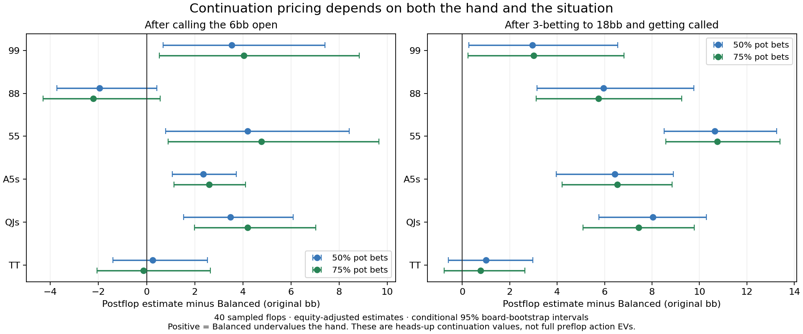

# Balanced continuation audit: current 0.5bb SB game

Completed 15 September 2026. **160/160 postflop references passed the 0.1%-pot
convergence target.** The continuation approximation materially misprices
selected hands in the user's current game. No live model was replaced.

## What was compared

The game on port 56708 finished at iteration 500 and was saved as
`saves/preflop/balanced-sb05-continuation-20260915.gtop`. It has eight seats,
200 original bb stacks, SB 0.5, BB 1, UTG straddle 2, opening raise 6, no rake,
no limps, Balanced realization and Solver in every seat. Full configuration
and input weights are in `fixtures.json`; `decision-node.json` records the
current response node. The live game and postflop session were preserved.

GTOpen UTG1 is Wizard UTG; GTOpen MP is Wizard LJ. The first-open response
menus inspected in Wizard match the intended 18bb IP / 24bb SB / 27bb BB /
30bb straddler 3-bets. This study does not claim that every later Wizard
branch or its postflop abstraction is identical. It compares **GTOpen's own
fixed incoming ranges** under two different ways of valuing future play.

Two heads-up terminals were evaluated separately:

| Terminal | Pot | Remaining stack | Line |
|---|---:|---:|---|
| Call | 15.5bb | 194bb | UTG1 raises6, MP calls, everyone else folds |
| 3-bet | 39.5bb | 182bb | UTG1 raises6, MP raises18, others fold, UTG1 calls |

For each, the postflop ranges were held fixed while solving all turn/river
runouts for 40 sampled flops, using both 50%-pot and 75%-pot bet menus. Each
street permits one raise with a 100%-pot raise size. Both players can lead;
there is no additional always-available jam action. Stack caps and automatic
jam conversion still apply. These are restricted postflop references, not
full-game Wizard solutions.

## Main results

Values below are MP's **gross continuation EV in original bb**: preflop
investment has not been subtracted. They are not full preflop call/raise EVs.
Postflop columns show the equity-adjusted estimate, with the range spanning
the two bet menus. The unadjusted estimator is retained in `summary.json`.

| Hand | Balanced after call | Postflop after call | Balanced after 3-bet/call | Postflop after 3-bet/call |
|---|---:|---:|---:|---:|
| 99 | 8.56 | 12.10-12.60 | 22.58 | 25.53-25.58 |
| 88 | 8.25 | 6.03-6.29 | 20.85 | 26.60-26.80 |
| 55 | 7.20 | 11.39-11.96 | 15.49 | 26.14-26.25 |
| A5s | 7.54 | 9.88-10.14 | 17.23 | 23.66-23.77 |
| QJs | 7.54 | 11.03-11.74 | 19.96 | 27.40-28.00 |
| TT | 9.29 | 9.15-9.54 | 25.00 | 25.77-26.00 |



The clearest observations are:

- A5s and QJs are underpriced in both continuations, under both menus.
- 55 is also underpriced here, though its call-branch interval is much wider.
- 88's point estimate is overpriced after calling but underpriced after
  3-betting. Its call-branch interval includes the Balanced estimate, so the
  direction there remains tentative. A universal pocket-pair bonus is unjustified.
- TT is relatively close, particularly compared with the other 3-bet errors.
- The actual calling range's unadjusted mean IP EV is only 6.82-7.03bb,
  versus Balanced's 8.71bb. Missing valuable hands and overvaluing the selected
  range can occur together. This is not just a uniform pessimistic offset.

Example conditional 95% board-bootstrap intervals under the 50% menu:
A5s call continuation 8.60-11.26bb versus Balanced 7.54; QJs 9.07-13.62bb
versus 7.54; 55 7.99-15.61bb versus 7.20. These intervals exclude uncertainty
about opponent adaptation, range transport, richer betting menus and the
Monte Carlo equity cache. They are exploratory, not multiplicity-adjusted.

## Does this affect the preflop decision?

The corrected-SB solve still folds 93.708% at MP's first response, versus
Wizard's previously observed 92.1%. The updated configuration also changed
the straddler's later multiplier; this is not an isolated SB-only experiment.

To measure the importance of the continuation error, `sensitivity.json`
replaces just the evaluated terminal's value in the original action EV.
Everything else remains fixed, including opponent policies, other heads-up
terminals, multiway pots, folds and re-raises. Within the preflop model's
independent-range probability convention, the heads-up call terminal occurs
38.71% of the time conditional on MP calling; the evaluated 3-bet/call
terminal occurs 36.75% conditional on MP raising18.

Illustrative call EVs using the 50% menu and equity-adjusted estimates:

| Hand | Original full call EV | With only this terminal replaced |
|---|---:|---:|
| 99 | +0.773 | +2.142 |
| 88 | +0.355 | -0.403 |
| 55 | -0.890 | +0.734 |
| A5s | -0.867 | +0.041 |
| QJs | -0.668 | +0.683 |

These are **sensitivity estimates, not a newly solved equilibrium or a
recommendation to play these frequencies**. Some sign changes, including
A5s and QJs, remain uncertain within the board-sampling intervals. The
exercise shows that the observed continuation errors are large enough to
matter; it does not establish the final strategy after everyone adapts.

## Why the model can miss this

Balanced divides the starting pot using raw equity and relative hand-class
weights, adjusted for position and SPR. It conserves chips, but does not
solve future betting. It cannot fully represent range-specific bluffing,
value extraction, implied odds or the distinction between being the caller
and being the 3-bettor. Postflop EV for an individual hand can exceed its
share of the starting pot through future bets; allocating starting-pot shares
is a restrictive substitute.

The observed discrepancies combine that limitation with differences in
card-removal treatment: postflop references use compatible physical hole
cards; the preflop approximation uses independent class marginals. Folded
players' cards are not modeled in either side of this comparison. Multiway
continuations were deliberately kept out of the reference benchmark, so
their errors remain a separate problem.

## Sampling, probes and precision

The first batch froze 20 canonical boards before solving: four per
pairedness/suit stratum, selected by a deterministic seeded hash ordering.
After seeing wide pocket-pair intervals, a second batch used the next four
boards per stratum without selecting by results. Both batches are included.
Together they form eight of each stratum's boards, 40 total, with shared
boards across all four branch/menu combinations. In the combined ratio
estimate the common factor of two in the stored first-batch inclusion weights
cancels. It is equivalent to using combined inclusion probability 8/N.

Board weights are suit multiplicity times compatible hole-card pair mass
divided by inclusion probability. Per-hand averages use that hand's compatible
pair mass. The bootstrap resamples boards within strata, jointly across menus
and branches (2,000 replicates, seed 15092026). Forty boards still give wide
intervals for rare profitable events; this does not replace all 1,755 flops.

To make rare-hand sampling less noisy, a secondary control-variate estimate
subtracts sampled checkdown value and adds its preflop expectation, with
coefficient fixed at one. The expectation uses exact compatible-combo counts
and the existing 20,000-sample class-pair equity cache, symmetrized with
diagonal 0.5. It is not exact enumerated preflop equity. This variance-reduction
analysis was added after the initial batch; raw estimates remain published.
For example, raw A5s call continuation is 10.65-10.91bb, adjusted 9.88-10.14.
The conclusion remains the same under both estimates.

Range weights are normalized without changing their relative probabilities.
Weights below 0.005 of the maximum are omitted for tractability: removed mass
is 0.027%/0.100% for call OOP/IP and 0.076%/0.087% for 3-bet OOP/IP. Missing
probe hands are inserted into MP's range at weight 0.0001, adding only
0.0043% and 0.0020% of range mass. Original and used weights/prices are
recorded. This measures approximate deviations against essentially fixed
opponent ranges, not a claim those hands belong in the current range.

Per-hand MP best-response values were also measured after each postflop solve.
Their average gains over the saved strategy are about 0.01-0.04bb in these
aggregates, substantially below the measured multi-bb pricing differences.
Every reference checked compatible-pair symmetry and zero-rake pot accounting.
Original Balanced predictions were cross-checked against the saved preflop
engine's terminal estimate before applying truncation/probes.

## Recommended implementation path

1. Build a broader heads-up continuation corpus spanning incoming-range
   shapes, caller/raiser roles, SPR and postflop sizing. Keep this game's
   observations as a diagnostic set, not the sole fitting target.
2. Fit a compact, range-aware value model to those references. Preserve
   range-weighted zero-rake pot accounting while allowing different individual
   hand values. Include a fallback and evidence indicator outside supported
   contexts. Do not hard-code bonuses for A5s, QJs or all pairs.
3. Validate on untouched games and board samples, then measure whether
   re-solving improves opening/defending behavior and action EVs. Evaluate
   multiway errors separately. Precompute/cache values where possible and
   benchmark GPU solve speed before any deployment.

This audit provides evidence to pursue that path; it is not sufficient to
deploy a general replacement immediately.

## Reproduce

Run from the repository root. The saved game remains local. Manifest and
provenance files record input, executable, equity-cache and fit hashes.

```powershell
cargo build --release -p solver --features gpu --example balanced_continuation_audit
target/release/examples/balanced_continuation_audit.exe prepare saves/preflop/balanced-sb05-continuation-20260915.gtop research/preflop-evolution/continuation/balanced-sb05-20260915/fixtures.json
python tools/research/balanced_continuation_audit.py prepare
python tools/research/balanced_continuation_audit.py run
python tools/research/balanced_continuation_audit.py extend
python tools/research/balanced_continuation_audit.py run
python tools/research/balanced_continuation_audit.py summarize
python tools/research/balanced_continuation_audit.py sensitivity
python tools/research/balanced_continuation_audit.py plot
```

Checkpoint reuse requires matching manifest, executable and input hashes.
If recompilation changes the executable hash, create a separate audit rather
than mixing outputs. `recorded-example.rs` preserves the source actually run.
The helper checks the retained local binary first at
`target/balanced-continuation-audit-gpu.exe`. The example is offline and never
connects to or replaces the app's live sessions.

Full solver tests and the 6 postflop / 15 preflop GPU equivalence tests passed.
The resume check reused all completed references without recomputing them.
