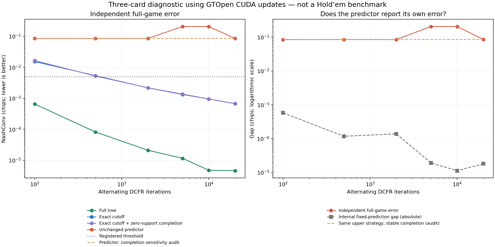

# Production CUDA continuation diagnostic

This test executes GTOpen’s unmodified GPU reach, strategy-update and discount routines in the independently solved three-card game. It does not use a live server or change port 56708.

**Exact-control gate: passed. Prediction gate: failed.**

## Results at 20,000 iterations

| Approach | Independent full-game error | Internal fixed-leaf gap |
|---|---:|---:|
| Full tree | 0.000004639 | Not applicable |
| Exact cutoff | 0.000670900 | 0.000670900 |
| Exact cutoff + zero-support completion | 0.000665181 | 0.000665181 |
| Unchanged predictor | 0.084968099 | 0.000018085 |

NashConv sums the gains available to both players by changing their strategy in the complete game; lower is better. The registered pass threshold is 0.005 chips.

At the final predictor checkpoint the independent error is 4,698 times its internal fixed-value gap. Exact continuation completion is granted to every cutoff arm, including the predicted arm.

The bumps at 5,000 and 10,000 iterations come from numerical selection of continuation actions for almost-impossible hands. A separately labeled, post-hoc audit floors only the reconstruction ranges at 1e-6; it leaves the learned upper policies unchanged. That removes the bumps, changes on-policy EV by at most 2e-12 chips, and still leaves prediction error near 0.085. Both exact controls and the final prediction result are unchanged. The original measurements and gates are retained.

## Checks

- 976 GPU/CPU comparisons passed. Reaches, update values, regrets and strategy sums matched exactly after matching GPU fused multiply-add rounding; maximum leaf-transfer difference was 1.19e-07 chips.
- A separate 192-vector transfer audit included zero opponent mass and predicted shares outside [0,1]; all matched direct explicit-deal arithmetic exactly.
- Every recorded complete-game error was recalculated using both exhaustive pure best responses and an independent recursive evaluator.
- The full-game linear-program reference value is 0.055555555556 chips, agreeing with 1/18. All 13 registered source/data inputs retained their hashes.
- Two smoke failures are retained in SMOKE-NOTES.md: CUDA context initialization and the initial non-fused CPU reference. Neither required a production edit or a relaxed tolerance.

## Interpretation and limits

When the controls pass but the predictor fails, the earlier prediction blind spot survives GTOpen’s real alternating GPU update method. A small reported gap against frozen predicted continuation values does not certify a good complete-game strategy.

This narrows the investigation; it does not prove the same cause explains GTOpen’s Hold’em range differences. The fixture has three private cards, two players, a tiny tree, and a separately fitted RBF predictor. It does not test the N15 model, Hold’em feature encoding, production tree construction, value-slot reuse, multiway continuation, forced policies, or the full CUDA host pipeline.

No production performance conclusion can be drawn from these times: the diagnostic deliberately moves values through Python and solves small linear programs on the CPU. The production CUDA kernels themselves were not modified.

## Suggested next step

Use a fixed, small heads-up Hold’em case to compare action values from direct downstream solves against the deployed prediction interface at the ranges produced by search. Check decision reversals and independent best responses, not only average prediction error or the internal stopping gap. Keep this as a research gate before any model deployment.

Reproduce from the repository root with Python 3.12, NumPy, SciPy, Torch CUDA and local NVRTC. The runner refuses to overwrite a registered run. Audit completed outputs with `tools/research/audit_continuation_dcfr_gpu.py`; render this report with `tools/research/report_continuation_dcfr_gpu.py`.
