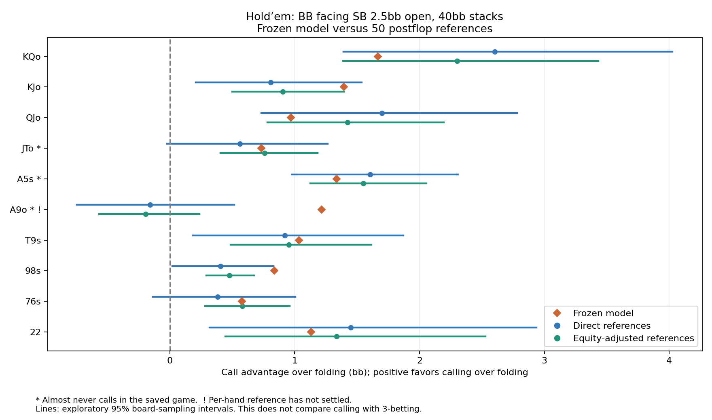

# Hold’em call-versus-fold accuracy audit

The frozen experimental model has **0 clear call/fold sign disagreements** under the predeclared evidence rules in this one heads-up spot. This is a local accuracy result, not full-game exploitability or a comparison with GTO Wizard.

## What was tested

BB faces SB’s 2.5bb open at 40bb, with zero rake. The model prices a call using its predicted postflop value. We compared that value with 50 separately solved flops, using the same opening and calling ranges and the model’s postflop action menu. Calling costs another 1.5bb; folding is the zero baseline in this comparison.

The N15 model and N20 GPU interface are frozen research versions. Neither was installed in the app. The Balanced comparison below also uses that research interface and the same ranges.

## Fixed hand probes

| Hand | Saved call % | Model bb | Direct bb [95%] | Equity-adjusted bb [95%] | BR gain bb | Evidence |
|---|---:|---:|---:|---:|---:|---|
| KQo | 28.41879 | +1.665 | +2.603 [+1.389, +4.026] | +2.301 [+1.386, +3.430] | 0.0075 | uncertain or no clear sign disagreement |
| KJo | 99.99982 | +1.393 | +0.807 [+0.210, +1.538] | +0.904 [+0.501, +1.393] | 0.0064 | uncertain or no clear sign disagreement |
| QJo | 35.88883 | +0.970 | +1.698 [+0.732, +2.780] | +1.424 [+0.781, +2.196] | 0.0067 | uncertain or no clear sign disagreement |
| JTo | 0.00969 | +0.734 | +0.562 [-0.021, +1.264] | +0.760 [+0.404, +1.185] | 0.0063 | sparse call support |
| A5s | 0.00959 | +1.336 | +1.605 [+0.980, +2.309] | +1.550 [+1.126, +2.055] | 0.0063 | sparse call support |
| A9o | 0.00013 | +1.216 | -0.159 [-0.743, +0.516] | -0.192 [-0.565, +0.236] | 1.6216 | sparse call support |
| T9s | 99.99952 | +1.035 | +0.920 [+0.186, +1.871] | +0.954 [+0.488, +1.613] | 0.0047 | uncertain or no clear sign disagreement |
| 98s | 99.99977 | +0.837 | +0.406 [+0.022, +0.829] | +0.478 [+0.291, +0.673] | 0.0047 | uncertain or no clear sign disagreement |
| 76s | 58.26975 | +0.577 | +0.382 [-0.135, +1.005] | +0.581 [+0.281, +0.959] | 0.0042 | uncertain or no clear sign disagreement |
| 22 | 5.45612 | +1.131 | +1.450 [+0.319, +2.936] | +1.337 [+0.446, +2.528] | 0.0080 | uncertain or no clear sign disagreement |

All 169 classes, including sparse and unsettled ones, are retained in [evaluation.json](evaluation.json).

## Clear disagreements under the exploratory screen

No class met every predeclared condition for a clear sign disagreement. This does not establish model accuracy: uncertain estimates and unsupported hands remain unresolved.

## Evidence checks

- All 50 references passed both GPU and transported CPU convergence checks. Maximum gaps: 0.0999% / 0.0999% of the pot.
- Reference solve time: 30.9 minutes, excluding launch overhead.
- 99.9994% of the saved calling range’s compatible pair mass passed the per-hand support and convergence screens.
- Native GPU/Python call-value parity, manifest hashes, weighted means, units, all 169 classifications, and all 5,000-sample confidence intervals were checked independently.

| Evidence classification | Classes |
|---|---:|
| sparse call support | 65 |
| uncertain or no clear sign disagreement | 104 |

| Pair-weighted mean absolute error (bb) | Direct | Equity-adjusted |
|---|---:|---:|
| Frozen model | 0.3664 | 0.2500 |
| Research Balanced baseline | 0.4274 | 0.3413 |

These average errors are weighted by the saved calling range. They are descriptive point estimates, not a statistically established model ranking or a substitute for the per-hand evidence screens.

## Interpretation and next step

This panel did not reproduce the earlier miniature-game decision failure among the adequately supported call/fold comparisons. That is encouraging, but it does not establish that the model chooses the best preflop action or will behave reliably in larger games.

For example, both the model and references value a KQo call above folding in this heads-up spot. A9o looks discrepant on the chart, but its calling frequency is tiny and its reference has a large per-hand best-response gain. It would be misleading to present that unsettled continuation as proof of a model error.

The next useful audit is calling versus 3-betting at a fixed decision, including the opponent’s folds, calls and re-raises. A profitable call alone cannot diagnose missing flatting or mixed strategies. More flops can narrow sampling intervals; they cannot replace evaluating those alternative actions. Keep this research model out of production until those action comparisons and broader contexts are checked.

## Limits

The 50-flop estimate has sampling uncertainty. Equity adjustment can reduce board noise, but uses an approximate cached equity whose error is absent from the intervals. Clear disagreements require both estimates to agree, adequate calling support, and a small per-hand best-response gain. Intervals are exploratory, not simultaneous guarantees across 169 hands.

A positive call value does not establish that calling beats raising. This fixed-range test does not measure the entire preflop strategy’s best response, alternative range distributions, richer postflop menus, other stacks, or multiway play. Some flops may overlap old training panels; the range context and reference labels are new, not a board-disjoint test.

## Reproduce

Run `holdem_call_audit.py run`, then `evaluate_holdem_call_audit.py`, then `report_holdem_call_audit.py` from `tools/research/`. The run checks input hashes and reuses completed references. Required local binaries and saved game are hashed in [manifest.json](manifest.json); they are not committed. See [PROTOCOL.md](PROTOCOL.md) for the frozen rules.
