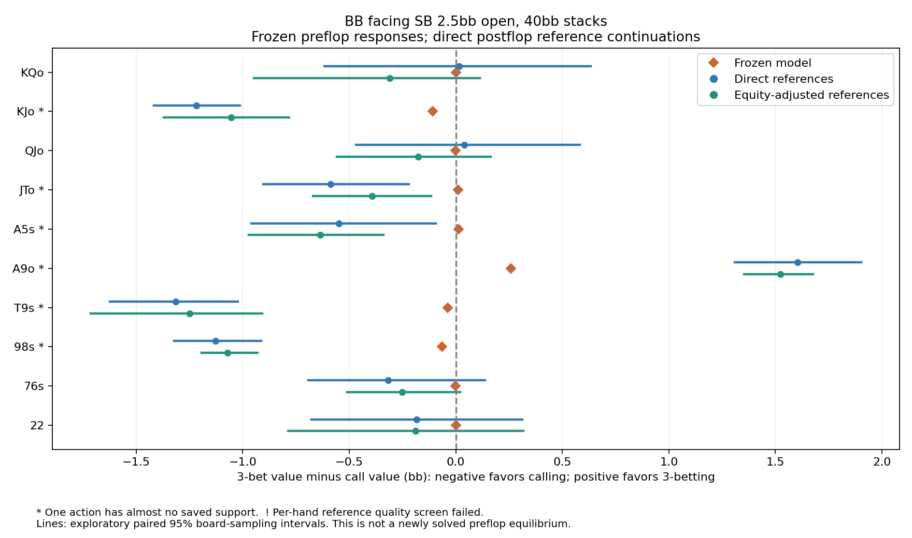
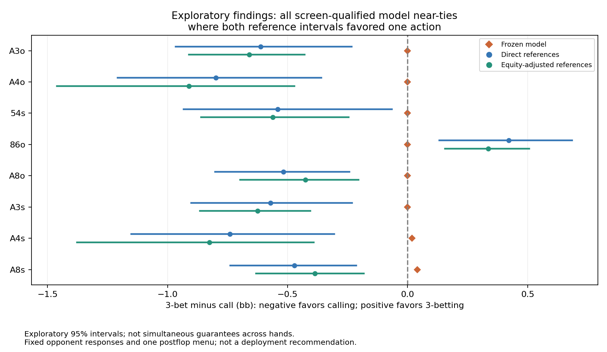

# Calling versus 3-betting: Hold’em audit

The primary screen found **0 clear sign disagreements**. A separate descriptive check found **8 supported model near-ties** where both reference intervals favored one action beyond 0.05bb. Neither count is a full-game accuracy certificate.

## What changed in this test

The same frozen heads-up 40bb game is evaluated at BB facing SB’s 2.5bb open. We compare calling with 3-betting to 7.5bb, including SB’s folds, calls, 4-bets to 22.5bb and jams, and BB’s saved later responses. No preflop strategy was retrained or re-solved.

The test reuses the 50 call-pot references and adds 50 called-3-bet and 50 called-4-bet solves on the same boards. The finite postflop menu is unchanged. Fold payoffs are exact; all-in outcomes retain the shared cached approximate equity. The shallow called-4-bet leaf uses the existing Balanced fallback rather than the learned model.

## Fixed hand probes

Positive differences favor 3-betting; negative differences favor calling. Frequencies below are the saved strategy, not recommendations from this audit.

| Hand | Call % | 3-bet % | Model difference bb | Direct bb [95%] | Equity-adjusted bb [95%] | Evidence |
|---|---:|---:|---:|---:|---:|---|
| KQo | 28.41879 | 71.58113 | +0.0001 | +0.015 [-0.617, +0.634] | -0.310 [-0.946, +0.114] | uncertain or no clear sign disagreement |
| KJo | 99.99982 | 0.00018 | -0.1093 | -1.217 [-1.415, -1.012] | -1.054 [-1.371, -0.782] | sparse action support |
| QJo | 35.88883 | 64.10881 | -0.0005 | +0.040 [-0.469, +0.581] | -0.177 [-0.558, +0.164] | uncertain or no clear sign disagreement |
| JTo | 0.00969 | 99.99027 | +0.0116 | -0.588 [-0.904, -0.220] | -0.394 [-0.669, -0.115] | sparse action support |
| A5s | 0.00959 | 99.99039 | +0.0124 | -0.547 [-0.960, -0.095] | -0.635 [-0.973, -0.341] | sparse action support |
| A9o | 0.00013 | 99.99983 | +0.2579 | +1.602 [+1.308, +1.902] | +1.522 [+1.353, +1.676] | sparse action support |
| T9s | 99.99952 | 0.00047 | -0.0387 | -1.313 [-1.623, -1.022] | -1.249 [-1.713, -0.909] | sparse action support |
| 98s | 99.99977 | 0.00022 | -0.0637 | -1.128 [-1.322, -0.914] | -1.072 [-1.193, -0.930] | sparse action support |
| 76s | 58.26975 | 41.73024 | -0.0002 | -0.317 [-0.692, +0.136] | -0.252 [-0.509, +0.021] | uncertain or no clear sign disagreement |
| 22 | 5.45612 | 94.39500 | +0.0009 | -0.185 [-0.678, +0.311] | -0.189 [-0.787, +0.316] | uncertain or no clear sign disagreement |

## Descriptive near-tie findings

The primary sign test requires a strong model preference. Many mixed hands have model values nearly tied, so zero primary failures would not validate their mixing. This supplementary interpretation was documented during reference generation, before new hand labels were inspected; the primary rules remain unchanged. These are exploratory observations, not extra preregistered failures.

| Hand | Call % | 3-bet % | Reference preference | Model difference bb | Direct bb [95%] | Equity-adjusted bb [95%] |
|---|---:|---:|---|---:|---:|---:|
| A3o | 16.9908 | 83.0092 | call | -0.0002 | -0.612 [-0.966, -0.233] | -0.661 [-0.911, -0.430] |
| A4o | 61.1672 | 38.8327 | call | -0.0002 | -0.799 [-1.209, -0.360] | -0.911 [-1.460, -0.471] |
| 54s | 11.3026 | 88.6974 | call | -0.0003 | -0.541 [-0.933, -0.066] | -0.562 [-0.861, -0.246] |
| 86o | 49.1055 | 17.2564 | 3-bet | -0.0003 | +0.421 [+0.132, +0.685] | +0.336 [+0.156, +0.506] |
| A8o | 56.8756 | 43.1244 | call | -0.0001 | -0.517 [-0.802, -0.242] | -0.427 [-0.697, -0.205] |
| A3s | 57.3592 | 42.6408 | call | -0.0010 | -0.571 [-0.901, -0.231] | -0.625 [-0.865, -0.405] |
| A4s | 0.0139 | 99.9861 | call | +0.0182 | -0.740 [-1.152, -0.305] | -0.826 [-1.378, -0.391] |
| A8s | 0.1601 | 99.8399 | call | +0.0409 | -0.471 [-0.740, -0.215] | -0.386 [-0.631, -0.182] |

## Where the estimated value changes come from

These descriptive point estimates are equity-adjusted reference minus model, in bb. The first column changes the value of calling; the next two change the value of 3-betting. Fold and all-in payoffs are unchanged. The last column is the net change in 3-bet minus call. Sparse-action caveats still apply.

| Hand | Call-pot change | Called-3-bet change | Called-4-bet change | Net comparison change |
|---|---:|---:|---:|---:|
| KQo | +0.636 | +0.182 | +0.145 | -0.310 |
| KJo | -0.489 | -0.447 | -0.988 | -0.945 |
| QJo | +0.455 | +0.328 | -0.050 | -0.177 |
| JTo | +0.027 | +0.191 | -0.570 | -0.406 |
| A5s | +0.213 | -0.116 | -0.318 | -0.647 |
| A9o | -1.409 | -0.063 | -0.081 | +1.264 |
| T9s | -0.082 | -0.402 | -0.890 | -1.210 |
| 98s | -0.360 | -0.458 | -0.910 | -1.008 |
| 76s | +0.004 | +0.114 | -0.361 | -0.251 |
| 22 | +0.205 | -0.017 | +0.033 | -0.190 |

## Interpretation and next step

This test exposes a more useful lead than the earlier call/fold comparison. Seven of the eight descriptive near-tie findings favor calling. For example, the equity-adjusted estimates put calling ahead by about 0.91bb with A4o, 0.66bb with A3o, and 0.56bb with 54s. Their direct estimates point the same way. These are exploratory findings in this fixed heads-up spot, not new recommended ranges.

The called-4-bet fallback contributes to all seven shifts toward calling: replacing its values with references reduces the initial 3-bet value. It is not the only source of error; some call-pot estimates also change materially. The learned model has higher descriptive comparison error than the research Balanced baseline on the 30 qualified classes, despite its better call/fold error in the previous audit. This argues against deployment on the strength of that earlier result.

Next, check the shallow 4-bet continuation directly with a larger, independently selected board panel, then test a replacement for the low-SPR fallback on held-out ranges. This targets an identified coverage gap (17.5bb behind a 45bb pot), rather than forcing prettier frequencies. Re-run both action audits after any candidate change; a local improvement must not come at the expense of the other branches. Do not deploy this frozen research model yet.

## Validation and limits

- All 100 new references and 50 reused references passed both GPU and transported CPU checks; maximum gaps 0.0999% / 0.0999% pot.
- New reference solve time: 10.7 minutes excluding process overhead.
- Native GPU values were matched independently before labels. Branch probabilities, investments, all 169 results and 5,000 paired bootstrap intervals were checked again using a separate conditional-probability calculation.
- Classes passing action-support and per-hand quality screens represent 19.52% of compatible hand mass at this decision.

| Evidence classification | Classes |
|---|---:|
| sparse action support | 139 |
| uncertain or no clear sign disagreement | 30 |

| Mean absolute error on qualified hands (bb) | Direct | Equity-adjusted |
|---|---:|---:|
| candidate | 0.3337 | 0.2983 |
| balanced | 0.2822 | 0.2302 |

These are descriptive error estimates for this fixed strategy and range context, not proof of a better equilibrium. Positive call value alone does not establish that calling beats raising. The same sampled boards are paired across branches, but cached equity error is not included in the intervals; intervals are not simultaneous guarantees over all hands.

A changed preflop strategy could induce different opponent responses. This audit freezes those responses, solves one finite postflop abstraction, and does not quantify full-game exploitability, richer sizing menus, multiway play, or agreement with Wizard.

All 169 classes, action values, and terminal contribution breakdowns are retained in [evaluation.json](evaluation.json). See [PROTOCOL.md](PROTOCOL.md), [INTERPRETATION_PLAN.md](INTERPRETATION_PLAN.md), and [independent-audit.json](independent-audit.json). Nothing was deployed to port 56708.

## Reproduce

From the repository root, run `python tools/research/holdem_raise_audit.py run`, then `python tools/research/evaluate_holdem_raise_audit.py`, then `python tools/research/report_holdem_raise_audit.py`. Completed references are reused after validation. The manifest records required local binary/save hashes; those binary artifacts are not committed.
