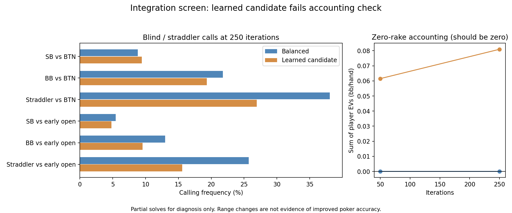

# Learned continuation: first decision screen

**Result: do not deploy this direct integration.** The GPU port matches the frozen model, but its values do not balance when inserted into the current preflop chance model. The longer decision-quality study is withheld until that interface is corrected.

The ordinary app on port 56708 was left unchanged. No candidate weights were retrained, clipped, or tuned.

## What was tested

Two fresh copies of the saved zero-rake, SB 0.5, eight-player straddle scenario used identical trees and action menus. Both reached 250 iterations. The candidate replaced 6,585 heads-up continuation terminals with SPR 1–20; 36,483 other heads-up terminals retained the original pricing, as did multiway leaves. These counts are tree coverage, not the frequency with which play reaches those leaves.

Inference was checked against all 32 original Python fixtures. Maximum GPU/Python discrepancy was 6.65e-08 of pot. All 5746 inspected hand rows were finite and normalized. Both saved policies were then evaluated under both pricing models without changing their strategy/regret arrays.

## Why the accounting gate failed

The learned model conditions on legal two-player card combinations. The current preflop engine combines independent hand-class weights. The same predictions balance to floating-point roundoff with the first weighting, but show up to 4.389% of pot imbalance with the second across the 32 original fixtures. This discrepancy can be reproduced in Python without running the GPU solver.

| Model | Iterations | Sum of player EVs, bb/hand | Diagnostic gap, bb |
|---|---:|---:|---:|
| balanced | 50 | -0.00000026 | 0.70820 |
| candidate | 50 | 0.06151168 | 1.54693 |
| balanced | 250 | -0.00000017 | 0.02086 |
| candidate | 250 | 0.08096140 | 0.11567 |

At zero rake, the EV sum should be zero. The candidate gap freezes its range-conditioned predictions during the best-response pass: it is not full-game exploitability or a standard CFR convergence guarantee. Reaching a smaller gap would not repair the accounting mismatch.

## Observed range changes — diagnostic only

| Decision | Balanced call | Candidate call |
|---|---:|---:|
| SB facing BTN open | 8.80% | 9.42% |
| BB facing BTN open | 21.78% | 19.32% |
| Straddler (UTG) facing BTN open | 38.06% | 26.95% |
| SB facing early open | 5.45% | 4.81% |
| BB facing early open | 12.98% | 9.53% |
| Straddler (UTG) facing early open | 25.73% | 15.59% |

The first opener raised 14.43% with Balanced and 13.53% with the candidate.

These are partial solves, not converged reference ranges. They do not establish improvement over Wizard or full postflop solving. The original source family was also represented in training, so this is not a new independent generalization test.

## Same-policy pricing examples

The following holds each preflop policy fixed and changes only continuation pricing. Values are bb relative to folding at the selected node, with opponent prefix mass divided out. They diagnose sensitivity to the value model; neither column is an independent truth reference.

| Policy | Decision | Hand | Action | Balanced value | Candidate value |
|---|---|---|---|---:|---:|
| balanced | BB vs BTN | TT | Call 6 | 5.422 | 6.401 |
| balanced | BB vs BTN | TT | 3-bet 27 | 5.425 | 7.223 |
| balanced | BB vs BTN | KQo | Call 6 | 1.394 | 0.936 |
| balanced | BB vs BTN | KQo | 3-bet 27 | 1.007 | 0.859 |
| balanced | BB vs BTN | AQs | Call 6 | 3.757 | 4.162 |
| balanced | BB vs BTN | AQs | 3-bet 27 | 3.664 | 5.062 |
| balanced | BB vs early open | TT | Call 6 | 2.982 | 3.380 |
| balanced | BB vs early open | TT | 3-bet 27 | 2.733 | 2.720 |
| balanced | BB vs early open | KQo | Call 6 | 0.432 | 0.500 |
| balanced | BB vs early open | KQo | 3-bet 27 | -1.803 | -0.324 |
| balanced | BB vs early open | AQs | Call 6 | 2.224 | 2.675 |
| balanced | BB vs early open | AQs | 3-bet 27 | 1.302 | 3.267 |
| candidate | BB vs BTN | TT | Call 6 | 5.029 | 5.985 |
| candidate | BB vs BTN | TT | 3-bet 27 | 6.732 | 6.571 |
| candidate | BB vs BTN | KQo | Call 6 | 1.248 | 1.235 |
| candidate | BB vs BTN | KQo | 3-bet 27 | -0.155 | -0.337 |
| candidate | BB vs BTN | AQs | Call 6 | 3.236 | 3.631 |
| candidate | BB vs BTN | AQs | 3-bet 27 | 4.682 | 3.611 |
| candidate | BB vs early open | TT | Call 6 | 2.588 | 3.097 |
| candidate | BB vs early open | TT | 3-bet 27 | 3.834 | 2.269 |
| candidate | BB vs early open | KQo | Call 6 | 0.493 | 0.110 |
| candidate | BB vs early open | KQo | 3-bet 27 | 0.687 | 0.074 |
| candidate | BB vs early open | AQs | Call 6 | 2.046 | 2.258 |
| candidate | BB vs early open | AQs | 3-bet 27 | 2.996 | 2.102 |

## Next step

Build and validate a consistent interface between range-conditioned continuation values and preflop counterfactual probabilities. Require zero-rake accounting and fixed-policy action-value checks before resuming longer learning runs. A common value offset chosen merely to make the totals balance would change the frozen predictions and would need separate validation; it is not silently applied here.

Only after that passes should we test whether changed blind calls and early-position decisions agree better with fresh postflop references. Better average prediction error alone is insufficient, particularly for sparse premium hands and ranges generated by the new policy itself.

## Reproduction and evidence

- `manifest.json` freezes the candidate, equity cache, source save, inference kernel and executable hashes. The 250 checkpoints resume the first 50 execution-check iterations; subsequent code changes before freezing only hardened CLI/experiment guards.
- `comparison.json` contains every selected hand/action comparison, mixed-hand counts, normalization checks and checkpoint summaries.
- `accounting-check.json` reproduces the weighting discrepancy on the original 32 fixtures.
- `balanced-priced-*.json` and `candidate-priced-*.json` contain read-only cross-pricing outputs.
- The planned 500/1,000/2,000 iteration extension was withheld at the structural gate. These 250-iteration results must not be marketed as completed convergence or accuracy validation.
- See `validation.json` for completed checks. Experimental `.gtop` policies remain local, excluded from Git, and must not be loaded into the ordinary app.
