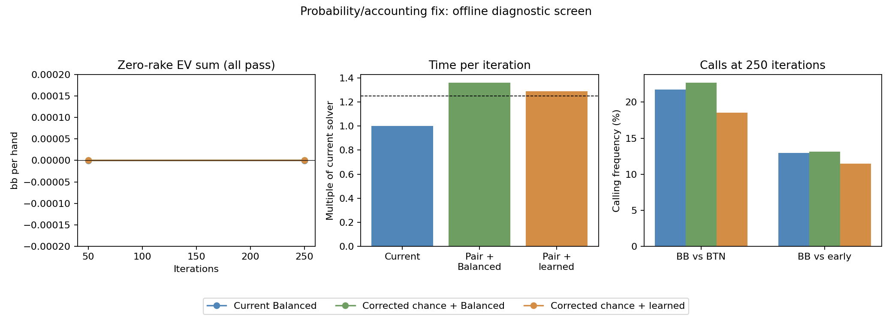

# Learned continuation: consistent chance/value interface

**Research only. Port 56708 remains unchanged.** The frozen predictor now passes the probability/accounting checks. That does not establish poker accuracy or a production-ready speed.

## What changed

Each heads-up branch now carries one consistent legal card-pair probability through folds, calls, all-ins and postflop continuation values. The same weighting applies to chips already invested by folded players. There is no extra offset added to force the total to zero. The predictor coefficients were not changed.

In a two-player game, the card-pair probabilities are exact for suit-symmetric hand classes. In the eight-player experiment, that joint distribution is reset when two live players remain. Cards belonging to previously folded players and earlier multiplayer correlations are still omitted. Cached showdown equity remains approximate.

## Independent checks

- 12 fixed-policy cases: two, three and eight players, current and learned continuation models, dense and sparse policies including whole unreachable branches.
- 54,756 GPU action values checked against independently enumerated physical card pairs; maximum discrepancy 0.000001560 bb.
- Two-player root values, individual terminal chip accounting, all-ins, folds, and folded players' sunk costs checked. Evaluation left stored strategy/regret arrays unchanged.
- 17,238 inspected hand-policy rows were finite, nonnegative and summed to one.
- Ordinary CPU and GPU regression-suite results, reference tolerances and source hashes are retained in [validation.json](validation.json).

## Matched preflop runs

All three arms start fresh from the same zero-rake, SB 0.5 eight-player straddle setup and reach 250 iterations. These are diagnostic partial solves, not certified equilibrium ranges.

| Version | EV sum, bb/hand | Frozen-value gap, bb | Seconds/iteration | Time vs current |
|---|---:|---:|---:|---:|
| Current Balanced | -0.000000167 | 0.02086 | 1.241 | 1.00x |
| Corrected chance + Balanced | 0.000000282 | 0.01320 | 1.688 | 1.36x |
| Corrected chance + learned | 0.000000060 | 0.08011 | 1.600 | 1.29x |

Timing is a single sequential matched run on this machine, including graph capture in each resumed segment; it is a screening measurement, not a controlled repeated benchmark. The production-speed screen was no more than 25% overhead. No deployment is implied.

The best-response gaps freeze the range-dependent predictions and chance anchors. They are not full-game exploitability. A smaller number cannot establish convergence of this changing continuation model.

| Decision | Current call | Corrected + Balanced | Corrected + learned |
|---|---:|---:|---:|
| BB vs BTN | 21.78% | 22.70% | 18.54% |
| BB vs early open | 12.98% | 13.11% | 11.49% |

Aggregate frequencies retain the UI's independent-class display convention. Per-hand probabilities are the direct solver policies. Wider calls are not automatically more accurate.

## Fresh postflop checks

Forty fresh solves cover the learned policy's BB-call branches against early position and BTN: 20 previously unused, stratified flops each. All must pass both GPU and full-enumeration CPU checks at 0.1% pot. The model is unchanged. Tiny range cleanup and probe additions are recorded in the reference manifest and used identically for prediction and solving.

| Branch | Current error (% pot) | Corrected Balanced error | Learned error | Relative improvement | 90% bootstrap interval |
|---|---:|---:|---:|---:|---:|
| BB vs BTN | 6.46 | 6.56 | 6.41 | 0.7% | -8.2% to 7.4% |
| BB vs UTG1 | 8.39 | 8.41 | 7.63 | 9.1% | -0.7% to 16.7% |

Error is range-weighted absolute conditional-value error. The reference uses cached preflop equity as a control variate plus the sampled postflop residual; the equity cache itself is Monte Carlo. These small samples exclude earlier boards and do not cover the complete board distribution. Intervals are exploratory, based on 300 stratified resamples.

The prospective screen required at least 15% lower average error in each branch. Result: **failed**. Hand-level regressions remain visible in `references/comparison.json`. The underlying scenario family also appeared in training, so these are changed-policy stress tests, not independent scenario generalization.

The 0.1% convergence bound is range-weighted; it does not independently certify each rare probe hand. Probe errors are diagnostic and need tighter targeted references before being used as promotion criteria.

| Branch | Current probe error (% pot) | Learned probe error | Negative learned values |
|---|---:|---:|---:|
| BB vs BTN | 17.82 | 9.88 | 0 |
| BB vs UTG1 | 16.39 | 12.50 | 0 |

Examples contributing to the regressions (gross value as a fraction of pot):

| Branch | Player / hand | Reference estimate | Current | Learned |
|---|---|---:|---:|---:|
| BB vs BTN | BB 88 | 0.542 | 0.531 | 0.673 |
| BB vs BTN | BTN KTo | 0.522 | 0.468 | 0.398 |
| BB vs BTN | BB 66 | 0.392 | 0.489 | 0.569 |
| BB vs UTG1 | UTG1 AJo | 0.529 | 0.518 | 0.456 |
| BB vs UTG1 | BB TT | 0.529 | 0.512 | 0.612 |
| BB vs UTG1 | UTG1 77 | 0.696 | 0.552 | 0.480 |

These are sampled conditional-value estimates, not per-hand confidence intervals. Missing reference hands are excluded from regression rankings.

## Decision and next steps

**Keep this offline; do not deploy the learned candidate.** The interface repair passes its independent checks, but the predictor misses the prospective accuracy screen and the prototype misses the 25% runtime-overhead target. The 500/1,000-iteration extension is withheld at these gates; the 250-iteration study is complete as a diagnostic, not as a convergence claim.

1. Expand independent board coverage for these changed-policy ranges, particularly the middle-pair and offsuit-broadway errors, to separate systematic bias from board sampling noise.
2. Add targeted training ranges generated by the candidate, keeping different source families and fresh boards reserved for evaluation. The present frozen predictor has not been refitted or tuned to this screen.
3. If prediction accuracy clears the gate, optimize shared compatible-mass/value calculations and redundant terminal work. Reuse the exact action-value oracle as the correctness contract; repeat timing on matched workloads before considering an opt-in app build.

## Reproduction

Build the research-only example into `target/learned-interface`; export the frozen CUDA predictor, run the independent oracle, then run matched checkpoints.

```text
cargo build --release -p solver --features preflop-research --example learned_interface --target-dir target/learned-interface
python tools/research/learned_interface.py export
python tools/research/learned_interface.py oracle
python tools/research/learned_interface.py run 50
python tools/research/learned_interface.py run 250
python tools/research/learned_interface_reference.py prepare
python tools/research/learned_interface_reference.py run
python tools/research/learned_interface_reference.py analyze
python tools/research/learned_interface_analysis.py report
```

The manifest freezes the executable, predictor, generated kernel, source save and caches. Changing frozen inputs requires a new output directory. Raw trees, checkpoints and saves remain local; compact comparisons, reference results and hashes are retained. Experimental saves still carry Balanced metadata and must never be opened in the ordinary app.


