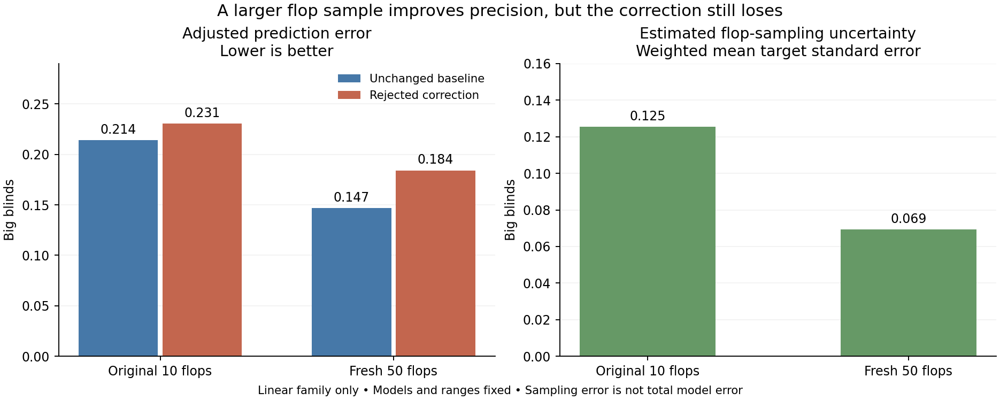

# Board-sampling audit and independent repeat

**Production unchanged. The earlier model screen remains failed.**

All 150 fresh reference solves passed. Maximum CPU/GPU gaps were 0.09984% / 0.09993% pot. Recorded solver time: 38.8 minutes, excluding process overhead and pauses.

The original audit selected the linear family because it had the larger adjusted target standard error among the two ten-board families. The repeat used 50 independently sampled boards shared across all three branches. Ranges, action menus, models and accuracy limits stayed fixed.

| Adjusted action metric | Original 10 boards | Fresh 50 boards |
|---|---:|---:|
| Weighted target standard error | 0.1255bb | 0.0694bb |
| Mean pointwise 95% target interval width | 0.4448bb | 0.2692bb |
| Unchanged baseline MAE | 0.2140bb | 0.1470bb |
| Fixed rejected control MAE | 0.2307bb | 0.1842bb |

The fixed rejected correction is worse on the fresh panel.

Fresh-panel adjusted MAE reduction is -0.0372bb; its conditional bootstrap interval is [-0.0368, -0.0271]bb. Positive means less error. This interval holds coefficients fixed and excludes model-selection uncertainty.

The action targets moved by 0.1893bb in weighted absolute terms between panels. That shift must not be interpreted as the fraction of model error caused by sampling.

Original qualified decision mass: 100.0%. Fresh qualification: 100.0%. Original mass failing the fresh per-hand BR limit: 0.0%. Comparison weights retain the original mask.

Incidental old/new board overlap: 0. Both panels sample the full canonical population; neither excludes old boards.

## Limits and next decision

These are approximate stratified bootstrap intervals, especially for the old panel with only two boards per stratum. There is no finite-population correction. They describe board sampling, not solver bias, postflop abstraction or uncertainty about other ranges and stacks. Pointwise coverage summaries are not simultaneous significance tests.

The repeat is complete and stops here. Inspect the direct estimator and adjusted estimator together in evaluation.json before choosing another model design. A remaining systematic error would motivate explicit interactions between both ranges; more sampling alone does not repair that error. Do not tune on this repeat and present it as independent validation.

See PROTOCOL.md, audit.json, fixed-controls.json, manifest.json and evaluation.json for the frozen design, complete hand-level results and hashes.

## Reviewed conclusion

Both estimators agree on the practical result. With the fresh panel, direct
prediction error was 0.1489bb for the baseline and 0.1854bb for the rejected
correction (24.5% worse). Equity-adjusted error was 0.1470bb versus 0.1842bb
(25.3% worse). This is a comparison against the unchanged research baseline,
not a measured performance loss in the production application.

The adjusted target standard error fell from 0.1255bb to 0.0694bb, about 45%.
Sampling clearly affects the measurements, but better sampling did not rescue
this correction. The remaining error should not be attributed entirely to
sampling, nor does this experiment identify its precise architectural cause.

The percentile bootstrap interval for the error reduction does not contain the
point estimate. Absolute-error comparisons are nonlinear, and resampling adds
variation around already noisy hand-level targets. Treat that interval as an
approximate conditional diagnostic, not a precisely calibrated confidence claim.
Its direction agrees with both fresh-panel point estimates. The selected family's
100% qualification coverage also remained intact.

Recommended next step: a bounded comparison of a model that uses interactions
between both full ranges against the existing correction, with adequately sampled
training targets and separately reserved evaluation ranges and flops. Freeze that
design before generating new evaluation labels. This repeat may inform the new
design, so it must not later be advertised as untouched validation for it.

No further sampling or model training was started. The previous failed screen is
preserved. All 395 frozen inputs and all 150 label hashes/quality checks were
verified again at completion; the process listening on port 56708 remained the
same production process.

