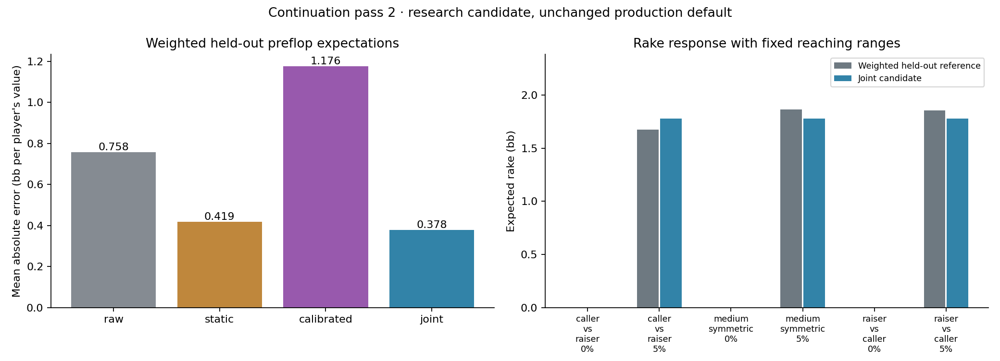
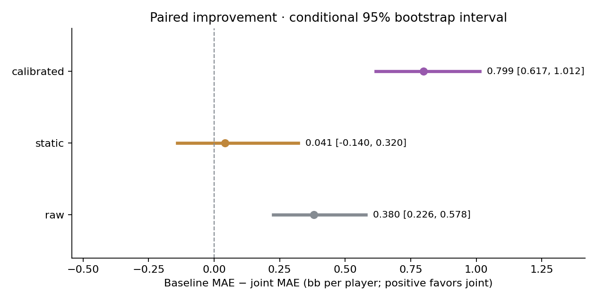
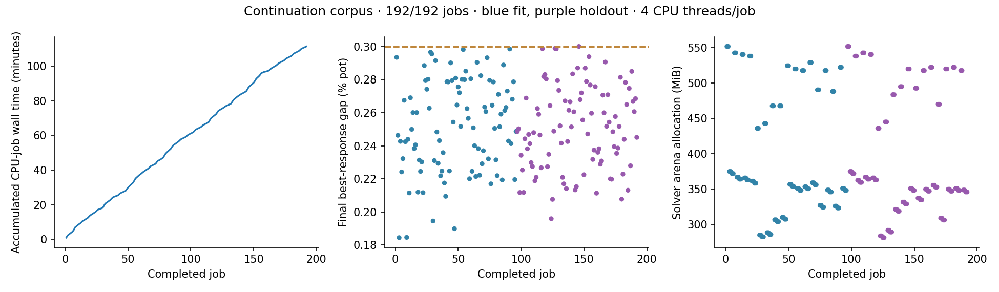

# Joint continuation research — pass 2

**Completed: 192/192 references met the frozen convergence target. Production
pricing is unchanged.** A small joint value/rake candidate reduced weighted
held-out value error versus the current calibrated model in these fixed
range fixtures. Its advantage over the simpler static model is inconclusive.
The experiment stopped at the planned 192 jobs; no extra solves or model tuning
followed inspection of the held-out outcomes.

## Results

These are errors of **weighted preflop expectations**, averaged equally over
three range fixtures, two rake settings and both players. They are not errors
against individual flops or exhaustive full-game poker values.

| Model | Mean absolute error, bb per player |
|---|---:|
| Raw equity | 0.757584 |
| Static realization | 0.418889 |
| Current calibrated realization | 1.176361 |
| Joint research candidate | 0.377568 |

The candidate's error is 67.9% lower than calibrated in this sample. The paired
95% bootstrap interval for the improvement is **0.616929 to 1.012473 bb**.
Against static, the point improvement is only 0.041321 bb and its interval is
**−0.140079 to +0.320439 bb**: superiority to static is not established.
Results are uneven across ranges: static is materially better when the
tighter range is OOP (0.215863 versus the candidate's 0.434044 bb MAE, averaging
both rake settings). The symmetric fixture accounts for much of the gain.




Expected rake at 5%, capped at 3 bb:

| Reaching ranges | Weighted held-out reference, bb | Joint prediction, bb |
|---|---:|---:|
| Medium OOP / tight IP | 1.676461 | 1.776312 |
| Medium / medium | 1.864004 | 1.776312 |
| Tight OOP / medium IP | 1.854293 | 1.776312 |

The candidate's mean absolute rake error across these three estimates is
0.088509 bb. Its predicted rake is zero in the no-rake controls, and both
players' values plus predicted rake sum to the 20 bb starting pot exactly.
Calibrated prices do not respond to the requested rake. Even at zero rake,
their combined values leave **2.894625, 3.551150 and 3.222440 bb unallocated**
in the three rows above; that deficit cannot be called expected rake. Static
also has signed accounting residuals around ±0.184 bb in the asymmetric cases.

All 192 reference solves reached 0.184495–0.299988% pot best-response gap in
100–250 iterations. Their maximum no-rake accounting residual is 0.000000552
bb; maximum equity-complement residual is 0.00000000487. Summed job wall time
was 6,678.90 seconds (111.32 minutes), with two jobs usually overlapping; this
is not end-to-end latency or an isolated speed benchmark. The largest solver
arena was 551.99 MiB and largest tree allocation 26.68 MiB, not total process
memory.

`evaluation.json` retains all six configurations, their OOP/IP values, all
baselines, paired intervals, accounting checks and source hashes. The fit was
frozen before either evaluation worker started. There is no unseen-range,
format or action-menu validation, and the small-sample intervals are
conditional on this fit. **This candidate is not promoted to production.**



The controller updates this graph after each completed job. Blue dots are fit
jobs; purple dots are held-out jobs. The dashed line is the 0.3%-pot reference
best-response-gap target. Each reference uses four CPU threads; the controller
may run two disjoint jobs concurrently when the research CPU slot is available.
Summed job wall times are not end-to-end elapsed time when workers overlap.

## Frozen experiment

`manifest.json` fixes the seed, boards, ranges, sampling weights, action menu,
convergence target and candidate-selection grid before collection. There are
**192 jobs**: 32 boards × three fixed range fixtures × 0%/5% rake, with a 3 bb
cap, 20 bb pot and 80 bb stack behind. Each tree enumerates the full turn/river
runouts, offering a 50%-pot bet and one 100%-pot raise per street.

Boards are drawn uniformly without replacement within eight strata: A-high,
K/Q-high, J/T-high and 9-high-or-lower, each split into paired and unpaired.
Each stratum has **two fit boards and two disjoint evaluation boards**. The
three previously inspected diagnostic boards are excluded before sampling.
Selection uses a fixed SHA256-based ordering, making the sample reproducible.
The target population is the remaining 1,752 canonical flops, not literally
every possible flop.

The fixed draw has seven rainbow and nine two-tone fit boards; evaluation has
five rainbow, ten two-tone and one monotone board. Suit texture was not a
stratum in this initial design. This is a material coverage limit, especially
for monotone flops, to address with broader sampling before promotion.

The range fixtures are a medium-width symmetric range, that range OOP against
a tighter IP range, and the same two ranges swapped between positions. These
are controlled analytical ranges, not measured player prescriptions. They
broaden the first audit but do **not** provide unseen-range validation.

## Correct conditioning and weights

Postflop root values use hand reach × compatible opponent mass. Each board's
sampling weight is:

```
suit multiplicity × compatible hand-pair mass ÷ inclusion probability
```

Fit and held-out expectations normalize these weights within each range/rake
configuration. This is a ratio estimate of the population expectation, not an
unbiased exhaustive sum. Suit multiplicity is applied once because sampling
was uniform within canonical-board strata, rather than proportional to suit
multiplicity. Equal board weights would be wrong here.

Reference checks enforce matching player pair-mass denominators, complementary
equities, zero-rake pot conservation, and implied rake within the configured
cap. Every accepted checkpoint must meet the convergence target.

## Candidate and information boundary

The candidate receives **preflop range equity and known pot, stack, rake and
cap only**. It cannot see the sampled flop or flop-specific equity. It produces
one board-independent prediction for a reaching-range configuration, which is
compared with the weighted held-out expectation, not with a single board.
Its equity input is the engine's approximate preflop class-equity estimate,
using the existing 20,000-sample matchup cache and independent class
distributions. It is not a newly computed exact blocker-conditioned equity.

Training fits expected rake separately as a multiple of rake on the starting
pot, bounded by legal starting/final-pot rake. It then fits OOP's value transfer
relative to its share of the remaining pot, using an intercept and preflop
equity slope. IP receives the remaining joint value. Physical stack bounds
allow negative or greater-than-starting-pot player values when future betting
requires them; the sum always equals starting pot minus predicted rake.

These parameters are learned from reference targets. **The old calibrated
values are not rescaled or normalized.** Two-fold validation within the fit
boards selects slope regularization from the frozen grid. All cases and rake
variants on a board stay in the same fold. The controller finishes both fit
worker shards and writes `joint-v1.json` before it launches any holdout job.

Evaluation reports mean absolute error of aggregate player values versus raw,
static and calibrated baselines. Paired within-stratum bootstrap resamples
held-out boards, carrying all cases/rake variants together. With only two
evaluation boards per stratum, intervals remain small-sample diagnostics,
conditional on this fit; they do not cover uncertainty from unseen ranges,
formats, action menus or model selection.

## Reproduce or resume

From the repository root:

```powershell
python tools/research/continuation_joint.py prepare
cargo build --release -p solver --example continuation_joint
$env:CONTINUATION_WORKERS='2'  # 8 CPU threads total; omit for one 4-thread worker
python tools/research/continuation_joint.py run
```

Existing manifest, frozen candidate and converged checkpoints are retained.
Workers own disjoint job IDs and atomically install completed JSON files. Each
job includes its manifest link and executable/source/input hashes. Resuming
with a different executable or input cache is rejected; changed inputs need
a separate experiment. Evaluation also checks the complete fit/holdout corpus
uses one signature. Initial
timing probes are preserved separately under `pilot-checkpoints`; they are
excluded from the accepted corpus and recomputed with complete provenance.
No live server, saved session, private history, or production default is used.

`recorded-example.rs` preserves the exact runner source matching the accepted
executable's recorded source hash. The maintained example subsequently gained
zero-cap-means-uncapped guards; all frozen jobs use cap 3, so those guards do
not change this experiment. `fit-verification.json` independently verifies the
frozen parameters from their hashed source jobs, and `freeze-record.json`
records that both evaluation workers started after the fit artifact was written.

`progress`, `fit`, and `report` are also separate script commands. `fit` reads
only fit files. `report` refuses incomplete or unconverged references.
With the complete published corpus, `run` performs fit verification and
evaluation directly, without executing or requiring the original platform
binary. For a partial corpus, it checks the current executable and input-cache
hashes against every existing checkpoint before launching workers. A newly
built binary with a different hash cannot append to that corpus; preserve the
original executable to resume, or create a separate study/output directory for
a new run. No reference solve is needed to regenerate the published charts:

```powershell
python tools/research/continuation_joint.py fit
python tools/research/continuation_joint.py report
```

Eight scientific invariant tests cover the preflop-only information boundary,
joint accounting/physical bounds, correct relative sampling weights, and
weighted held-out aggregation. A known synthetic reference recovers its rake
and value-transfer parameters exactly, and altering legacy calibrated values
cannot change the fit. Mixed executable/cache provenance is rejected, including
when Python runs with `-O`; integrity checks use explicit exceptions. The
solver's zero-cap-means-uncapped convention is also
checked (this does not establish prediction accuracy outside the fitted cap):

```powershell
python -m unittest discover -s tools/research -p test_continuation_joint.py -v
```

The maintained Rust example also passed a release compile-check in an isolated
target directory, preserving the accepted executable used by the workers:

```powershell
cargo check --release -p solver --example continuation_joint --target-dir output/continuation-check-target -j 4
```

Promotion would require more range families and held-out formats, rake/SPR
grids, menu sensitivity and preflop decision validation. This pass establishes
a measured research candidate and accounting discipline, not a replacement
for full-game solving or a win-rate claim.
