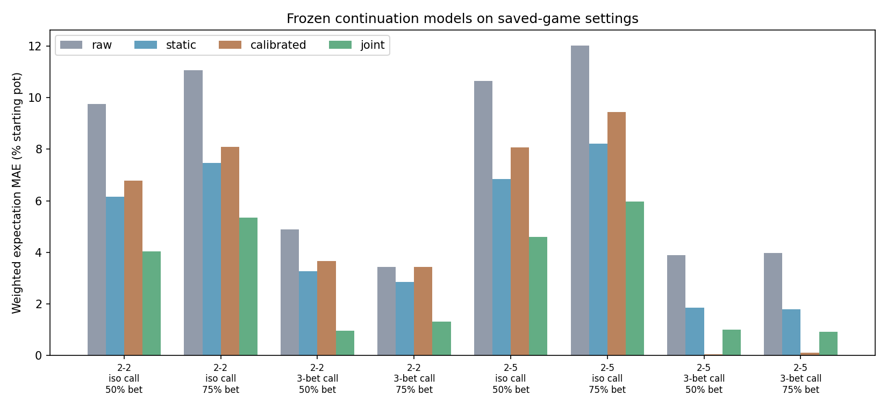
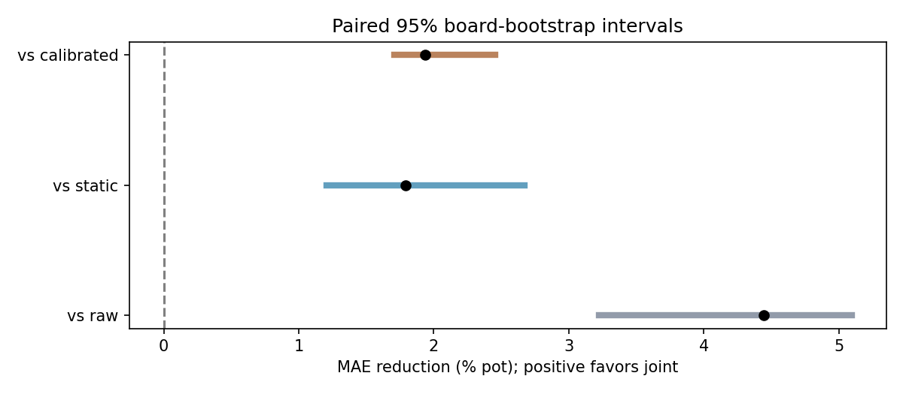
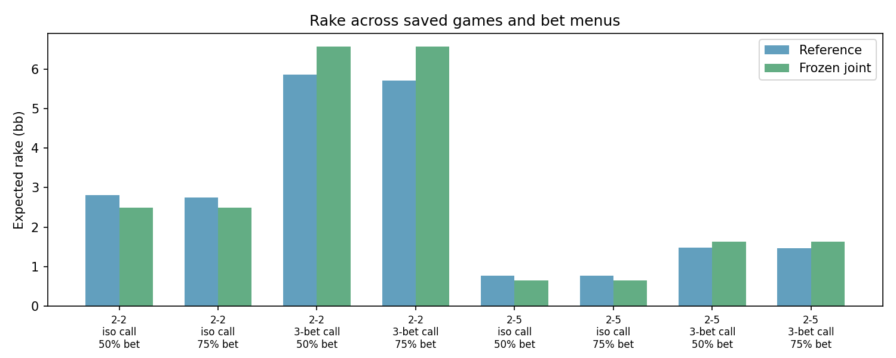

# Saved-game validation results

**Completed: 150 / 150 references. The joint-v1 candidate remains research-only.**

The primary metric is absolute error of the weighted preflop expectation, averaged across both players and the eight raked configurations. Percent-pot scores give each configuration equal weight. These are restricted heads-up postflop references using transported saved ranges, not freshly solved full preflop games.

| Model | Mean error, % starting pot |
|---|---:|
| Raw | 7.461 |
| Static | 4.810 |
| Calibrated | 4.951 |
| Joint | 3.018 |

Positive gain favors joint. Conditional paired 95% board-bootstrap intervals:

| Comparator | Joint gain, percentage points of pot | 95% interval |
|---|---:|---:|
| Raw | 4.444 | 3.224 to 5.095 |
| Static | 1.792 | 1.207 to 2.671 |
| Calibrated | 1.934 | 1.707 to 2.453 |

**The average improvement is not universal.** Current calibrated realization is better in both $2/5 3-bet/call fixtures: its MAE is 0.009 / 0.019 bb, versus joint 0.186 / 0.170 bb for the 50% / 75% bet menus. The joint candidate improves the aggregate by 37.3% versus static and 39.1% versus calibrated in this limited sample, but these exceptions and transported-range limitations rule out a blanket replacement.

## Individual configurations

| Configuration | SPR | Raw MAE, bb | Static MAE, bb | Calibrated MAE, bb | Joint MAE, bb |
|---|---:|---:|---:|---:|---:|
| 2-2-iso_call-half_pot | 10.29 | 1.367 | 0.863 | 0.949 | 0.564 |
| 2-2-iso_call-large_bet | 10.29 | 1.550 | 1.046 | 1.132 | 0.747 |
| 2-2-threebet_call-half_pot | 3.57 | 1.806 | 1.212 | 1.351 | 0.355 |
| 2-2-threebet_call-large_bet | 3.57 | 1.272 | 1.052 | 1.272 | 0.482 |
| 2-2-iso_call-zero_rake | 10.29 | 1.474 | 0.913 | 1.538 | 0.584 |
| 2-5-iso_call-half_pot | 26.62 | 0.788 | 0.507 | 0.597 | 0.341 |
| 2-5-iso_call-large_bet | 26.62 | 0.890 | 0.608 | 0.699 | 0.442 |
| 2-5-threebet_call-half_pot | 10.38 | 0.716 | 0.341 | 0.009 | 0.186 |
| 2-5-threebet_call-large_bet | 10.38 | 0.732 | 0.331 | 0.019 | 0.170 |
| 2-5-iso_call-zero_rake | 26.62 | 0.820 | 0.524 | 0.813 | 0.350 |

## Rake and bet-menu controls

The zero-rake controls are excluded from the primary score. The current calibrated model does not respond to the requested rake: its OOP/IP predictions are unchanged between each matched pair. Its combined-value deficit at zero rake is therefore not expected rake.

| Game | Calibrated unallocated value at zero rake, bb | Reference OOP change with rake, bb | Reference IP change with rake, bb |
|---|---:|---:|---:|
| $2/2 | 3.077 | -1.188 | -1.627 |
| $2/5 | 1.626 | -0.326 | -0.450 |

The frozen joint model has no bet-menu input. The following observed shifts therefore cannot be represented by it:

| Game / line | OOP value change, 75% minus 50% bet, bb | IP value change, bb |
|---|---:|---:|
| 2-2 / iso_call | -0.154 | +0.213 |
| 2-2 / threebet_call | +0.614 | -0.455 |
| 2-5 / iso_call | -0.099 | +0.104 |
| 2-5 / threebet_call | -0.006 | +0.026 |

Per-texture conditional expectations, all baseline prices and raw checkpoint provenance are retained in `evaluation.json`. They are diagnostics, not a demand that a preflop estimate anticipate the future texture.

## Precision and limitations

All references reached the frozen 0.3%-pot target; maximum observed gap 0.299975% pot. Maximum solver arena 756.4 MiB. Summed build/solve/query time 80.0 minutes overlaps across two four-thread workers; it is not end-to-end latency.

Only 15 independent boards (three per texture stratum) are sampled. The intervals condition on the frozen fit and these two transported reaching ranges. They exclude uncertainty about range construction, residual reference-solve error, opponent adaptation, folded-card removal and a richer postflop betting tree. The small sample does not validate all $2/2 or $2/5 situations. No model is promoted or installed from this test.

See [the frozen protocol](README.md) for the exact source settings, board population, weighting and reproduction commands.
