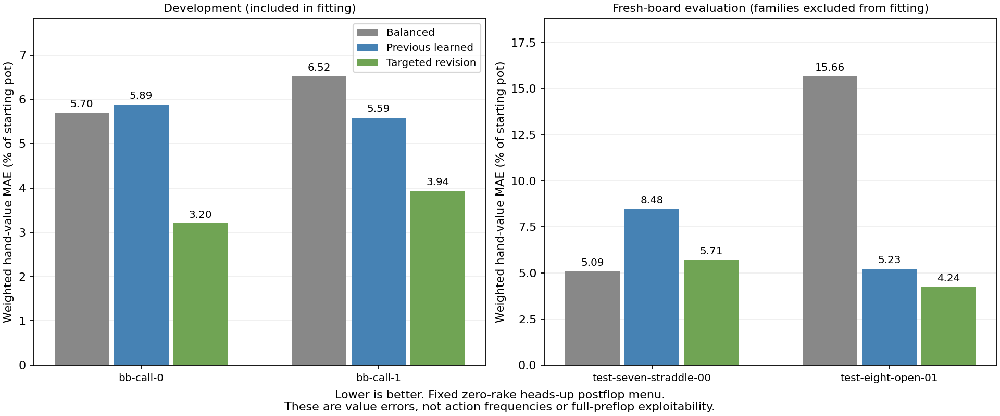

# Targeted continuation-data revision: results

**Fixed accuracy screen: failed; keep this candidate out of the application.**

Completed 260 fresh postflop references. Together with 40 reused references, the two development cases have 100 flops each and two evaluation cases have 50 fresh flops each. The candidate was frozen before generating the new evaluation results. Port 56708 was unchanged.

The revised model uses the same 104-feature shape encoder and ridge penalty 0.1 as the previous model. Only its fitting data changed: the original 24 cases plus two blind-call cases from the earlier preflop study.

| Partition / case | Balanced | Previous model | Revision | Improvement vs Balanced | Change vs previous |
|---|---:|---:|---:|---:|---:|
| Development: bb-call-0 | 5.702 | 5.887 | 3.205 | +43.8% | +45.6% |
| Development: bb-call-1 | 6.520 | 5.595 | 3.937 | +39.6% | +29.6% |
| Evaluation: test-seven-straddle-00 | 5.092 | 8.481 | 5.714 | -12.2% | +32.6% |
| Evaluation: test-eight-open-01 | 15.661 | 5.228 | 4.236 | +72.9% | +19.0% |

Errors are mean absolute per-hand continuation-value errors in percentage points of the starting pot, weighted by compatible range mass. Positive improvement means lower error. Development results include fitting data and do not establish generalization.

## Prospective evaluation

| Case | Improvement vs Balanced, 90% interval | Improvement vs previous, 90% interval | Point screen |
|---|---:|---:|---|
| test-seven-straddle-00 | -18.6% to +1.9% | +22.2% to +33.7% | Fail |
| test-eight-open-01 | +39.7% to +74.8% | -20.2% to +19.0% | Pass |

The fixed point screen requires at least 15% lower error than original Balanced in each evaluation case, and no more than 5% greater error than the previous model. Intervals use 500 paired stratified board resamples and condition on the fitted models and cached equities; they exclude training uncertainty. Evaluation source families never entered fitting, but these case identities were tested in earlier work. The fresh boards provide prospective evaluation, not proof on entirely unseen game contexts.

## Reference quality

| Case | Largest CPU gap (% pot) | Largest GPU gap (% pot) | Largest pot-accounting error (bb) | Negative predictions |
|---|---:|---:|---:|---:|
| bb-call-0 | 0.09986 | 0.09991 | 2.72e-07 | 0 |
| bb-call-1 | 0.09968 | 0.09974 | 2.75e-07 | 0 |
| test-seven-straddle-00 | 0.09941 | 0.09952 | 1.98e-07 | 0 |
| test-eight-open-01 | 0.09946 | 0.09927 | 1.45e-06 | 0 |

Every reference must pass both GPU and full CPU best-response stopping criteria at 0.1% of the starting pot. Per-hand probe best-response gains are retained in the comparison JSON files: a small range-average gap does not certify each rare-hand label. Neither negative nor greater-than-pot individual gross values alone violate conservation; accounting is checked over compatible range mass.

This sample uses five texture strata and excludes all earlier study boards except the explicitly reused development subset. It retains the fixed half-pot postflop menu and zero rake. Broader menus, different rake structures, multiway play and range evolution remain outside this test.

## Reproducibility

The data-boundary tests passed, including reproduction of the previous frozen predictor from its original training data. Source references, configurations, input hashes, the candidate freeze and per-job solver traces are retained. No GPU predictor integration or performance claim follows from this data experiment.

The final comparison initially stopped because evaluation fixtures store position labels as `oop_position` / `ip_position`, while the report expected a `positions` list. [Reporting recovery](report-recovery.json) supplies those labels in memory and calls the original comparison unchanged. No reference, candidate, numerical calculation or eligibility rule changed.

See [protocol](protocol.json), [run instructions](README.md), [development details](development-comparison.json), [evaluation details](evaluation-comparison.json), [frozen candidate](candidate-freeze.json) and [status](status.json).
