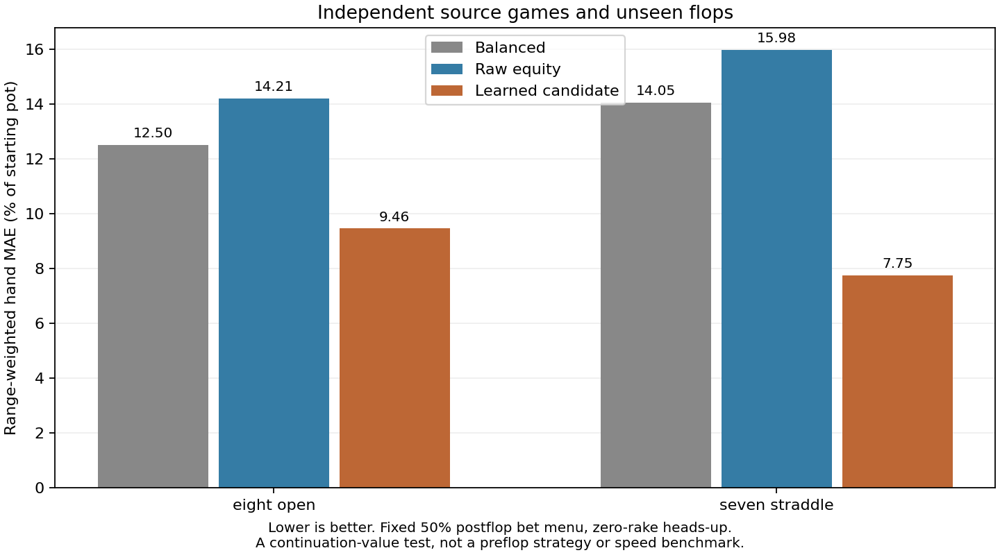

# Overnight continuation research results

**Accuracy screen: passed; further validation required.**

Completed 3,200 GPU postflop references: 24 training configurations on 100 training flops, and eight independent configurations on 100 separate test flops. Port 56708 was not modified.

| Independent source family | Balanced MAE | Raw-equity MAE | Candidate MAE |
|---|---:|---:|---:|
| test-eight-open | 12.50 | 14.21 | 9.46 |
| test-seven-straddle | 14.05 | 15.98 | 7.75 |

MAE is per-hand continuation-value error as a percentage of the starting pot, weighted by compatible range mass and averaged equally across cases. These are not action frequencies or full-game exploitability.

Training-only selection chose **shape**, with ridge penalty **0.1**. The point accuracy screen requires at least 15% lower error than both baselines in each independent source family.

Model selection used training families only. The held-out source games and boards were evaluated after the candidate was frozen. Cases derived from the same save, including perturbations, stayed in the same partition.

The reference labels are policy EVs with an equity control variate. Both-player per-hand best-response checks are included in evaluation.json; rare-hand labels with large BR gains need additional solving. Sampled flops, cached preflop equity, fixed postflop sizing and approximate source ranges remain limitations.

This run did not deploy a model or demonstrate faster preflop solving. A successful value screen must be followed by fresh-game decision checks and GPU time-to-target/memory measurements.

## Uncertainty in the measured improvement

The intervals below come from 500 paired, stratified resamples of the test flops. Positive values favor the candidate; an interval crossing zero leaves the direction uncertain. They condition on this fitted model and cached equity, and do not measure training uncertainty or coverage of other game types.

| Independent source family | Improvement over Balanced, 95% interval | Improvement over raw equity, 95% interval |
|---|---:|---:|
| test-eight-open | 2.22 to 3.66 | 4.02 to 5.32 |
| test-seven-straddle | 4.07 to 8.08 | 5.87 to 9.99 |

Intervals use percentage points of starting-pot MAE. Only two independent test source families were evaluated; passing this screen is evidence within these cases, not proof of broad preflop accuracy.

## Reference quality

| Test case | SPR | Mean best-response gain (% pot) | Largest probe-hand gain (% pot) |
|---|---:|---:|---:|
| test-seven-straddle-00 | 14.48 | 0.0925 | 0.2703 |
| test-seven-straddle-01 | 4.67 | 0.0883 | 0.1861 |
| test-seven-straddle-02 | 1.35 | 0.0819 | 0.1389 |
| test-seven-straddle-03 | 4.10 | 0.0842 | 0.5101 |
| test-eight-open-00 | 10.61 | 0.0924 | 0.1821 |
| test-eight-open-01 | 10.38 | 0.0924 | 1.0486 |
| test-eight-open-02 | 8.53 | 0.0926 | 0.5581 |
| test-eight-open-03 | 5.44 | 0.0909 | 0.1651 |

A small range-average solver gap can coexist with a larger error for a rarely reached hand. The probe-hand gains above help identify that limitation; they are diagnostics, not fitted labels.

All references in this result were regenerated with explicit CPU policy and best-response queries, requiring both CPU and GPU gaps to meet the unchanged 0.1%-pot target. The earlier batch stopped after 2,122 references because a suit-symmetry query shortcut failed pot accounting. Those earlier references are retained only as diagnostic history and were excluded from training and evaluation. See [the correction and frozen protocol](README.md).

Details: [evaluation](evaluation.json), [cross-validation](cross-validation.json), [candidate](candidate.json), [protocol and jobs](manifest.json), [live run status](status.json).
