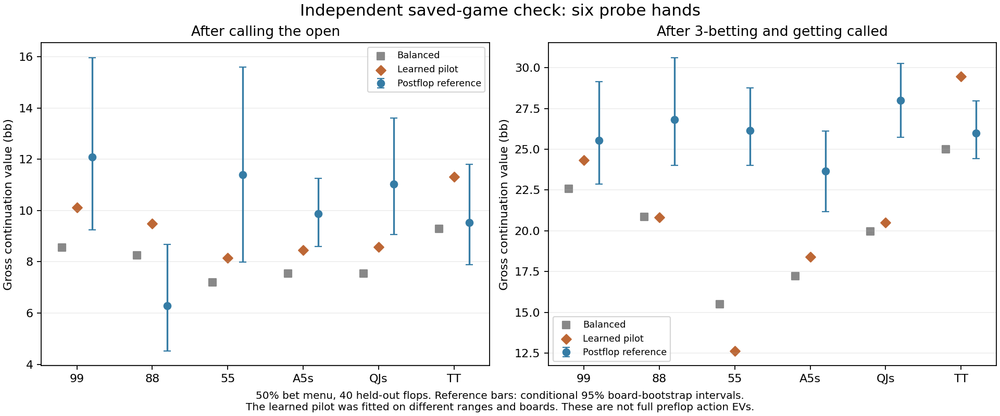

# Range-aware continuation model: first pilot

**Result: reject this candidate.** It passed the accounting checks and improved
internal validation, but failed on the independent saved game. The live build
on port 56708 is unchanged.

This follows the [fixed-range audit](../balanced-sb05-20260915/README.md),
which found that Balanced mispriced several hands at heads-up preflop leaves.
Here we train a small hand-level value predictor and test it on the saved
game that motivated the audit. We do not fit to Wizard's displayed ranges.

## Results

All 240 new references reached the 0.1%-pot target. Median job time was 3.08s;
summed job time was 15.9 minutes. These are corpus-generation timings, not
preflop performance benchmarks; some references ran alongside correctness tests.
The model has 54 learned coefficients. Family validation selected ridge 0.1.

| Evaluation | Balanced | Raw equity | Learned pilot |
|---|---:|---:|---:|
| Internal range-family validation | 9.52 | 10.55 | **6.01** |
| Saved-game call, 50% menu | 14.10 | **12.97** | 17.98 |
| Saved-game 3-bet, 50% menu | **8.00** | 10.05 | 9.87 |
| Saved-game call, 75% stress menu | 15.95 | **14.56** | 19.95 |
| Saved-game 3-bet, 75% stress menu | **7.56** | 9.41 | 10.47 |

Numbers are range-weighted hand-value MAE as a percentage of the starting pot,
averaged over both players. Lower is better. They are **not** action frequencies,
win rates or measured exploitability. The candidate's 50% call-case regression
versus Balanced is 3.88 percentage points of pot; its paired 95% board-bootstrap
interval is 2.06–5.82 points worse. The smaller 3-bet difference is less certain.

The six probe hands alone would give an overly favorable impression of the
call case: their mean error falls from 2.63bb to 2.35bb. But AQo makes up about
34% of the actual IP compatible range and remains badly overpriced. The new
model also increases errors on 88 and AQs. Across the range it is worse.



Machine-readable results: [evaluation](evaluation.json),
[family validation](cross-validation.json), [diagnostics](diagnostics.json),
and the rejected [candidate weights](candidate.json).

## What this teaches us

The synthetic ranges did not provide enough coverage of concentrated solver
ranges. Their effective number of equally weighted hand classes spans
15.6–41.7; the saved IP call range is only 4.6 and its 3-bet range 7.6.
The saved 3-bet ranges also contain more pair weight than any training range.
The pilot's coarse range summaries omit concentration and the detailed holes
in the range. These are identifiable coverage/representation gaps, not proof
that they explain the entire regression.

There are only **20 distinct training flops**, reused across all 12 cases.
Splitting those into two disjoint ten-flop samples changes per-hand residual
labels by an average 12.0% of pot. That diagnostic is not a formal error bound,
but it shows that more independent boards matter. Internal family validation
shares those boards; its improvement does not establish board generalization.

The next experiment should use a broader collection of solver-generated leaf
ranges, including concentrated ranges and controlled perturbations, with
100–200 distinct boards per case and concentration/full-range features.
Reserve entirely new games and boards for the next independent test. This
saved game can now serve as a development check, but must not be presented
as untouched validation after tuning in response to these findings.

No GPU integration or fresh preflop solve was run with the rejected candidate.
Its warm NumPy inference took about 34 microseconds per pair of 169-hand
vectors with features already available; this is **not** evidence of acceptable
end-to-end GPU overhead. Accuracy failed before that engineering gate.

## Experiment

- 240 new GPU postflop references: 12 synthetic range configurations across
  20 canonical flops. The three range-pair families contain linear, capped,
  polarized and broader ranges, with both position orientations and SPR 3/12.
  These are designed training distributions, not measured population ranges.
- All references are zero rake, heads-up, with 50% pot bets and one 100% pot
  raise per street, no extra jam option. Turn and river are enumerated. Each
  reference must reach an aggregate exploitability target of 0.1% pot.
- Training boards are hash-selected, four per pairedness/suit-count stratum,
  excluding all 40 external audit boards. Weights account for suit multiplicity,
  inclusion probability and compatible hand-pair mass. The training expectation
  is over this restricted board population, which omits those 40 boards.
- Targets are per-hand continuation EV, using cached preflop equity as a
  control variate to reduce board noise. The primary audit retains estimates
  without this adjustment. Equity-cache Monte Carlo error is not in the CIs.
- A ridge model predicts the residual beyond raw equity from hand features,
  position, SPR and summaries of both ranges. It has no board input or freely
  fitted coefficient for each of the 169 hands. Regularization is selected
  with leave-one-range-pair-family-out validation. Component ranges overlap
  between families; this internal check is not a fully independent range test.
- The saved SB=0.5 call and 3-bet ranges, and all their 40 boards, are used
  only after fitting. The audit's 75% bet menu is an additional stress test;
  it is outside the pilot's training menu. The call SPR is 12.52, slightly
  above the largest training SPR of 12.

The predeclared screening gate is at least 15% lower external hand-level
MAE than **both** Balanced and raw equity, separately for each branch at the
50% menu. MAE weights hands by their compatible range mass. Six tiny-mass
probe hands are also reported separately so they cannot disappear from the
headline metric. Frozen-model confidence intervals resample boards within
strata, jointly across model predictions; they do not include training noise.

## Accounting and performance

Raw equity uses compatible concrete-hand counts. A shared scalar adjustment
centers the learned corrections so the two players' range-weighted values
sum to the pot. Individual hand values are not clipped to a share of the
starting pot. Future betting can make them larger, or negative.

`candidate.json` is an offline artifact, not a model loaded by GTOpen.
Its NumPy timing is only a warm inference microbenchmark with features
already computed. It excludes range-feature construction, transfers,
GPU scheduling and the preflop iteration. It cannot establish GPU speed.

Even passing this pilot would not justify deployment. Before integration:

1. Expand independent range and board coverage, including low-probability
   hands and different sizing menus. Quantify label noise and stability.
2. Test the value model as ranges change during solving. A range-dependent
   leaf evaluator is not a fixed payoff matrix; a small approximate solver
   gap alone would not certify the real full-game strategy.
3. Implement a batched GPU research path that reuses range summaries and
   equity caches, then compare time-to-target and memory against the current
   build on the same full preflop games. Snapshot inference speed is insufficient.
4. Require fresh-game action-EV and strategy checks, rollback support and
   explicit fallback outside the validated domain. Raked and multiway leaves
   are outside this pilot.

## Reproduce

From the repository root:

```powershell
python tools/research/range_value_pilot.py prepare
python tools/research/range_value_pilot.py run
python tools/research/range_value_pilot.py fit
python tools/research/range_value_pilot.py report
python tools/research/range_value_pilot.py diagnose
python tools/research/range_value_pilot.py plot
python -m unittest discover -s tools/research -p test_range_value_pilot.py -v
```

The reference runner is the same GPU executable used in the preceding audit:
`target/balanced-continuation-audit-gpu.exe`, with its hash frozen in the manifest.
Its source is `crates/solver/examples/balanced_continuation_audit.rs` and its
recorded source snapshot is in the preceding audit directory. Recompiling
to a different hash requires a new manifest/output directory; do not mix runs.
The runner resumes matching completed checkpoints and never connects to the
app. Training/evaluation use the frozen manifest, equity-cache and fit hashes.

Validation: full release solver suite passed; 6 postflop and 15 preflop GPU
equivalence tests passed; all five research accounting/source-parity tests
passed. Checkpoint resume and deterministic fitting were checked separately.
