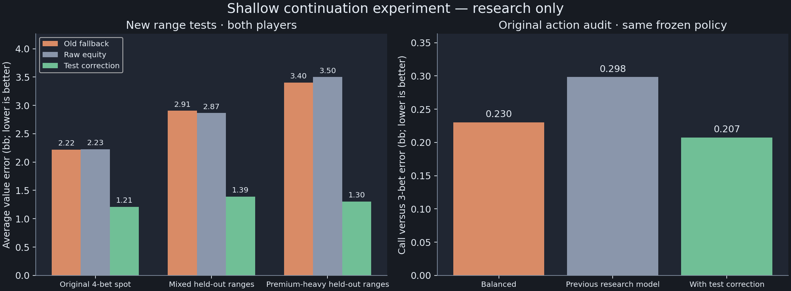

# What this test established

The shallow 4-bet fallback has a real, reproducible weakness in the saved heads-up
spot. The small correction improves it on ranges excluded from fitting. It is
worth moving to native integration and fresh-equilibrium testing, but is not ready
to replace production pricing.

## Results

We completed 280 new offline reference solves: 100 fresh flops for the original
spot, 120 synthetic training examples and 60 held-out examples. All passed both
CPU and GPU checks at 0.1% pot or better. Training coefficients were frozen before
held-out evaluation. The original 50-board sample is retained as a certainty
stratum, avoiding double-counting when estimating the whole board population.

| Test | Old fallback error | Correction error | Reduction |
|---|---:|---:|---:|
| Original shallow 4-bet spot | 2.219bb | 1.210bb | 45.5% |
| Mixed held-out ranges | 2.906bb | 1.392bb | 52.1% |
| Premium-heavy held-out ranges | 3.402bb | 1.304bb | 61.7% |

These are legal-pair-weighted mean absolute hand-value errors, using the equity
control variate, across both players. The correction also improved each player's
point estimate separately in every context. Direct-reference errors improved as
well, and all three contexts exceeded the 95% qualified-mass requirement.

The per-context 95% bootstrap intervals for error reduction were positive using
both estimators. In bb, the equity-adjusted intervals were [0.80, 1.10],
[0.67, 1.86] and [1.46, 2.62]; the direct intervals were [0.28, 1.02],
[0.09, 1.61] and [0.67, 2.68]. These intervals condition on the fitted model and
the cached equity estimates. They are not simultaneous guarantees across contexts
or guarantees on arbitrary ranges, menus, stack depths or newly solved policies.

## Does the improvement reach the preflop decision?

Yes, in the original frozen-policy audit. Replacing only the shallow leaf reduced
call-versus-3-bet error from 0.298 to 0.207bb using the equity-adjusted reference
(30.5%), and from 0.334 to 0.264bb using the direct reference (20.8%). This was also
better than the research Balanced baseline's 0.230/0.282bb point estimates.

All seven previously identified call-favoring near-ties moved toward calling.
There were still zero clear opposite-sign failures on the original primary screen.
This comparison covers only 30 adequately supported hand classes (about 19.5% of
the decision's legal-pair mass); 139 other classes lack support for both actions.
The new model does not make those missing comparisons reliable.

The entire call/fold audit was reproduced, including all 169 records and the
original classification and error totals. Its values were unchanged: the modified
4-bet leaf cannot be reached after the initial call in this fixed tree. These
action checks reuse the earlier references and are not new independent action
experiments. No preflop ranges were retrained or re-solved here.

## What is still wrong?

The fix is incomplete at some of the hands that exposed the problem. A4o's shallow
leaf value moved from 15.41bb to 13.91bb, but the expanded reference estimates
10.78bb. A3o similarly moved from 15.20bb to 13.66bb versus a 10.58bb reference.
Consequently, the correction's original-action call preference is still much
smaller than the reference preference for those hands.

The apparent shallow-leaf error for 86o is not usable evidence: its reference has
4.52bb of remaining best-response gain. Its tiny arrival mass makes it negligible
in the aggregate but does not make its individual value trustworthy. For A8o and
A8s, the equity-adjusted evidence is clearer than the wider direct intervals.

The method was trained at SPR 0.2 and 0.75 and evaluated at 17.5/45, with zero rake,
heads-up ranges and one finite postflop menu. It is a small polynomial correction,
not a comprehensive replacement for postflop solving. The held-out synthetic
mixtures share some range components with training. The saved-game ranges were
never used to fit the correction.

## Recommended next step

1. Integrate this frozen correction behind a research-only switch. Verify native
   CPU/CUDA values, pot conservation, stack-depth boundaries and inference cost.
   The analytical zero-stack limit already passes; transition to the existing
   model near SPR 1 still needs an explicit, validated design.
2. Re-solve the same small heads-up game using that implementation. Export the
   changed reaching ranges and test those against fresh reference solves. A model
   can work on fixed ranges yet fail once it changes the ranges itself.
3. Investigate the remaining small-ace bias with more diverse shallow range
   contexts, rather than hard-coded hand adjustments. Preserve this candidate
   and its test set as a baseline; use fresh evaluation ranges for later tuning.

There is no production change and no renewed autoresearch loop. Port 56708 remained
on its existing process throughout. Four new accounting/sampling/boundary tests
and the four existing action-audit tests passed. An independent scalar aggregation
matched all held-out hand values within 3.2e-14bb. The 280 solves used 9.1 minutes
of measured in-process reference work and about 28.5 minutes including per-job
startup and checkpoint validation.

See [full results](REPORT.md), [frozen protocol](PROTOCOL.md),
[candidate](candidate.json), [evaluation](evaluation.json), and
[action regression](action-regression.json).
