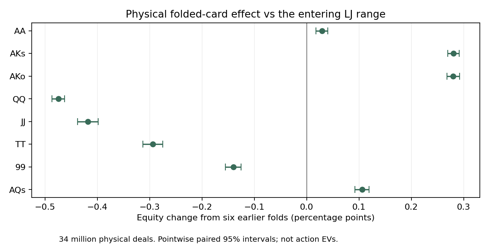

# Board coverage and folded-card research

Research only; the application on port 56708 is unchanged. This follows the
[connected preflop/postflop prototype](../integrated-continuation-20260919/README.md).

**The comparison batch is complete.** All six prescribed runs reached 2,000
iterations and passed independent accounting checks. See the
[results and graphs](RESULTS.md) and [next scaling steps](SCALING.md).
The small board samples still produce materially different ranges; nothing
from this study is ready to replace the production range model.

## What is established

The solver can reuse a board under all 24 suit relabelings without allocating
24 postflop solvers. A separate vector-algebra check agreed within 8.9e-16;
an explicit 24-copy river solve agreed within 4.4e-7 bb through 100 iterations.
This averages counterfactual values inside the connected solver, not final
strategies from separately solved games. Public-board strategies retain
individual hole-card combos and full turn/river enumeration.

The original two boards, closed under suit relabeling and using a 50% bet
menu, converged to 0.002057 bb combined deviation gain in 129.9 seconds.
Its root strategy is 58.87% fold, 24.52% call, 16.60% 4-bet and negligible
jam. AA almost always 4-bets. The earlier literal two-board, 50%/75% menu
mixed AA between calling and 4-betting. **That difference has two measured
contributors**. With the literal boards, removing the 75% bet reduces AA
calling from 52.7% to 41.5%. Keeping both bet sizes and covering all suit
relabelings reduces calling to 4.0%. These are sensitivity results in small
artificial games, not recommended AA ranges.

The preselected ten-board run reached 0.004092 bb combined deviation gain in
653.8 seconds. Both five-board panels also completed. Panel A's restart
reproduced all previously saved evaluations exactly; the interrupted output
is retained as `panel-a-interrupted-500.json`. No production process was
interrupted. Despite the small numerical gaps, 66 and 88 switch between
calling and folding across the five-board samples.

## Folded cards: completed independent audit

We sampled 34 million physical deals: two million conditional entry deals,
plus four million for each of eight preselected hands. Each deal was used
twice, with and without the likelihood implied by the six earlier folds.
Cards were mutually disjoint, and boards came from the remaining deck.

| UTG hand | Equity vs entering LJ range | Including six folds | Change, percentage points (95% interval) |
|---|---:|---:|---:|
| AA | 83.255% | 83.285% | +0.029 [0.018, 0.041] |
| AKs | 49.827% | 50.107% | +0.280 [0.269, 0.292] |
| AKo | 47.243% | 47.523% | +0.280 [0.268, 0.292] |
| QQ | 58.584% | 58.109% | -0.474 [-0.486, -0.463] |
| JJ | 51.072% | 50.653% | -0.418 [-0.438, -0.399] |
| TT | 45.171% | 44.878% | -0.294 [-0.313, -0.275] |
| 99 | 38.503% | 38.363% | -0.140 [-0.155, -0.125] |
| AQs | 40.338% | 40.444% | +0.106 [0.092, 0.120] |

These are raw equities against the **entering** LJ range, not equities against
its later calling range and not action EVs. Intervals are pointwise paired
batch estimates. Earlier opening/3-betting/folding policies stay fixed.
This measures one scenario, not a universal fold adjustment.



Effective sample sizes were 3.62–3.74 million per four-million-hand probe.
The proposal's class frequencies passed an independent exact enumeration
of 1,326×1,326 private-card pairs (largest supported-cell discrepancy 1.75
standard errors). Unit fold weights produced identical paired controls.

The six folds slightly favor remaining high cards. In this entry population,
ace-high flops increase by about 0.205 percentage points and king-high flops
by 0.176 points. The live players' class priors also shift. This is why a
single generic equity penalty or marginal-range correction is inadequate:
the posterior links both live hands and future boards. Giving a postflop
solver the actual hidden folded cards would leak information; any future
integration must share strategies across those unobserved possibilities.

## What remains

1. Validate the proposed future-card symmetry compression for changing ranges.
   The planner estimates a 30.5% memory reduction for this ten-board case;
   its external-reach implementation has not yet been tested.
2. Expand to representative rank and texture coverage, with the existing
   47-flop report subset as a feasibility candidate. Check hand-making
   opportunities as well as private-card priors. Investigate board-group
   processing to fit memory, using the current resident game as a reference.
3. Keep the reserved ten-board panel untouched until a new validation
   protocol is registered. No accuracy claim against Wizard is justified yet.
4. Incorporate folded-card uncertainty into the connected game without
   revealing hidden cards or replacing the joint posterior by marginals.

The expanded panel reduces the private-pair prior's total variation from
16.63% for the earlier literal two boards to 3.96% for the weighted ten-board
sample. This is a distribution-distance diagnostic, **not** a bound on poker
strategy error or proof that ten boards are enough.

## Resume and verify

The queue is a manual foreground runner. It checks production state before
launching and during every run, and stops only its own research process if
production starts solving. It also leaves the app's resident GPU allocation
in place and skips panels that cannot fit a conservative memory budget.
Interrupted checkpoints are preserved; they contain reported preflop policies,
not full postflop arenas, so resuming restarts that experiment from iteration 1.

From the repository root, with Python 3.12, numpy, scipy and matplotlib:

```powershell
python tools/research/integrated_coverage_queue.py
python tools/research/integrated_coverage.py audit
python tools/research/integrated_coverage_review.py folds
python tools/research/integrated_coverage_review.py report
python tools/research/integrated_coverage_review.py controls
python tools/research/integrated_coverage_review.py stability
python tools/research/integrated_coverage_review.py summary
```

`freeze.json`, `fold-freeze.json` and `control-freeze.json` record the original
protocol, inputs and executable digests. A rebuild with a different digest
requires an explicitly documented new run registration; do not replace the
old freeze silently. No reserved Wizard case is opened by these commands.

See [coverage-audit.json](coverage-audit.json), [fold-review.json](fold-review.json),
[PROTOCOL.md](PROTOCOL.md), [FOLD-PROTOCOL.md](FOLD-PROTOCOL.md) and
[CONTROL-PROTOCOL.md](CONTROL-PROTOCOL.md) for the detailed evidence and scope.
