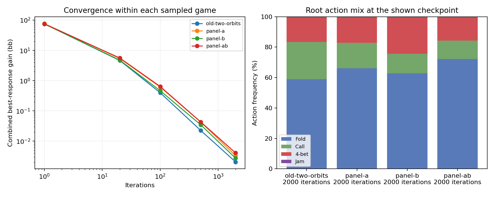
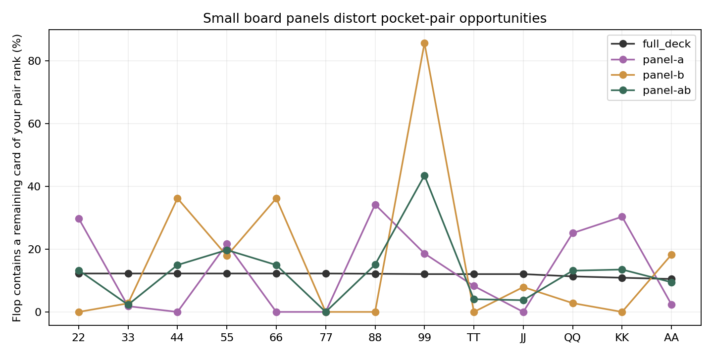

# Completed board-coverage comparison

All prescribed development solves and both additional controls reached 2,000 iterations. The numerical accounting checks pass, but these small board panels produce materially different ranges. They are research games, not a deployment candidate or a validated match to GTO Wizard.

## Connected-game results

Same fixed UTG/LJ entry policies, original investments, 4% rake capped at 6 bb, and both called postflop branches. The four rows below use 50% bets and pot raises. All legal turn and river cards are included. Earlier folded-card information is still omitted from these solves.

| Board panel | Fold | Call | 4-bet | Jam | Combined deviation gain (bb) | Time (s) |
|---|---:|---:|---:|---:|---:|---:|
| old-two-orbits | 58.87% | 24.52% | 16.60% | 0.000% | 0.002057 | 129.9 |
| panel-a | 66.19% | 16.60% | 17.21% | 0.000% | 0.003308 | 324.5 |
| panel-b | 62.87% | 12.86% | 24.05% | 0.230% | 0.002732 | 324.5 |
| panel-ab | 72.23% | 12.09% | 15.68% | 0.000% | 0.004092 | 653.8 |

Times are observed research-run wall times, not an isolated performance benchmark.

Using one common full-deck entry prior, A versus B has 38.75% prior-weighted policy total variation. This measures action-probability redistribution across hands, not the percentage of hands with any difference. 66 is almost all fold in A and all call in B; 88 moves the other way. The restarted A run reproduced every saved checkpoint exactly.

## Why the board sample is not adequate

The ten-board game has no seven on any flop, so 77 cannot flop a set. 99 gets a matching flop card about 43% of the time, versus roughly 12% with the full deck and this entering opposing range. The full-deck enumeration agrees with an independent remaining-card combinatorial calculation to below 7e-16. A small private-prior distance therefore cannot substitute for checking actual hand-making opportunities.

The existing 47/95/184 report subsets reduce the worst pocket-pair opportunity error to 4.28/2.90/3.24 percentage points, respectively, versus 31.40 points for the ten-board development panel. Those are chance-only checks; no connected strategies for the report subsets were solved in this batch. Bigger samples do not guarantee monotonic improvement for every feature.

## AA controls: separate suit coverage from bet sizes

| Suit treatment | Postflop bet menu | AA call | AA 4-bet | AA jam | Combined gain (bb) |
|---|---|---:|---:|---:|---:|
| literal | 50% / 75% | 52.700% | 47.300% | 0.00004% | 0.003658 |
| literal | 50% | 41.507% | 58.493% | 0.00003% | 0.002525 |
| all suits | 50% | 0.000% | 100.000% | 0.00005% | 0.002057 |
| all suits | 50% / 75% | 3.979% | 96.021% | 0.00016% | 0.005359 |

These controls keep the two board ranks fixed. Literal-board games contain only the announced suit arrangements; the orbit games include every suit relabeling. Neither has comprehensive rank coverage. The comparison explains sensitivity inside these small games; it does not establish how AA should be played in the full game.

## Validation and next gate

- Physical private-card enumeration reproduces root normalizers, action frequencies and hand summaries. A separate terminal traversal verifies total probability and player EVs plus rake.
- The suit-orbit river comparison matches 24 explicit copies through 100 iterations within 4.4e-7 bb.
- The independent folded-card audit remains unchanged; its simulation policies came from the frozen saved game, not new observed player hands.
- No production code was changed or deployed. The user session on 56708 was preserved. Reserved boards and Wizard validation outcomes were not solved or used to tune strategies.

Next: validate the existing future-card symmetry compression for the restricted external-reach interface, then test processing a more representative board set in groups. The allocation estimate drops from 17.558 to 12.209 GB for this ten-board game, excluding overhead, but correctness and runtime still need to be tested. See [the scaling plan](SCALING.md) for the guard conditions and larger-board feasibility gate.

Detailed measurements: [accounting](coverage-audit.json), [control accounting](control-accounting.json), [policy sensitivity](policy-stability.json), [sampling audit](sampling-audit.json), [flop structure](flop-structure.json), and [memory plan](future-card-memory.json).
