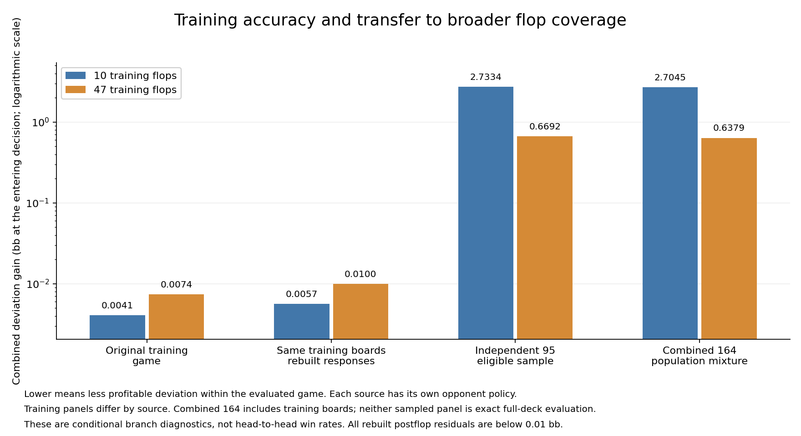

# Completed board-coverage and reconstruction comparison

The broader training panel transfers substantially better in this experiment, but it is not yet a full-game preflop model. Both strategies remain nearly self-consistent when their postflop responses are rebuilt on their original training boards. Their much larger deviations on broader board mixtures therefore cannot be explained primarily by that reconstruction step in these two tested cases.

All 118 supplementary board workers completed, with 210 verified original workers reused. All six supplementary aggregates preserved the frozen preflop policies and passed the registered postflop residual and independent accounting checks. The original four independent/stress comparisons also remain complete. No acceptance threshold, source policy or board selection was changed after inspecting outcomes.

| Evaluation | Ten-flop source: combined deviation (bb) | 47-flop source: combined deviation (bb) |
|---|---:|---:|
| Original connected training game | 0.004092 | 0.007424 |
| Original training boards, rebuilt postflop responses | 0.005663 | 0.009961 |
| Reserved ten-board stress panel | 4.473860 | 3.694894 |
| Independent 95-board eligible-population sample | 2.733421 | 0.669224 |
| Complete excluded 69-board stratum | 2.308130 | 0.405988 |
| Combined 164-board population mixture | 2.704459 | 0.637920 |

These are sums of profitable deviations at the same entering two-player decision, against each source's own opponent policy and reconstructed continuations. They are not head-to-head win rates, full-deck exploitability estimates, or a percentage improvement in production accuracy. The ten-board stress panel emphasizes a different board population and still exposes a large gap for both sources.

## What the checks establish

The matched-panel checks preserve the private-card distribution as well as the entering strategy. Rebuilt EV changes are at most 0.000307 bb for the ten-flop source and 0.000146 bb for the 47-flop source. The original and reconstructed combined gaps are both small relative to the broad-panel deviations. This narrows reconstruction sensitivity as an explanation here; it does not prove a general safety guarantee for arbitrary re-solving in a raked, general-sum game.

On the combined mixture, changing only OOP's entering decision gains 1.769502 bb for the ten-flop source and 0.427311 bb for the 47-flop source. Their full OOP deviations are 1.774488 and 0.458967 bb. Most of the observed OOP discrepancy is therefore already present at the entering decision.

Combined postflop residuals are 0.000969647 / 0.000146052 bb (ten / 47 training flops). The largest individual-board residuals are 0.00179046 / 0.00028858 bb. The separate conditional-hand audit retains even almost-never-played hands: for the 47-flop source its largest panel-averaged gains are 0.010718 / 0.008483 bb in the call branch and 0.021974 / 0.004512 bb in the called 4-bet branch (OOP / IP). Those checks do not reveal a large hidden mean postflop numerical error, but they are not per-board/per-hand accuracy guarantees.

## What remains unresolved

The combined mixture covers the complete excluded stratum plus the registered systematic sample of the remaining flops. It contains training boards, is not wholly independent, and is not exact full-deck enumeration. No naive sampling confidence interval is warranted. Finite board panels also alter private-card frequencies through card removal; the separate chance audit quantifies that distortion without attributing all strategic error to it.

The study retains fixed incoming ranges, two players, a restricted preflop branch and 50% postflop bets with one raise per street. It omits earlier folded-card information and does not validate a flexible multiway game, richer betting menus, every stack depth, or learned player profiles. The two training solutions also differ materially: their hand-weighted strategy difference under a common entering prior is 26.72%, and the 47-flop source nearly eliminates the entering call. A lower broad-panel deviation does not make that particular calling range a production recommendation.

## Next decisions

Keep the 47-flop result as a reference that showed less deviation on the measured broader panels, with its limitations explicit. Preserve this evaluation as evidence; reusing its boards for training would require fresh independent validation. Before larger connected training, address host storage: the measured 164-board forest needs 123.184 GB for strategy arrays alone and fails the 20 GB free-host reserve even before overhead. The separate compact bridge failed its additional coherent-range qualification, so its smaller storage plan is not a cleared solution. The full-arena transfer optimization has independent checks still in progress and cannot solve host capacity by itself.

No research result in this review has been deployed to port 56708.

Evidence: `population-supplement-summary.json`; all `excluded69-*`, `population164-*` and `sourcepanel-*-result{,-review}.json` files; both `sourcepanel-*-comparison.{json,md}` checks; both sources' `population164-*-{board-diagnostics,decision-diagnostics,conditional-residuals}.{json,md}`; `population-transfer-comparison.{json,png}`. Per-worker manifests, input hashes, logs and compressed results are retained. See also `INDEPENDENT-TRANSFER-REVIEW.md`, `PRIVATE-PRIOR-AUDIT.md`, `recorded-policy-stability.md`, `POPULATION-MEMORY-FEASIBILITY.md`, and the sibling `symmetric-bridge-20260919/COHERENT-RANGE-REVIEW.md`.
