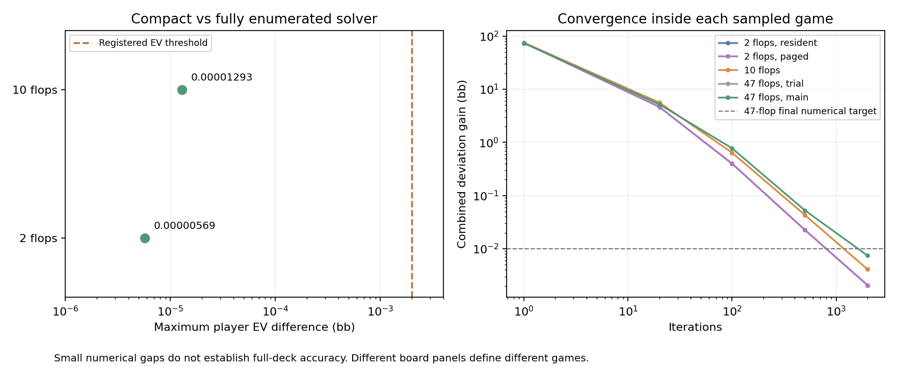
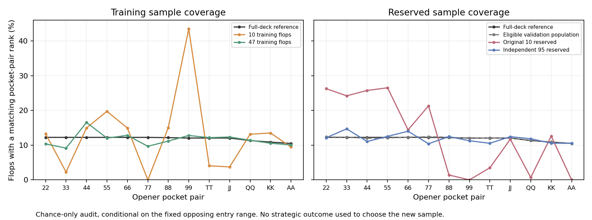

# Overnight reference study

Updated 2026-09-19T17:46:17.885518+00:00.

Research only. Production port 56708 has not been changed by this work.

This study follows one opener facing a 3-bet, after all other players have folded: 200 bb starting stacks, open to 6, reraise to 18, and a 27.5 bb decision pot. It retains folding, calling, raising to 45 and jamming, with both called postflop branches. The game charges 4% rake capped at 6 bb and uses 50% postflop bets with pot-sized raises. It is a reference case for improving continuation values, not a solved replacement for every Preflop Lab situation.

Both entering ranges are frozen from the saved GTOpen baseline. This experiment re-solves decisions inside the selected branch; it does not jointly re-solve the earlier opening and 3-betting decisions that supplied those ranges. Earlier folded-card information is also omitted. Good transfer here would be evidence for this continuation method, not proof that the complete preflop game matches GTO Wizard.

## Numerical correctness

| Comparison | Maximum EV difference | Root policy TV | Registered checks |
|---|---:|---:|---|
| Full vs compact, 2 flops | 0.00000569 bb | 0.00000897 | Passed |
| Full vs compact, 10 flops | 0.00001293 bb | 0.00001905 | Passed |

The separate abrupt-changing-range stress test still fails its 0.002 bb independent-trajectory value threshold. Successful converged tests do not erase that failure. The paging experiment uses the original fully enumerated path.

Paging unit test: passed, including bitwise CFV and arena agreement across 160 switches.
Connected two-flop paging: passed; all checkpoint evaluations identical: True. Shared workspace 1.422 GB; 1199.1 seconds.

## Broader coverage

The unchanged 47-flop candidate improves pocket-pair opportunity coverage over the ten-flop development panel. It remains an approximation; more representative chance coverage and unseen-board tests are needed before making accuracy claims.
Feasibility trial: latest recorded iteration 20, gap 5.206158 bb, elapsed 405.4 seconds. A checkpoint alone does not prove completion.
Main 47-flop solve: latest recorded iteration 2000, gap 0.007424 bb, elapsed 28832.0 seconds. A checkpoint alone does not prove completion.

Last recorded validation-queue stage: `complete-awaiting-trial-review`. Check the actual process before treating that stage as live.
Last recorded transfer-control stage: `complete-passed`; overnight sequence: `held-validation95-ab-002`.

## Independent evaluation

The frozen-policy implementation controls passed. Streamed versus paged two-board evaluation agreed within 2.66e-15 bb in EV and 2e-15 bb in deviation gains. All imported preflop probabilities stayed bitwise unchanged. This validates the transfer implementation; it does not establish accuracy on unseen flops.

The reserved-board protocol freezes all preflop decisions, solves their postflop continuations, then separates postflop numerical residual from profitable full-game deviations. Deterministic controls precede reserved-board use. Ten reserved flops are a transfer stress test, not a precise full-deck exploitability estimate. A separate 95-flop sample was frozen before any reserved strategic outcomes. Its complete suit orbits exclude all training/development and original reserved boards; it targets the eligible complement, with 4.525% of physical flops excluded.

The evaluator combines per-hand leaf values across all boards before allowing a preflop best response. Averaging separately optimized preflop choices would incorrectly give the player knowledge of the future flop.
The synthetic hidden-chance control passed: correct deviation gain 0.0 bb, versus 1.0 bb under deliberately invalid advance knowledge. This checks information handling; its artificial utilities are not poker observations.

| Reserved panel | Frozen source | OOP EV | IP EV | Postflop residual | Full deviation gain | Numerical check |
|---|---|---:|---:|---:|---:|---|
| reserved10 | ab | -3.16803 | 5.85775 | 0.000984 | 4.473860 | Passed |
| reserved10 | report47 | -3.03116 | 6.17878 | 0.000141 | 3.694894 | Passed |

**47-flop reference numerical gate: passed**. This is the registered within-game check, not a full-deck accuracy certificate.

### Entering action frequencies

Same exact source policies, reweighted by each panel's compatible private-hand distribution. Differences between panels here need not mean the policy changed.

| Panel | Frozen source | Fold | Call | 4-bet | Jam |
|---|---|---:|---:|---:|---:|
| reserved10 | ab | 70.29% | 12.97% | 16.74% | 0.00% |
| reserved10 | report47 | 80.97% | 0.05% | 9.89% | 9.08% |

The complete registered independent comparison is still pending or numerically incomplete.

Values are bb at the same entering two-player decision. Full deviation gain is against the particular evaluated postflop continuations, including off-path choices. It need not be zero when preflop is frozen. Neither a small residual nor favorable transfer in one finite panel proves full-deck accuracy.

[Paging protocol](PAGING-PROTOCOL.md) · [Reserved-board protocol](HOLDOUT-PROTOCOL.md) · [95-board selection](VALIDATION95-PROTOCOL.md) · [Overnight registration](OVERNIGHT-RUN-PROTOCOL.md) · [Transfer controls](TRANSFER-CONTROLS.md) · [Hand-level decision diagnostics](DECISION-DIAGNOSTICS.md) · [Rare-branch reach audit](REACH-DIAGNOSTICS.md) · [Entry-support audit](ENTRY-SUPPORT-AUDIT.md) · [Per-board residual diagnostics](BOARD-RESIDUAL-DIAGNOSTICS.md) · [Completed 47-flop reference](REPORT47-REFERENCE-REVIEW.md) · [10 vs 47 flops, common prior](ab-vs-report47-common-prior.md) · [First reserved transfer panel](RESERVED10-TRANSFER-REVIEW.md) · [Turn storage screen](STORAGE-SCREEN.md) · [Full-flop storage results](FLOP-STORAGE-RESULTS.md) · [Earlier coverage findings](../integrated-coverage-20260919/RESULTS.md)
