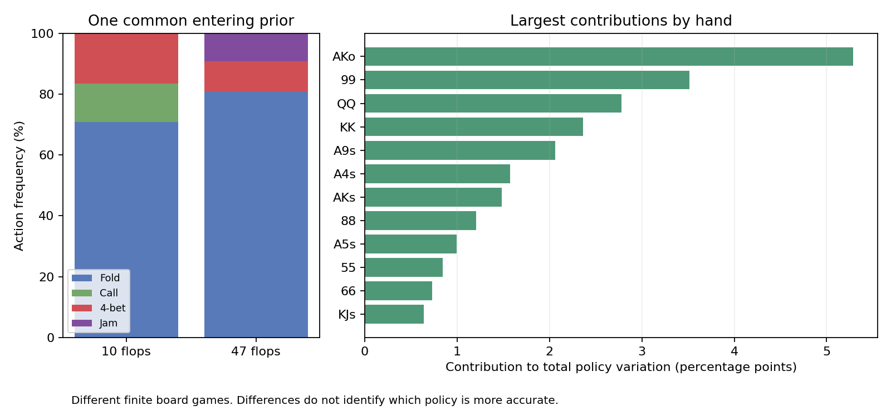

# Root policy comparison

10 flops versus 47 flops, using the same entering private-card distribution.

Total prior-weighted policy variation: **26.72%**. This measures redistributed action probability, not the percentage of hands that changed.

| Source | Fold | Call | 4-bet | Jam | Training-game gap (bb) |
|---|---:|---:|---:|---:|---:|
| 10 flops | 70.76% | 12.79% | 16.45% | 0.000% | 0.004092 |
| 47 flops | 80.88% | 0.06% | 9.94% | 9.130% | 0.007424 |

The source strategies solve different finite flop games. A lower training gap is not proof of greater poker accuracy. Use the independently reserved transfer results to assess robustness.

| Hand | Common prior | Call: first source | Call: second source | Policy variation |
|---|---:|---:|---:|---:|
| AKo | 5.77% | 23.75% | 0.05% | 91.63% |
| 99 | 3.52% | 50.41% | 0.04% | 99.96% |
| QQ | 3.14% | 87.52% | 0.44% | 88.39% |
| KK | 2.96% | 15.12% | 0.06% | 79.75% |
| A9s | 2.06% | 36.43% | 0.00% | 100.00% |
| A4s | 2.18% | 0.00% | 0.18% | 72.27% |
| AKs | 1.92% | 75.56% | 0.01% | 77.00% |
| 88 | 3.67% | 26.64% | 0.01% | 32.86% |
| A5s | 2.18% | 11.39% | 0.01% | 45.68% |
| 55 | 3.78% | 22.41% | 0.04% | 22.37% |
| 66 | 3.80% | 18.94% | 0.01% | 19.24% |
| KJs | 2.12% | 0.05% | 0.06% | 30.14% |
