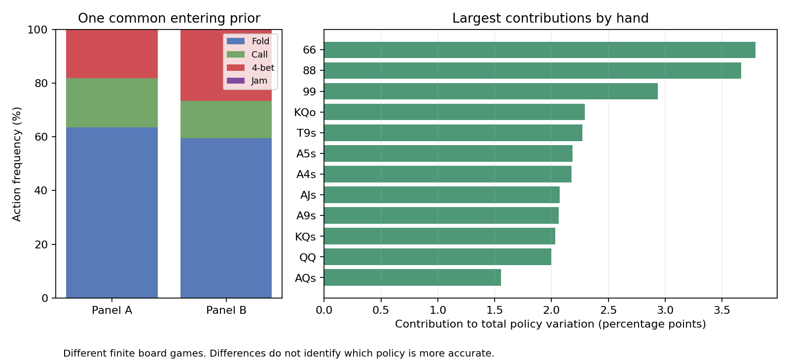

# Root policy comparison

Panel A versus Panel B, using the same entering private-card distribution.

Total prior-weighted policy variation: **38.75%**. This measures redistributed action probability, not the percentage of hands that changed.

| Source | Fold | Call | 4-bet | Jam | Training-game gap (bb) |
|---|---:|---:|---:|---:|---:|
| Panel A | 63.55% | 18.20% | 18.26% | 0.000% | 0.003308 |
| Panel B | 59.57% | 13.80% | 26.37% | 0.260% | 0.002732 |

The source strategies solve different finite flop games. A lower training gap is not proof of greater poker accuracy. Use the independently reserved transfer results to assess robustness.

| Hand | Common prior | Call: first source | Call: second source | Policy variation |
|---|---:|---:|---:|---:|
| 66 | 3.80% | 0.00% | 100.00% | 100.00% |
| 88 | 3.67% | 68.15% | 0.00% | 100.00% |
| 99 | 3.52% | 54.49% | 0.00% | 83.43% |
| KQo | 5.96% | 8.66% | 0.00% | 38.49% |
| T9s | 2.27% | 0.00% | 65.93% | 100.00% |
| A5s | 2.18% | 0.00% | 100.00% | 100.00% |
| A4s | 2.18% | 0.00% | 0.00% | 100.00% |
| AJs | 2.07% | 0.00% | 6.64% | 99.97% |
| A9s | 2.06% | 0.00% | 7.54% | 100.00% |
| KQs | 2.03% | 78.59% | 0.00% | 100.00% |
| QQ | 3.14% | 62.63% | 15.72% | 63.62% |
| AQs | 1.98% | 43.16% | 11.57% | 78.43% |
