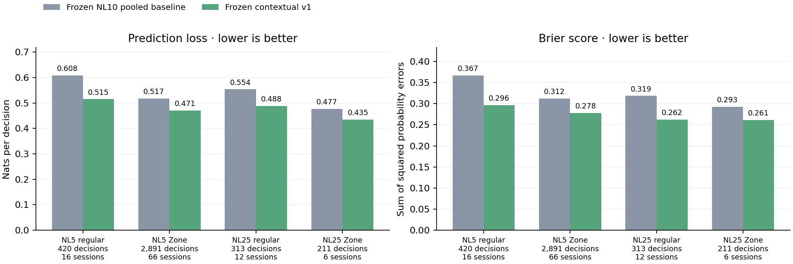
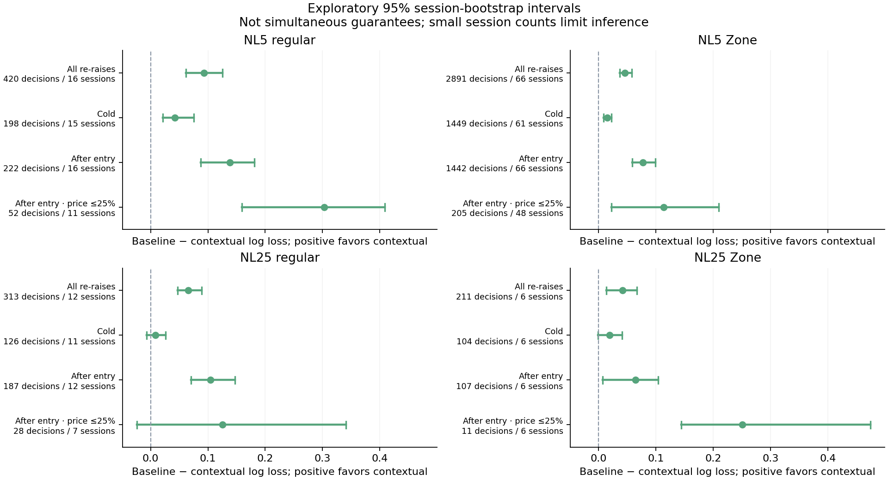
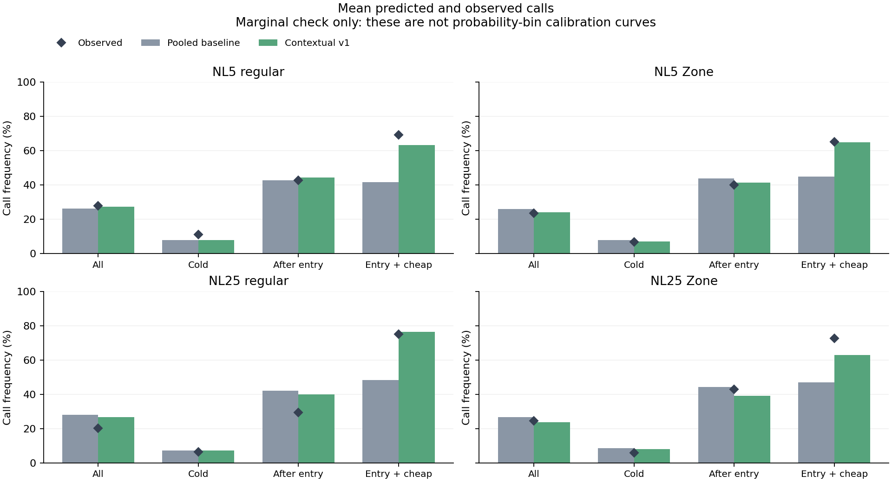
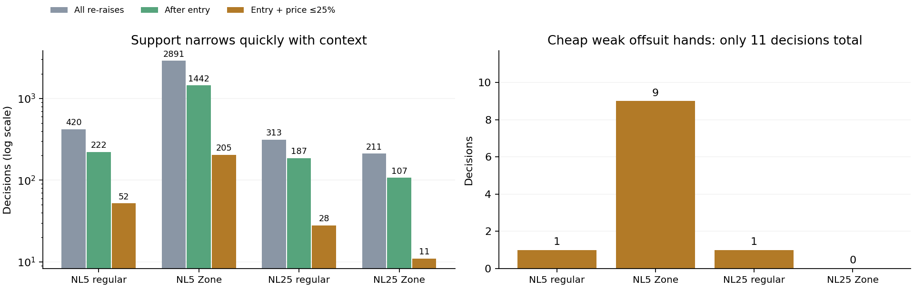

# Frozen model transfer across stakes and table formats

The same frozen Ignition NL10 model predicts re-raise actions better than its
frozen pooled baseline on average in all four examined groups: NL5 regular,
NL5 Zone, NL25 regular and NL25 Zone. Both log loss and Brier score improve.
This is useful cross-domain evidence, **not a model promotion or a fresh NL10
temporal holdout**.

No fitting, parameter selection, profile installation or production-support
change occurred. Both predictors use the same frozen artifact, with the
contextual corrections enabled only for the contextual comparison. Its hash
is `d4951da8fadfd5f76da95df7e5f87a3965dc7bf042c1480854e14ef3d5883ae5`.

## What these sources cover

| Source | Dates | Validated hands | Validated sessions | Scored re-raise decisions | Sessions with scored decisions |
|---|---|---:|---:|---:|---:|
| NL5 regular | 2025-11-27–2025-12-10 | 1,469 | 19 | 420 | 16 |
| NL5 Zone | 2025-10-16–2025-12-15 | 7,577 | 77 | 2,891 | 66 |
| NL25 regular | 2025-11-02–2025-12-02 | 685 | 14 | 313 | 12 |
| NL25 Zone | 2025-10-16–2025-11-02 | 448 | 6 | 211 | 6 |

There are **10,179 validated hands** and **3,835 scored opponent re-raise
decisions** in total. Sessions are source files; a validated session may contain
no eligible re-raise decisions. Hero decisions are excluded. Hand IDs were
checked for overlap with NL10 training and between target groups by the
evaluation pipeline. Parsing, cards, action order and money checks are applied
before scoring.

These NL5 and NL25 sources have **0.4/1 bb blinds**, while the current runtime
guard for Contextual v1 requires **0.5/1 bb**. Zone and regular tables remain
separate. The offline evaluator deliberately measures transfer outside that
guard; it does not imply the app activates this model in these conditions.
The guard, existing library entries and model artifact remain unchanged.

The existence of these sources, card visibility and broad counts were inspected
before the frozen protocol. They were not used to fit this NL10 candidate, but
they are not an untouched future NL10 period. These results cannot establish
time stability, equal-blind support, eight-player support or casino-player
accuracy.

## Overall results

Lower log loss and Brier score are better. Log loss uses natural logarithms
(nats per decision). Brier score sums squared errors across fold/call/raise;
it is not divided by the three actions. The gain interval is for baseline minus
contextual log loss, so a positive interval favors the contextual model.

| Source | Log loss: baseline → contextual | Loss reduction | 95% interval for absolute loss gain | Brier: baseline → contextual |
|---|---:|---:|---:|---:|
| NL5 regular | 0.6083 → 0.5149 | 15.4% | [0.0617, 0.1252] | 0.3670 → 0.2963 |
| NL5 Zone | 0.5173 → 0.4709 | 9.0% | [0.0369, 0.0581] | 0.3123 → 0.2780 |
| NL25 regular | 0.5540 → 0.4882 | 11.9% | [0.0469, 0.0892] | 0.3188 → 0.2624 |
| NL25 Zone | 0.4770 → 0.4350 | 8.8% | [0.0135, 0.0673] | 0.2928 → 0.2612 |



Intervals use the protocol's paired **2,000-resample source-file/session
bootstrap**, seed 20260909. They are exploratory per-comparison intervals,
**not simultaneous guarantees**. NL25 Zone has only six scored sessions; the
apparent precision of a numerical interval should not conceal that limitation.
Only log-loss-gain intervals were calculated; the report does not invent Brier
or call-frequency intervals.

## Where transfer remains uncertain

After-entry aggregate log loss improves in every group. Cold-response intervals
for **NL25 regular and NL25 Zone cross zero**. The cheap after-entry interval
also crosses zero for NL25 regular. Positive overall results do not establish
that every situation, position or hand class improves.



Average call rates expose another limitation. In **NL25 regular**, contextual
predictions still call **26.8% versus 20.1% observed overall**, and **40.1% versus
29.4% observed after entry**. Thus improved loss does not mean every frequency
is calibrated. These are marginal averages, not probability-bin reliability
curves or a calibration test with uncertainty bands.



The original weak-hand concern remains especially under-sampled. For
after-entry, nominal price ≤25%, offsuit T-high or lower:

| Source | Decisions | Sessions | Log loss: baseline → contextual | Gain interval / limitation |
|---|---:|---:|---:|---|
| NL5 regular | 1 | 1 | 0.784 → 0.589 | Not informative: one session |
| NL5 Zone | 9 | 9 | 0.909 → 0.662 | [-0.299, 0.618] |
| NL25 regular | 1 | 1 | 0.457 → 2.731 | Not informative: one session |
| NL25 Zone | 0 | 0 | — | No observations |

The one NL25 regular observation was a fold to which the contextual model
assigned approximately **87% call probability**, worse than its pooled
baseline on that observation. It should remain visible, but one event cannot
establish population behavior. The NL5 Zone weak-hand interval spans both
improvement and deterioration; NL25 Zone has no observations in this slice.
In total, just **11 decisions** address this narrow question.

Singleton bootstrap intervals would collapse to a point because the same
session is resampled each time. That is **not confidence**. The evaluation
therefore marks intervals for fewer than two sessions as **not estimable**, and
this report shows the individual outcomes without a misleading error bar.



## Implications

1. Preserve the frozen candidate and current app guards. The four overall
   improvements justify further testing; they do not justify silently treating
   0.4/1, Zone, equal-blind or larger tables as validated production support.
2. Keep stakes and Zone/regular effects visible when evaluating future models.
   NL25 regular's excess predicted calling makes it a useful targeted check.
3. Acquire additional known-card decisions for sparse entry/price/hand contexts,
   especially cheap weak offsuit responses. More already-dense observations
   cannot replace missing contexts.
4. Reserve newly acquired sessions before model selection. Future adjustment
   of the model after inspecting these results would consume these domains as
   development evidence; a separate reserved set is needed to assess promotion.
5. Continue measuring decision sensitivity as well as predictive loss. No EV,
   win-rate or whole-game solving-accuracy improvement was measured here.

## Reproduce the publication

```powershell
python tools/research/transfer_report.py
```

The publication script reads only [protocol.json](protocol.json) and
[evaluation.json](evaluation.json), verifies their recorded hashes and writes
this report and its charts. It does not reopen histories or rerun evaluation.
The evaluation also records analysis/predictor source hashes and private
aggregate-analysis digests for provenance.
Evaluation refuses a missing or stale collection manifest and rejects changed
analysis bytes or mismatched schema, site or stake. The private manifest binds
the protocol, model, collector, repository predictor import chain and source
snapshots, and records zero hand-ID
overlap between the current NL10 regular source snapshot and the four target
groups, or between target groups. The public evaluation contains only the
manifest digest and aggregate results; histories and hand IDs remain private.
The data/evaluation pipeline is `tools/research/transfer_validation.py`.
Source histories and per-session observations remain private.
