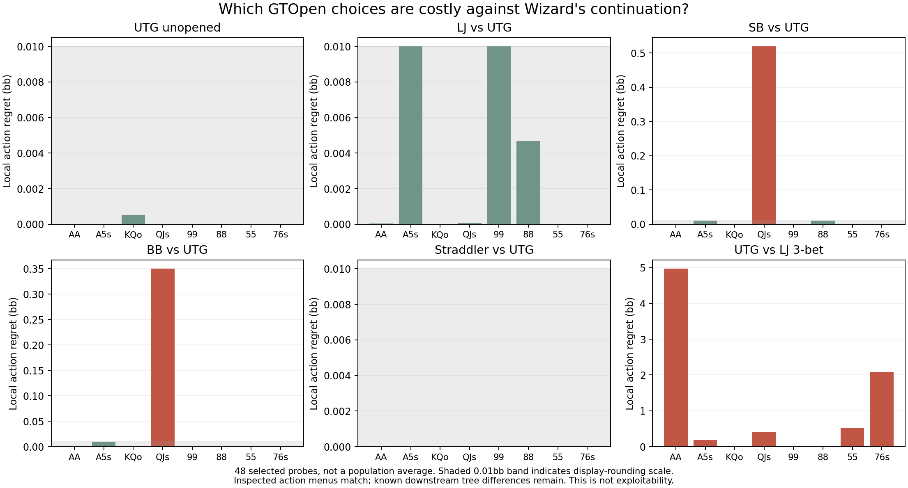
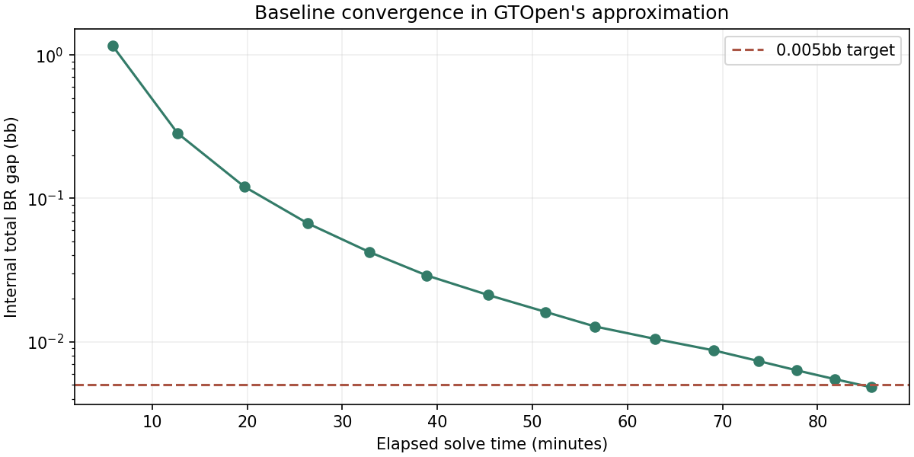

# GTOpen / Wizard baseline: evidence tables

19 September 2026. Generated evidence; see README.md for reviewed interpretation.

Six inspected decision menus match. The downstream trees and continuation models do not;
this is a diagnostic comparison, not an exact solver-equivalence test.

## Solve and stability

| Checkpoint | Iterations | Internal total BR gap (bb) | Stage minutes |
|---|---:|---:|---:|
| Initial | 750 | 0.0048246 | 85.6 |
| Additional 250 | 1000 | 0.0028610 | 18.5 |

Initial target reached: **True**.
Largest probe strategy change during refinement: **7.945 percentage points** (total variation).
Largest change in local Wizard-action regret: **0.73634bb**.

The internal gap measures GTOpen's approximation, not full-game accuracy. Small global
gap does not by itself certify every rare branch. Refinement drift is reported separately.

## Whole-range frequencies

| Decision | Wizard | GTOpen |
|---|---|---|
| UTG unopened | Allin 200 0.00%; Raise 6 13.40%; Fold 86.60% | Fold 86.01%; Raise 6 13.99%; Allin 200 0.00% |
| LJ vs UTG | Allin 200 0.00%; Raise 18 5.30%; Call 1.50%; Fold 93.20% | Fold 94.85%; Call 0.00%; Raise 18 5.14%; Allin 200 0.00% |
| SB vs UTG | Allin 200 0.00%; Raise 24 5.10%; Call 0.30%; Fold 94.60% | Fold 92.48%; Call 3.15%; Raise 24 4.37%; Allin 200 0.00% |
| BB vs UTG | Allin 200 0.00%; Raise 27 4.60%; Call 2.80%; Fold 92.60% | Fold 88.46%; Call 7.48%; Raise 27 4.06%; Allin 200 0.00% |
| Straddler vs UTG | Allin 200 0.00%; Raise 30 4.10%; Call 13.30%; Fold 82.60% | Fold 73.55%; Call 22.51%; Raise 30 3.94%; Allin 200 0.00% |
| UTG vs LJ 3-bet | Allin 200 8.60%; Raise 45 12.60%; Call 18.70%; Fold 60.10% | Fold 41.57%; Call 47.56%; Raise 45 4.94%; Allin 200 5.93% |

UTG's response to the 3-bet is conditional on its own opening range in each solver.
Different incoming ranges can therefore contribute to aggregate differences.

## Selected hand diagnostics

Local regret = best displayed Wizard action EV minus GTOpen's mixture of those EVs.
It scores one decision followed by Wizard continuation, not GTOpen exploitability.
EV display rounding alone gives roughly +/-0.01bb uncertainty; unknown solution error
and tree differences are additional. These 48 selected probes are not a population average.

| Decision | Hand | Local regret (bb) | GTOpen choice | Wizard choice |
|---|---|---:|---|---|
| UTG vs LJ 3-bet | AA | 4.9690 | Fold 0.00%; Call 0.00%; Raise 45 35.47%; Allin 200 64.53% | Allin 200 0.00%; Raise 45 100.00%; Call 0.00%; Fold 0.00% |
| UTG vs LJ 3-bet | 76s | 2.0820 | Fold 83.59%; Call 0.06%; Raise 45 0.00%; Allin 200 16.35% | Allin 200 0.00%; Raise 45 0.00%; Call 99.99%; Fold 0.01% |
| UTG vs LJ 3-bet | 55 | 0.5299 | Fold 99.95%; Call 0.05%; Raise 45 0.01%; Allin 200 0.00% | Allin 200 0.00%; Raise 45 0.00%; Call 100.00%; Fold 0.00% |
| SB vs UTG | QJs | 0.5195 | Fold 0.08%; Call 0.01%; Raise 24 99.91%; Allin 200 0.00% | Allin 200 0.00%; Raise 24 0.00%; Call 0.00%; Fold 100.00% |
| UTG vs LJ 3-bet | QJs | 0.4100 | Fold 0.01%; Call 99.99%; Raise 45 0.00%; Allin 200 0.00% | Allin 200 0.00%; Raise 45 0.00%; Call 0.00%; Fold 100.00% |
| BB vs UTG | QJs | 0.3499 | Fold 0.00%; Call 0.04%; Raise 27 99.96%; Allin 200 0.00% | Allin 200 0.00%; Raise 27 0.00%; Call 0.57%; Fold 99.43% |
| UTG vs LJ 3-bet | A5s | 0.1816 | Fold 0.06%; Call 94.06%; Raise 45 0.00%; Allin 200 5.88% | Allin 200 0.00%; Raise 45 36.58%; Call 30.21%; Fold 33.21% |
| LJ vs UTG | 99 | 0.0100 | Fold 0.01%; Call 0.06%; Raise 18 99.93%; Allin 200 0.00% | Allin 200 0.00%; Raise 18 5.49%; Call 8.47%; Fold 86.04% |
| SB vs UTG | 88 | 0.0100 | Fold 0.01%; Call 99.99%; Raise 24 0.01%; Allin 200 0.00% | Allin 200 0.00%; Raise 24 10.80%; Call 2.60%; Fold 86.60% |
| LJ vs UTG | A5s | 0.0100 | Fold 100.00%; Call 0.00%; Raise 18 0.00%; Allin 200 0.00% | Allin 200 0.00%; Raise 18 83.33%; Call 8.69%; Fold 7.98% |
| SB vs UTG | A5s | 0.0100 | Fold 99.97%; Call 0.01%; Raise 24 0.03%; Allin 200 0.00% | Allin 200 0.00%; Raise 24 98.27%; Call 1.28%; Fold 0.44% |
| BB vs UTG | A5s | 0.0100 | Fold 0.00%; Call 99.32%; Raise 27 0.68%; Allin 200 0.00% | Allin 200 0.00%; Raise 27 88.39%; Call 11.47%; Fold 0.14% |
| LJ vs UTG | 88 | 0.0047 | Fold 53.36%; Call 0.22%; Raise 18 46.42%; Allin 200 0.00% | Allin 200 0.00%; Raise 18 6.36%; Call 12.19%; Fold 81.45% |
| SB vs UTG | 99 | 0.0014 | Fold 0.00%; Call 92.87%; Raise 24 7.13%; Allin 200 0.00% | Allin 200 0.00%; Raise 24 3.48%; Call 1.89%; Fold 94.63% |
| BB vs UTG | KQo | 0.0009 | Fold 99.36%; Call 0.64%; Raise 27 0.01%; Allin 200 0.00% | Allin 200 0.00%; Raise 27 0.00%; Call 0.00%; Fold 100.00% |
| UTG vs LJ 3-bet | 88 | 0.0008 | Fold 0.31%; Call 98.76%; Raise 45 0.93%; Allin 200 0.00% | Allin 200 0.00%; Raise 45 2.73%; Call 89.23%; Fold 8.04% |
| UTG unopened | KQo | 0.0005 | Fold 0.59%; Raise 6 99.41%; Allin 200 0.00% | Allin 200 0.00%; Raise 6 100.00%; Fold 0.00% |
| SB vs UTG | AA | 0.0001 | Fold 0.00%; Call 0.00%; Raise 24 100.00%; Allin 200 0.00% | Allin 200 0.05%; Raise 24 99.95%; Call 0.00%; Fold 0.00% |
| LJ vs UTG | QJs | 0.0001 | Fold 99.99%; Call 0.00%; Raise 18 0.01%; Allin 200 0.00% | Allin 200 0.00%; Raise 18 0.00%; Call 0.00%; Fold 100.00% |
| LJ vs UTG | AA | 0.0000 | Fold 0.00%; Call 0.00%; Raise 18 100.00%; Allin 200 0.00% | Allin 200 0.03%; Raise 18 99.97%; Call 0.00%; Fold 0.00% |
| Straddler vs UTG | AA | 0.0000 | Fold 0.00%; Call 0.00%; Raise 30 100.00%; Allin 200 0.00% | Allin 200 0.04%; Raise 30 99.96%; Call 0.00%; Fold 0.00% |
| BB vs UTG | AA | 0.0000 | Fold 0.00%; Call 0.00%; Raise 27 100.00%; Allin 200 0.00% | Allin 200 0.05%; Raise 27 99.95%; Call 0.00%; Fold 0.00% |
| UTG vs LJ 3-bet | KQo | 0.0000 | Fold 100.00%; Call 0.00%; Raise 45 0.00%; Allin 200 0.00% | Allin 200 0.00%; Raise 45 0.00%; Call 0.00%; Fold 100.00% |
| BB vs UTG | 76s | 0.0000 | Fold 99.82%; Call 0.18%; Raise 27 0.00%; Allin 200 0.00% | Allin 200 0.00%; Raise 27 5.20%; Call 6.73%; Fold 88.07% |
| LJ vs UTG | 76s | 0.0000 | Fold 100.00%; Call 0.00%; Raise 18 0.00%; Allin 200 0.00% | Allin 200 0.00%; Raise 18 12.09%; Call 3.20%; Fold 84.71% |
| UTG unopened | A5s | 0.0000 | Fold 0.01%; Raise 6 99.99%; Allin 200 0.00% | Allin 200 0.00%; Raise 6 100.00%; Fold 0.00% |
| UTG vs LJ 3-bet | 99 | 0.0000 | Fold 0.01%; Call 99.99%; Raise 45 0.00%; Allin 200 0.00% | Allin 200 0.00%; Raise 45 4.71%; Call 46.29%; Fold 49.01% |
| Straddler vs UTG | 99 | 0.0000 | Fold 0.00%; Call 99.99%; Raise 30 0.01%; Allin 200 0.00% | Allin 200 0.00%; Raise 30 0.00%; Call 100.00%; Fold 0.00% |
| BB vs UTG | 55 | 0.0000 | Fold 0.00%; Call 100.00%; Raise 27 0.00%; Allin 200 0.00% | Allin 200 0.00%; Raise 27 0.00%; Call 13.52%; Fold 86.48% |
| Straddler vs UTG | 55 | 0.0000 | Fold 0.00%; Call 100.00%; Raise 30 0.00%; Allin 200 0.00% | Allin 200 0.00%; Raise 30 0.78%; Call 99.22%; Fold 0.00% |
| Straddler vs UTG | 88 | 0.0000 | Fold 0.00%; Call 100.00%; Raise 30 0.00%; Allin 200 0.00% | Allin 200 0.00%; Raise 30 8.87%; Call 91.13%; Fold 0.00% |
| Straddler vs UTG | QJs | 0.0000 | Fold 0.00%; Call 100.00%; Raise 30 0.00%; Allin 200 0.00% | Allin 200 0.00%; Raise 30 0.27%; Call 99.73%; Fold 0.00% |
| UTG unopened | AA | 0.0000 | Fold 0.00%; Raise 6 100.00%; Allin 200 0.00% | Allin 200 0.02%; Raise 6 99.98%; Fold 0.00% |
| LJ vs UTG | KQo | 0.0000 | Fold 100.00%; Call 0.00%; Raise 18 0.00%; Allin 200 0.00% | Allin 200 0.00%; Raise 18 0.00%; Call 0.00%; Fold 100.00% |
| Straddler vs UTG | A5s | 0.0000 | Fold 0.00%; Call 100.00%; Raise 30 0.00%; Allin 200 0.00% | Allin 200 0.00%; Raise 30 50.25%; Call 49.75%; Fold 0.00% |
| UTG unopened | QJs | 0.0000 | Fold 0.01%; Raise 6 99.99%; Allin 200 0.00% | Allin 200 0.00%; Raise 6 100.00%; Fold 0.00% |
| UTG unopened | 99 | 0.0000 | Fold 0.00%; Raise 6 100.00%; Allin 200 0.00% | Allin 200 0.00%; Raise 6 72.79%; Fold 27.21% |
| SB vs UTG | KQo | 0.0000 | Fold 100.00%; Call 0.00%; Raise 24 0.00%; Allin 200 0.00% | Allin 200 0.00%; Raise 24 0.00%; Call 0.00%; Fold 100.00% |
| Straddler vs UTG | KQo | 0.0000 | Fold 0.00%; Call 99.99%; Raise 30 0.01%; Allin 200 0.00% | Allin 200 0.00%; Raise 30 30.34%; Call 53.77%; Fold 15.89% |
| SB vs UTG | 55 | 0.0000 | Fold 100.00%; Call 0.00%; Raise 24 0.00%; Allin 200 0.00% | Allin 200 0.00%; Raise 24 0.00%; Call 1.09%; Fold 98.91% |
| Straddler vs UTG | 76s | 0.0000 | Fold 0.00%; Call 100.00%; Raise 30 0.00%; Allin 200 0.00% | Allin 200 0.00%; Raise 30 17.01%; Call 82.96%; Fold 0.03% |
| UTG unopened | 88 | 0.0000 | Fold 0.00%; Raise 6 100.00%; Allin 200 0.00% | Allin 200 0.00%; Raise 6 34.37%; Fold 65.63% |
| BB vs UTG | 99 | 0.0000 | Fold 0.00%; Call 99.97%; Raise 27 0.03%; Allin 200 0.00% | Allin 200 0.00%; Raise 27 9.41%; Call 22.07%; Fold 68.52% |
| SB vs UTG | 76s | 0.0000 | Fold 100.00%; Call 0.00%; Raise 24 0.00%; Allin 200 0.00% | Allin 200 0.00%; Raise 24 9.17%; Call 0.32%; Fold 90.52% |
| BB vs UTG | 88 | 0.0000 | Fold 0.00%; Call 98.70%; Raise 27 1.30%; Allin 200 0.00% | Allin 200 0.00%; Raise 27 9.16%; Call 22.60%; Fold 68.24% |
| UTG unopened | 55 | 0.0000 | Fold 0.42%; Raise 6 99.58%; Allin 200 0.00% | Allin 200 0.00%; Raise 6 20.88%; Fold 79.12% |
| LJ vs UTG | 55 | 0.0000 | Fold 100.00%; Call 0.00%; Raise 18 0.00%; Allin 200 0.00% | Allin 200 0.00%; Raise 18 0.00%; Call 3.42%; Fold 96.58% |
| UTG unopened | 76s | 0.0000 | Fold 22.44%; Raise 6 77.56%; Allin 200 0.00% | Allin 200 0.00%; Raise 6 9.08%; Fold 90.92% |

## Action values under each solver's own continuation

These values use different opponent ranges and future policies. Their difference does
not isolate continuation-model error. Both use original bb relative to folding here.

| Decision | Hand | Action | Wizard EV | GTOpen own EV |
|---|---|---|---:|---:|
| Straddler vs UTG | AA | Call | 14.39 | 7.2935 |
| Straddler vs UTG | A5s | Call | 0.24 | 1.2568 |
| Straddler vs UTG | KQo | Call | 0.00 | 0.5810 |
| Straddler vs UTG | QJs | Call | 0.21 | 1.3388 |
| Straddler vs UTG | 99 | Call | 0.98 | 2.2020 |
| Straddler vs UTG | 88 | Call | 0.79 | 1.9559 |
| Straddler vs UTG | 55 | Call | 0.33 | 1.0037 |
| Straddler vs UTG | 76s | Call | 0.13 | 1.1016 |
| UTG vs LJ 3-bet | AA | Call | 54.17 | 19.7604 |
| UTG vs LJ 3-bet | A5s | Call | 0.00 | 0.3878 |
| UTG vs LJ 3-bet | KQo | Call | -2.54 | -1.6209 |
| UTG vs LJ 3-bet | QJs | Call | -0.41 | 0.7109 |
| UTG vs LJ 3-bet | 99 | Call | 0.00 | 1.6354 |
| UTG vs LJ 3-bet | 88 | Call | 0.00 | 0.2810 |
| UTG vs LJ 3-bet | 55 | Call | 0.53 | -0.2097 |
| UTG vs LJ 3-bet | 76s | Call | 0.55 | -0.2206 |

## Extra cold-call branches

Wizard excludes these calls after UTG6/LJ18; GTOpen currently permits them.

| Actor (GTOpen label) | Call frequency |
|---|---:|
| HJ | 0.314% |
| CO | 0.269% |
| BTN | 0.191% |
| SB | 0.415% |
| BB | 0.753% |
| UTG | 0.891% |

See TREE-AUDIT.md for all known differences and the fixed run plan.

