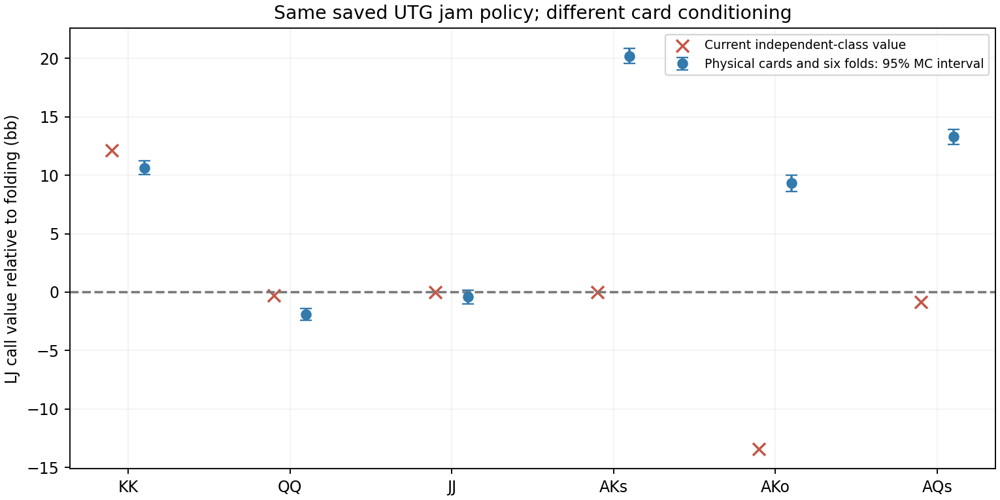

# Physical-card response audit: reviewed results

**Confirmed in this saved spot:** ignoring the caller's cards when constructing the opponent's range can reverse the value of important calls. This is a separate limitation from the postflop continuation approximation. This all-in branch has no postflop betting left.

32 million physical eight-player deals and boards per hand, ten selected hands, four CPU threads. The full conditioning includes the six observed folds. The old independent-class formula first reproduced all six exported saved action values within 0.0001bb. Both calculations therefore concern the same saved policy and pot accounting.

| LJ hand | Current call % | Independent EV | Physical EV, six folds [95% MC interval] |
|---|---:|---:|---:|
| AA | 100.0% | +106.22 | +134.56 [+134.00, +135.12] |
| KK | 100.0% | +12.12 | +10.63 [+10.04, +11.22] |
| QQ | 0.4% | -0.30 | -1.92 [-2.43, -1.41] |
| JJ | 18.1% | -0.00 | -0.42 [-0.99, +0.16] |
| AKs | 51.0% | +0.00 | +20.21 [+19.55, +20.86] |
| AKo | 0.0% | -13.41 | +9.32 [+8.63, +10.02] |
| AQs | 0.2% | -0.83 | +13.30 [+12.66, +13.94] |
| AJs | 0.0% | -2.62 | +12.91 [+12.13, +13.68] |
| ATs | 0.1% | -30.43 | -17.09 [-17.59, -16.59] |
| KQs | 0.0% | -56.65 | -53.18 [-53.74, -52.63] |

AKs, AKo and AQs are material parts of LJ's entering range. They have clearly positive physical call values against the frozen UTG jam, while the current policy calls AKs only about half the time and almost always folds AKo/AQs. AJs also has positive counterfactual value, but almost never reaches this node in the saved policy. Do not equate every displayed hand's error with equal overall impact.

JJ remains near the boundary: its full-conditioning interval overlaps zero. QQ is slightly negative. Some class-cache estimates differ by around 1bb from the fresh physical-deal estimate; the cache cannot justify fine-grained recommendations near zero.

## Why the policies must adapt together

The exploratory analytic audit moves AA probability from UTG jam to call while preserving AA's total action probability and its 4-bet frequency. LJ's local best response changes substantially. Even before that transfer, recomputing a two-card-compatible local response changes AA's jam value from about 44.2bb against the saved response to about 75.1bb against that local response. This is not AA's equilibrium value: changing LJ's response creates incentives for other UTG hands to change too.

The local response calculation estimates a 2.83bb improvement for LJ conditional on this jam under its cached two-hand model. It is not a root exploitability estimate. The saved independent-class branch probability is only about 0.000381; physical branch probabilities and a full-game best response were not computed.

## Implementation consequence

Changing only the displayed equity or normalizing one terminal by compatible opponent mass is insufficient. A solver correction must use consistent card-conditioned chance weights in showdown values, fold payoffs, action aggregation and counterfactual updates. Otherwise it can create a different accounting error. A bounded two-player test game with independently enumerated compatible hand pairs is the appropriate next implementation gate, before modifying the multiway GPU solver.

This result does not establish that matching Wizard requires these exact responses: Wizard has different entering and jamming ranges. No production changes were made; reserved Wizard cases remain untouched.
