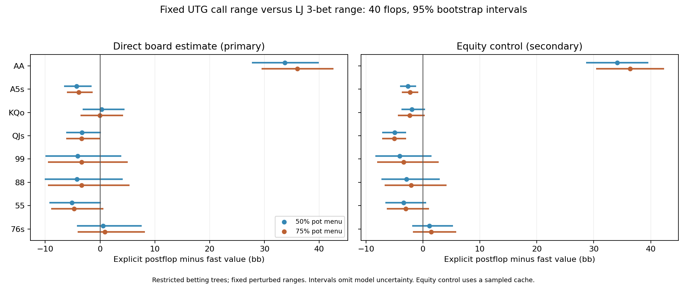

# Fixed-range continuation results

This experiment tests the postflop value estimate for one saved branch. It does not produce new preflop ranges, certify agreement with Wizard, or test a full postflop betting tree. Production is unchanged.

All 80 references pass the global target; 59 were rerun with the stricter per-hand check. Every sampled probe has an OOP best-response gain at most 0.05bb. That is a convergence diagnostic, not a rigorous bound on value error.

Values below are gross continuation values before subtracting the additional 12bb preflop call. Positive differences mean the explicit postflop solve values the hand more highly than the fast approximation.

| Hand | Fast value | 50% menu value [95% interval] | 75% menu value [95% interval] |
|---|---:|---:|---:|
| AA | 31.76 | 65.50 [59.47, 71.64] | 67.78 [61.25, 74.33] |
| A5s | 12.39 | 8.10 [5.79, 10.82] | 8.48 [6.37, 11.02] |
| KQo | 10.38 | 10.67 [7.18, 14.83] | 10.32 [6.80, 14.58] |
| QJs | 12.71 | 9.39 [6.53, 12.89] | 9.35 [6.56, 12.77] |
| 99 | 13.63 | 9.57 [3.67, 17.48] | 10.24 [4.10, 18.69] |
| 88 | 12.28 | 8.04 [2.20, 16.40] | 8.88 [2.78, 17.63] |
| 55 | 11.79 | 6.67 [2.52, 11.96] | 7.02 [2.86, 12.42] |
| 76s | 11.78 | 12.32 [7.53, 19.40] | 12.63 [7.66, 19.95] |

The stricter hand checks changed the direct estimates by up to 0.084bb and the equity-control estimates by up to 0.084bb. These shifts measure numerical sensitivity within the same tree; they do not measure abstraction error.

## Interpretation limits

The fast model removes 1.58bb rake from the starting pot. The explicit trees collect an estimated 2.85bb (50% menu) / 2.70bb (75% menu) across the range, including later betting. Rake treatment therefore contributes to the comparison; this experiment does not isolate its hand-specific effect.

A separate static audit adds two-player physical-card compatibility to the unchanged fast formula. It shifts these eight probe values by at most 0.517bb, much less than AA's observed discrepancy. This does not account for cards held by folded players; see `card-compatibility-audit.json`.

The direct estimator is primary. The secondary equity control reduces board noise using a preflop equity cache whose mean is itself sampled. Its narrower intervals do not include cache error. Both use the same paired, stratified board resamples. Only eight flops per texture stratum were sampled; neither interval captures betting abstraction, range estimation, or folded-card-removal uncertainty.

The inputs preserve the saved ranges apart from documented tiny trimming and injected probe weights. A hand given negligible weight can have an unstable counterfactual value even when the overall solution is settled. Passing the hand check improves numerical confidence; it does not validate extrapolation to a substantially different range.

The AA 4-bet-versus-jam discrepancy is outside this call-branch test. Testing it requires its own continuation ranges and opponent responses.

See `PROTOCOL.md`, `precision/PROTOCOL.md`, both manifests, raw job records, and `report-provenance.json` for reproducibility.
