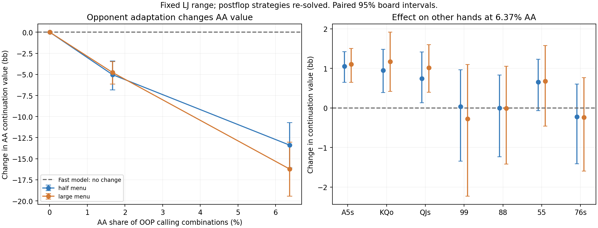

# Material AA range sensitivity: completed

All 160 registered solves passed the global and per-probe gates. Independent accounting reproduced range means within 4e-14bb. No solver or production changes.

**Finding:** AA loses substantial value when it becomes a meaningful part of the calling range and the opponent adapts postflop. The fast Balanced approximation cannot represent this response: its OOP hand values depend on the opponent range but not on the composition of OOP's own range.

| AA combination share | Bet menu | Explicit AA value | Change from original [paired 95% interval] |
|---|---|---:|---:|
| 1.67% | half | 60.46bb | -5.04 [-6.86, -3.42]bb |
| 1.67% | large | 63.00bb | -4.78 [-6.15, -3.49]bb |
| 6.37% | half | 52.12bb | -13.38 [-16.09, -10.72]bb |
| 6.37% | large | 51.56bb | -16.22 [-19.44, -13.04]bb |

Originally AA is 0.0068% of this prepared range, worth 65.50/67.78bb in the explicit half/large menus. Its fast-model value stays 31.76bb throughout. These are gross postflop continuation values; subtract 12bb to compare with folding at the preceding preflop call decision.

At the largest AA inclusion, A5s, KQo and QJs each gain roughly 0.7–1.2bb; their paired intervals exclude zero in both menus. Effects on the other probes are less clear. Strengthening the range changes the opponent's play and can protect weaker hands.

The AA call value after subtracting 12bb falls to about 40.12/39.56bb. That removes the earlier apparent dominance over the separately priced 4-bet, but does not establish a new preferred action: moving AA into calls would also change the 4-bet and jam ranges, and LJ's preflop response. Those branches were not jointly re-solved here.

## Consequence for the research

A correction based only on the hero hand, its equity and the opponent range cannot capture this effect. A useful continuation model must represent both players' range composition and be tested on controlled own-range changes, not merely fit isolated absolute values. This experiment gives a concrete development diagnostic for that property. It does not by itself prove a new learned model will generalize.

Next: assess the same effect when strength moves between competing branches rather than only being injected into one. Use coherent action probabilities and paired continuation values; keep this now-inspected case in development and reserve fresh range contexts/boards for validation. Avoid simply increasing a scalar AA value or tuning to Wizard's displayed percentages.

Limitations: one fixed LJ range and one 200bb raked case; 40 sampled flops; two restricted postflop menus; unchanged preflop responses. AA weights 0.25 and 1.0 are normalized range weights, not literal preceding action frequencies. Intervals reflect board sampling only.
